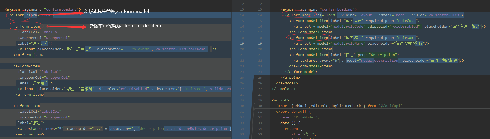
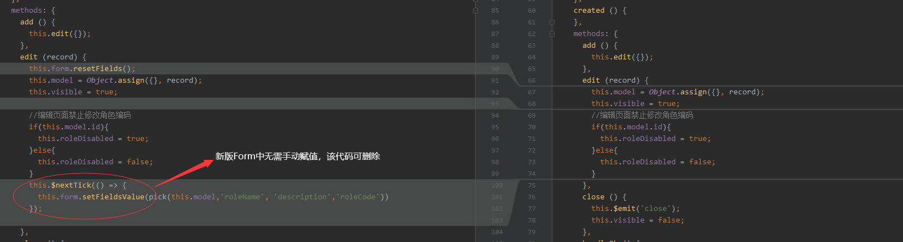
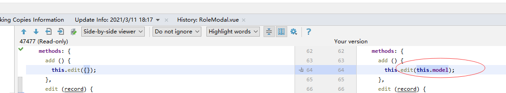

## FormModel 表单 (支持 v-model 绑定)(Ant Design of Vue 版本：1.5.0+)

[TOC]

 ###  新版form特性
- 1、支持双向绑定
- 2、无需v-decorator这个反人类属性设置
- 3、form用法跟目前主流框架(element ui iview风格形成统一,不在另类)
- 4、表单赋值无需手动设置，双向绑定自动赋值


  ###  新老form用法对比

标签规则升级

校验规则区别

表单赋值区别

表单提交区别


 ###  代码案例分析

角色管理老版form代码
```
~~~
<template>
  <a-modal
    :title="title"
    :width="800"
    :visible="visible"
    :confirmLoading="confirmLoading"
    @ok="handleOk"
    @cancel="handleCancel"
    cancelText="关闭"
    wrapClassName="ant-modal-cust-warp"
    style="top:5%;height: 85%;overflow-y: hidden">

    <a-spin :spinning="confirmLoading">
      <a-form :form="form">

        <a-form-item
          :labelCol="labelCol"
          :wrapperCol="wrapperCol"
          label="角色名称">
          <a-input placeholder="请输入角色名称" v-decorator="[ 'roleName', validatorRules.roleName]" />
        </a-form-item>

        <a-form-item
          :labelCol="labelCol"
          :wrapperCol="wrapperCol"
          label="角色编码">
          <a-input placeholder="请输入角色编码" :disabled="roleDisabled" v-decorator="[ 'roleCode', validatorRules.roleCode]" />
        </a-form-item>

        <a-form-item
          :labelCol="labelCol"
          :wrapperCol="wrapperCol"
          label="描述">
          <a-textarea :rows="5" placeholder="..." v-decorator="[ 'description', validatorRules.description ]" />
        </a-form-item>

      </a-form>
    </a-spin>
  </a-modal>
</template>

<script>
  import pick from 'lodash.pick'
  import {addRole,editRole,duplicateCheck } from '@/api/api'

  export default {
    name: "RoleModal",
    data () {
      return {
        title:"操作",
        visible: false,
        roleDisabled: false,
        model: {},
        labelCol: {
          xs: { span: 24 },
          sm: { span: 5 },
        },
        wrapperCol: {
          xs: { span: 24 },
          sm: { span: 16 },
        },
        confirmLoading: false,
        form: this.$form.createForm(this),
        validatorRules:{
          roleName:{
            rules: [
              { required: true, message: '请输入角色名称!' },
              { min: 2, max: 30, message: '长度在 2 到 30 个字符', trigger: 'blur' }
            ]},
          roleCode:{
            rules: [
              { required: true, message: '请输入角色名称!'},
              { min: 0, max: 64, message: '长度不超过 64 个字符', trigger: 'blur' },
              { validator: this.validateRoleCode}
            ]},
          description:{
            rules: [
              { min: 0, max: 126, message: '长度不超过 126 个字符', trigger: 'blur' }
            ]}
        },
      }
    },
    created () {
    },
    methods: {
      add () {
        this.edit({});
      },
      edit (record) {
        this.form.resetFields();
        this.model = Object.assign({}, record);
        this.visible = true;

        //编辑页面禁止修改角色编码
        if(this.model.id){
          this.roleDisabled = true;
        }else{
          this.roleDisabled = false;
        }
        this.$nextTick(() => {
          this.form.setFieldsValue(pick(this.model,'roleName', 'description','roleCode'))
        });

      },
      close () {
        this.$emit('close');
        this.visible = false;
      },
      handleOk () {
        const that = this;
        // 触发表单验证
        this.form.validateFields((err, values) => {
          if (!err) {
            that.confirmLoading = true;
            values.roleName = (values.roleName || '').trim()
            values.roleCode = (values.roleCode || '').trim()
            let formData = Object.assign(this.model, values);
            let obj;
            console.log(formData)
            if(!this.model.id){
              obj=addRole(formData);
            }else{
              obj=editRole(formData);
            }
            obj.then((res)=>{
              if(res.success){
                that.$message.success(res.message);
                that.$emit('ok');
              }else{
                that.$message.warning(res.message);
              }
            }).finally(() => {
              that.confirmLoading = false;
              that.close();
            })
          }
        })
      },
      handleCancel () {
        this.close()
      },
      validateRoleCode(rule, value, callback){
        if(/[\u4E00-\u9FA5]/g.test(value)){
          callback("角色编码不可输入汉字!");
        }else{
          var params = {
            tableName: "sys_role",
            fieldName: "role_code",
            fieldVal: value,
            dataId: this.model.id,
          };
          duplicateCheck(params).then((res)=>{
            if(res.success){
              callback();
            }else{
              callback(res.message);
            }
          });
        }
      }

    }
  }
</script>

<style scoped>

</style>
```
  角色管理新版from代码

```
<template>
  <a-modal
    :title="title"
    :width="800"
    :visible="visible"
    :confirmLoading="confirmLoading"
    @ok="handleOk"
    @cancel="handleCancel"
    cancelText="关闭"
    wrapClassName="ant-modal-cust-warp"
    style="top:5%;height: 85%;overflow-y: hidden">

    <a-spin :spinning="confirmLoading">
      <a-form-model ref="form"  v-bind="layout"  :model="model" :rules="validatorRules">
        <a-form-model-item label="角色编码" required prop="roleCode">
          <a-input v-model="model.roleCode" :disabled="roleDisabled"  placeholder="请输入角色编码"/>
        </a-form-model-item>
        <a-form-model-item label="角色名称" required prop="roleName">
          <a-input v-model="model.roleName" placeholder="请输入角色名称"/>
        </a-form-model-item>
        <a-form-model-item label="描述" prop="description">
          <a-textarea :rows="5" v-model="model.description" placeholder="请输入角色描述"/>
        </a-form-model-item>
      </a-form-model>
    </a-spin>
  </a-modal>
</template>

<script>
  import {addRole,editRole,duplicateCheck } from '@/api/api'
  export default {
    name: "RoleModal",
    data () {
      return {
        title:"操作",
        visible: false,
        roleDisabled: false,
        model: {},
        layout: {
          labelCol: { span: 3 },
          wrapperCol: { span: 14 },
        },
        confirmLoading: false,
        validatorRules:{
          roleName: [
            { required: true, message: '请输入角色名称!' },
            { min: 2, max: 30, message: '长度在 2 到 30 个字符', trigger: 'blur' }
          ],
          roleCode: [
            { required: true, message: '请输入角色名称!'},
            { min: 0, max: 64, message: '长度不超过 64 个字符', trigger: 'blur' },
            { validator: this.validateRoleCode}
          ],
          description: [
            { min: 0, max: 126, message: '长度不超过 126 个字符', trigger: 'blur' }
          ]
        },
      }
    },
    created () {
    },
    methods: {
      add () {
        this.edit({});
      },
      edit (record) {
        this.model = Object.assign({}, record);
        this.visible = true;
        //编辑页面禁止修改角色编码
        if(this.model.id){
          this.roleDisabled = true;
        }else{
          this.roleDisabled = false;
        }
      },
      close () {
        this.$emit('close');
        this.visible = false;
      },
      handleOk () {
        const that = this;
        // 触发表单验证
        this.$refs.form.validate(valid => {
          if (valid) {
            that.confirmLoading = true;
            let obj;
            if(!this.model.id){
              obj=addRole(this.model);
            }else{
              obj=editRole(this.model);
            }
            obj.then((res)=>{
              if(res.success){
                that.$message.success(res.message);
                that.$emit('ok');
              }else{
                that.$message.warning(res.message);
              }
            }).finally(() => {
              that.confirmLoading = false;
              that.close();
            })
          }else{
            return false;
          }
        })
      },
      handleCancel () {
        this.close()
      },
      validateRoleCode(rule, value, callback){
        if(/[\u4E00-\u9FA5]/g.test(value)){
          callback("角色编码不可输入汉字!");
        }else{
          let params = {
            tableName: "sys_role",
            fieldName: "role_code",
            fieldVal: value,
            dataId: this.model.id,
          };
          duplicateCheck(params).then((res)=>{
            if(res.success){
              callback();
            }else{
              callback(res.message);
            }
          });
        }
      }
    }
  }
</script>

<style scoped>

</style>
```

### 注意：这里有大坑
~~~
this.$refs.form.resetFields();

ant-design-vue官方文档声明
对整个表单进行重置，将所有字段值重置为初始值并移除校验结果

但是实际form绑定的model无法清除原始值。所以添加页面和编辑页面的时候，一定先清空，再设置默认值。
~~~
千万不要这么写
~~~
this.edit(this.model)
~~~


### 官方文档
  [官方FormModel用法](https://www.antdv.com/components/form-model-cn/)


