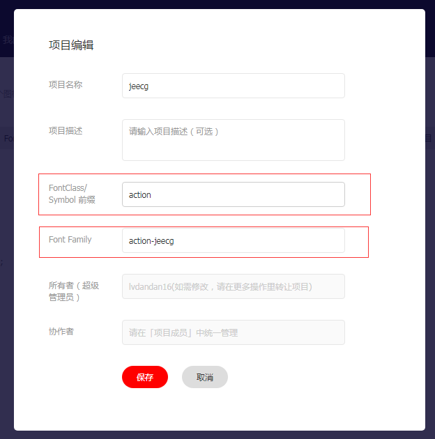
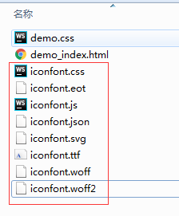
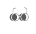

# Icon图标扩展方法
===
这里介绍的是系统与阿里矢量图标库的结合
[TOC]
## 图标准备
登录icon，并将图标下载至本地。如果还没有项目可在我的项目中新建项目并上传图标

新建项目

FontClass/  Symbol 前缀可修改 也可为默认的icon  引用时一致即可
Font Family  可修改
## 整合项目
在src/components（其他目录也可以）下新建文件夹 iconfont，使用Fontclass模式时，需引入iconfont.css
将下载图标解压后，复制文件到iconfont下（demo可不复制）

在iconfont文件下创建文件common.less，将如下代码复制到common.less文件中
~~~
/* 引入 icon class 文件 */
@import  "./iconfont.css";

/* 设置使用字体的优先级 anticon 高 */
:global(.anticon) {  /* :global() 是为了覆盖全局class .anticon 的样式 */
  &:before {
    font-family: "anticon", "anticon-jeecg" !important;
    /* 默认样式是这样
        font-family: "anticon" !important;
    */
  }
}
~~~
将common.less在全局文件中引入，这里是在src/App.vue中引入
~~~
// Fontclass模式
import '@/components/iconfont/common.less'
// 使用 symbol模式 支持多色
import '@/components/iconfont/iconfont.js'
~~~

## 在所需文件处，引 入图标
~~~
font-class模式 ： 

<i class="anticon-jeecg actionglasses1" style="font-size: 65px;"/>
anticon-jeecg 与icon项目的Font Family 对应
actionglasses1为icon项目的前缀和图片名称
~~~

~~~
symbol 方式：

 <svg class="icon" aria-hidden="true">
  <use xlink:href="#actionglasses1"></use>
</svg>
//可修改图标样式  加入通用 CSS 代码（引入一次就行）
.icon {
  width: 4em;
  height: 4em;
  vertical-align: -0.15em;
  fill: currentColor;
  overflow: hidden;
}
~~~

## 菜单中使用自定义图标
### 1.菜单表中的icon字段,保存自定义图标时，手动添加'cus_'前缀

### 2.菜单index.js中处理显示自定义图标
src/components/menu/index.js

