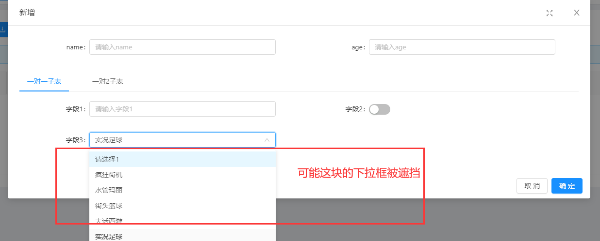

主子表代码生成器生成代码后可能会出现子表组件被遮挡的情况

修改：只需要在调用组件的时候给组件加个属性（不同的组件可能不一样，具体看文档）
~~~
<j-dict-select-tag 
    type="list" 
    v-decorator="['demofield']" 
    dictCode="sports" 
    getPopupContainer="getModalAsContainer"
/>

....
methods:{
  getModalAsContainer(node){
    return document.querySelector('.j-modal-box .ant-modal-content')
  }

}

~~~
| 组件类型    |   属性名  |
| --- | --- |
|  下拉   | getPopupContainer    |
|  时间|  getCalendarContainer |