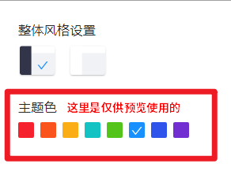
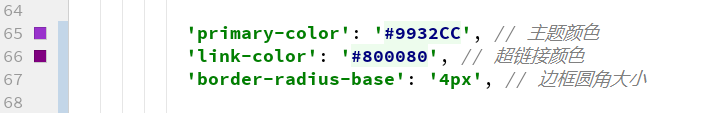
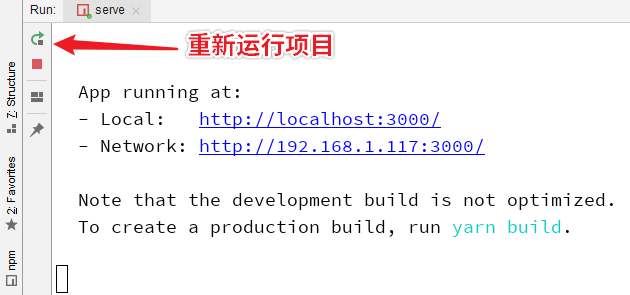
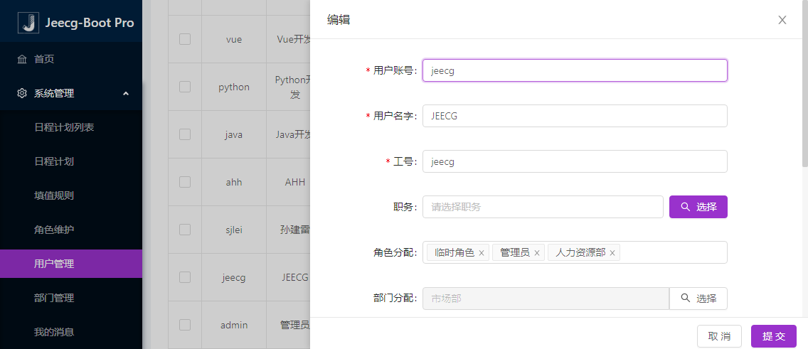
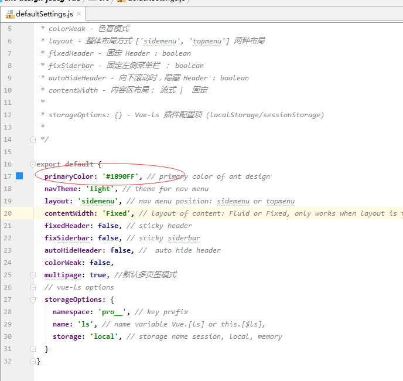

# 更改系统默认主题

在 `系统设置` 界面里设置的主题颜色，仅供临时预览用，并不是编译时默认的主题，所以才会出现先加载默认主题，再加载你设置的主题的问题。

如果想要自定义默认主题，需要修改项目根目录下的 `vue.config.js` 文件。
在该文件中，找到如下代码块：

解除掉红框里的注释，并将颜色改为你自己的主题颜色

并重新运行项目，等待项目启动

再刷新页面，就是你默认的主题颜色了

## 首页主题风格设置  
src/defaultSettings.js  更多风格在这里设置（注意改颜色的话，此处颜色需要与上面保持一致）

## 更多变量覆盖

更多相关内容可查看`Ant Design Vue`官方文档
<https://www.antdv.com/docs/vue/customize-theme-cn/>

>  primary-color: #1890ff; // 全局主色
    link-color: #1890ff; // 链接色
    success-color: #52c41a; // 成功色
    warning-color: #faad14; // 警告色
    error-color: #f5222d; // 错误色
    font-size-base: 14px; // 主字号
    heading-color: rgba(0, 0, 0, 0.85); // 标题色
    text-color: rgba(0, 0, 0, 0.65); // 主文本色
    text-color-secondary: rgba(0, 0, 0, .45); // 次文本色
    disabled-color: rgba(0, 0, 0, .25); // 失效色
    border-radius-base: 4px; // 组件/浮层圆角
    border-color-base: #d9d9d9; // 边框色
    box-shadow-base: 0 2px 8px rgba(0, 0, 0, 0.15); // 浮层阴影