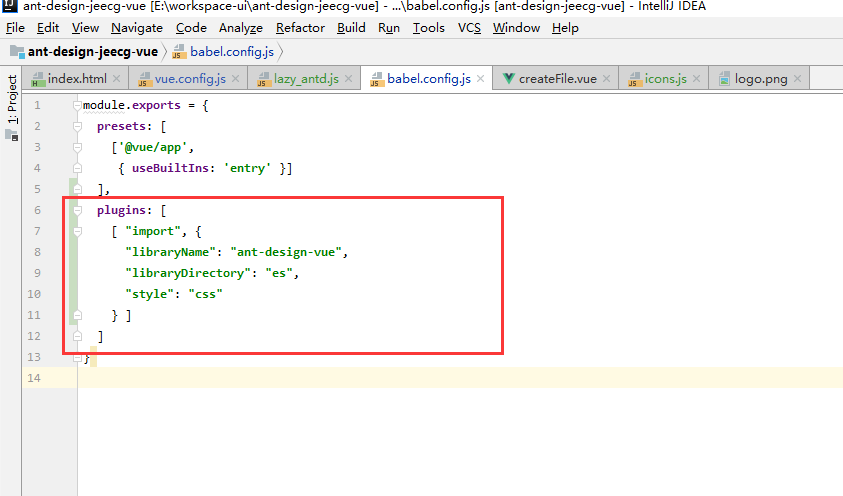
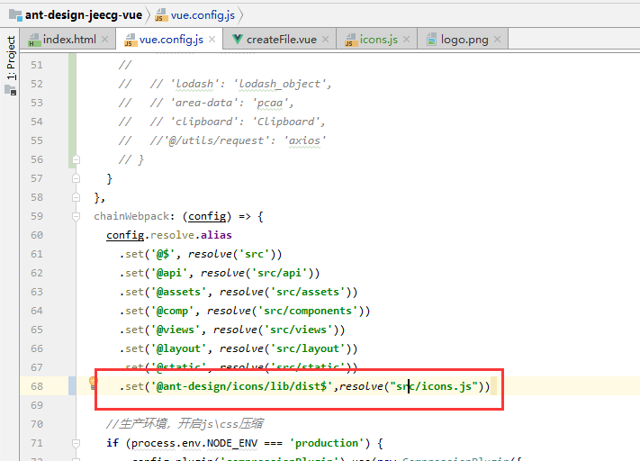

# JeecgBoot实战 - 按需加载方案

[TOC]

## 一、Ant-Design-Vue 按需加载
* 1.创建js文件 src/components/lazy_antd.js

```
import Vue from 'vue'

// base library
import {
  ConfigProvider,
  Layout,
  Input,
  InputNumber,
  Button,
  Switch,
  Radio,
  Checkbox,
  Select,
  Card,
  Form,
  Row,
  Col,
  Modal,
  Table,
  Tabs,
  Icon,
  Badge,
  Popover,
  Dropdown,
  List,
  Avatar,
  Breadcrumb,
  Steps,
  Spin,
  Menu,
  Drawer,
  Tooltip,
  Alert,
  Tag,
  Divider,
  DatePicker,
  TimePicker,
  Upload,
  Progress,
  Skeleton,
  Popconfirm,
  PageHeader,
  Result,
  Statistic,
  Descriptions,
  message,
  notification,
  Empty,
  Tree,
  TreeSelect
} from 'ant-design-vue'
import Viser from 'viser-vue'

Vue.use(ConfigProvider)
Vue.use(Layout)
Vue.use(Input)
Vue.use(InputNumber)
Vue.use(Button)
Vue.use(Switch)
Vue.use(Radio)
Vue.use(Checkbox)
Vue.use(Select)
Vue.use(Card)
Vue.use(Form)
Vue.use(Row)
Vue.use(Col)
Vue.use(Modal)
Vue.use(Table)
Vue.use(Tabs)
Vue.use(Icon)
Vue.use(Badge)
Vue.use(Popover)
Vue.use(Dropdown)
Vue.use(List)
Vue.use(Avatar)
Vue.use(Breadcrumb)
Vue.use(Steps)
Vue.use(Spin)
Vue.use(Menu)
Vue.use(Drawer)
Vue.use(Tooltip)
Vue.use(Alert)
Vue.use(Tag)
Vue.use(Divider)
Vue.use(DatePicker)
Vue.use(TimePicker)
Vue.use(Upload)
Vue.use(Progress)
Vue.use(Skeleton)
Vue.use(Popconfirm)
Vue.use(PageHeader)
Vue.use(Result)
Vue.use(Statistic)
Vue.use(Descriptions)
Vue.use(Empty)
Vue.use(Tree)
Vue.use(TreeSelect)

Vue.prototype.$confirm = Modal.confirm
Vue.prototype.$message = message
Vue.prototype.$notification = notification
Vue.prototype.$info = Modal.info
Vue.prototype.$success = Modal.success
Vue.prototype.$error = Modal.error
Vue.prototype.$warning = Modal.warning

process.env.NODE_ENV !== 'production' && console.warn('[jeecg-boot-vue] NOTICE: Antd use lazy-load.')
```

* 2. 修改配置文件 babel.config.js增加插件配置
```
plugins: [
  [ "import", {
    "libraryName": "ant-design-vue",
    "libraryDirectory": "es",
    "style": "css"
  } ]
]
```
参考图


3. 修改main.js 引入配置文件 src/components/lazy_antd.js，同时注释掉原来的 ant-design-vue引入。

    src/main.js

```
// 按需引入所需组件，统一引入文件
import './components/lazy_antd'
```

4. package.json引入依赖babel-plugin-import

```
"babel-plugin-import": "^1.13.0"
```


备注： `组件如果有缺少，需手工添加。`

参考文献： 

[https://github.com/vueComponent/ant-design-vue-pro/blob/1.2.0/docs/load-on-demand.md](https://github.com/vueComponent/ant-design-vue-pro/blob/1.2.0/docs/load-on-demand.md)
[https://www.antdv.com/docs/vue/getting-started-cn/#按需加载](https://www.antdv.com/docs/vue/getting-started-cn/#%E6%8C%89%E9%9C%80%E5%8A%A0%E8%BD%BD)


## 二、Icon按需加载

* 1. 创建js文件 src/icons.js
```
// src/icons.js

// export what you need
export {
  default as SmileOutline
} from '@ant-design/icons/lib/outline/SmileOutline';
export {
  default as MehOutline
} from '@ant-design/icons/lib/outline/MehOutline';

// export what antd other components need
export {
  default as CloseOutline
} from '@ant-design/icons/lib/outline/CloseOutline';
// and other icons...
```

* 2. 修改配置文件 vue.config.js
在 chainWebpack: (config) => {  config.resolve.alias 新增一个配置

```
.set('@ant-design/icons/lib/dist$',resolve("src/icons.js"))
```
参考图


备注： `图标如果有缺少，需手工添加。`

参考文献:  [https://github.com/HeskeyBaozi/reduce-antd-icons-bundle-demo](https://github.com/HeskeyBaozi/reduce-antd-icons-bundle-demo)