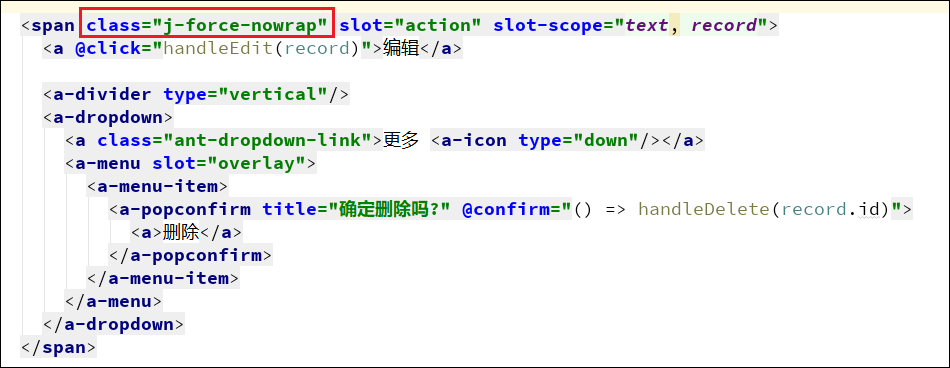
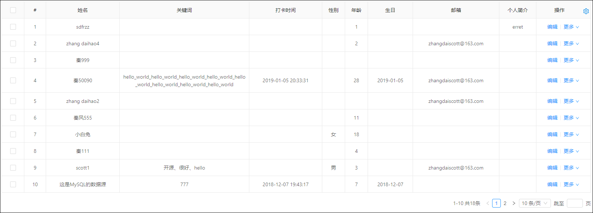

# 表格的换行与不换行

[TOC]

## 必备代码

若要使用该功能，必须引用以下代码

```
import '@/assets/less/TableExpand.less'
```


## 一、强制表格所有列不换行

仅需在 `a-table` 上添加一个 class 样式即可（弊端： 会导致列设置宽度失效）


```
class="j-table-force-nowrap"
```

### 添加前效果


### 添加后效果


## 二、单个列强制不换行

给需要不换行的的列上加上以下代码

``` js
customRender: (text) => (<span class="j-force-nowrap">{text}</span>)
```


也可以写一个公共的方法，统一调用

``` js
const forceNowrap = (text) => (<span class="j-force-nowrap">{text}</span>)
```


如果设置了 slot，可以在slot里加上class，比如


## 三、强制表格换行

仅需在 `a-table` 上添加一个 class 样式即可


```
class="j-table-force-wrap"
```

### 添加前效果


### 添加后效果


## 四、固定操作列或者其他列字段
> 20200427 平台升级，代码生成器改造点：
> 1. 默认加上 class="j-table-force-nowrap"，强制列表不换行
> 2. 取消了操作列的默认固定（目的是为了更好的移动自适应效果），如果需要固定操作列，参考此文档。

需在 `a-table` 上添加一个 属性  :scroll="{x:true}" 即可

需在 `column` 上添加一个 属性 fixed:"right", 同时最好指定宽度

选择框列固定在左边，加上属性 `,fixed: true`


## 五、如何删除强制不换行样式，切换至原始写法
删除样式引入

删除样式属性


## 常见问题解答

### 强制换行样式不生效？

为什么即使加上了 `j-table-force-wrap` 样式后也没有换行？

* `原因`： 达不到换行要求
    因为没有设置列的宽度，所以默认是自适应的宽度，当程序认为有足够的宽度可以显示的时候，就不会换行了。
    
* `解决方法`：主动给要换行或者内容可能很长的列设置宽度
    
* `效果`：
    


代码备份
```

/** [表格主题样式二] 表格强制英文换行 */
.j-table-force-wrap {
  th {
    white-space: nowrap;
  }

  td {
    white-space: normal;
    word-wrap: break-word;
    word-break: break-all;
  }
}

/** 单列或文本强制不换行 */
.j-force-nowrap {
  white-space: nowrap;
}

```