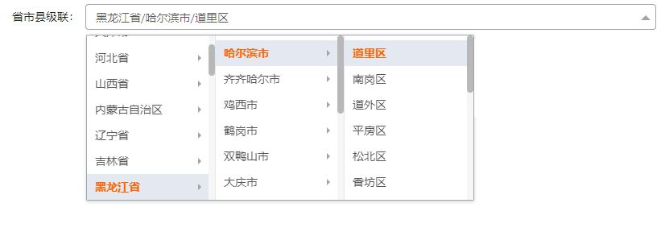

# 省市县三级联动组件文档

## 参数

| 参数名         | 类型   | 默认值   | 必填 | 说明                              |
|----------------|--------|----------|------|-----------------------------------|
| value(v-modal) | String |          | 是   | 绑定值                            |
| type           | String | cascader |      | 控件的显示类型 |
| width          | String | 100%     |      | 控件的宽度                        |

### 1.

- `cascader` 级联样式
   
- `select` 下拉样式
   
