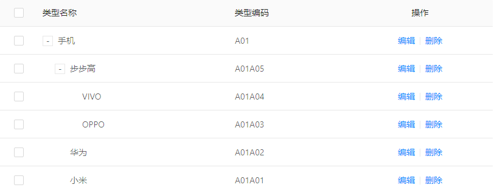
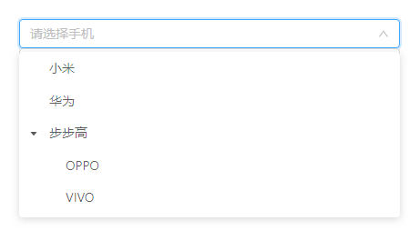

# JCategorySelect  帮助文档

分类字典选择器

使用前请在 `系统管理 --> 分类字典` 处配置字典，下图为示例配置



## 效果展示



## 引用方式

``` js
import JCategorySelect from '@/components/jeecg/JCategorySelect'
```

``` html
<j-category-select/>
```

## 参数文档

| 参数名         | 类型    | 默认值   | 备注                                     |
|----------------|---------|----------|------------------------------------------|
| pcode          | String  | ""       | 起始选择code，见配置的分类字典的类型编码 |
| value(v-model) | String  | ""       | 选择的值                                 |
| placeholder    | String  | "请选择" | 占位内容                                 |
| disabled       | Boolean | false    | 是否禁用                                 |
| condition      | String  | "{}"     | 查询条件，传一个JSON字符串               |
| multiple       | Boolean | false    | 是否支持多选                             |

## 示例

``` html
<template>
  <a-card>
    <j-category-select v-model="value" pcode="A01" placeholder="请选择手机"/>
  </a-card>
</template>

<script>
  import JCategorySelect from '@/components/jeecg/JCategorySelect'
  export default {
    name: 'App',
    components: { JCategorySelect },
    data() {
      return {
        value: ""
      }
    }
  }
</script>
```