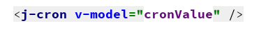
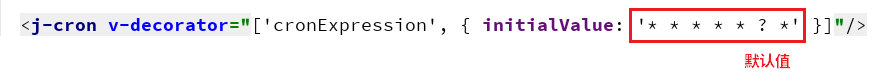

# JCron 帮助文档

## 效果展示


## 引用方式

``` js
import JCron from "@/components/jeecg/JCron";
```

``` html
<j-cron />
```

## 设置默认值

### v-model 方式




### a-form 表单方式



``` html
<j-cron v-decorator="['cronExpression', { initialValue: '* * * * * ? *' }]"/>
```