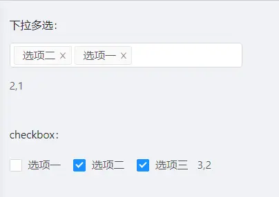

# JMultiSelectTag 多选组件


## 组件功能
   实现下拉/checkbox多选功能。

## 示例代码

----
```vue
<template>
  <a-form>
    <a-form-item label="下拉多选" style="width: 300px">
      <j-multi-select-tag
        v-model="selectValue"
        :options="dictOptions"
        placeholder="请做出你的选择">
      </j-multi-select-tag>
      {{ selectValue }}
    </a-form-item>

    <a-form-item label="checkbox">
      <j-multi-select-tag
        v-model="checkboxValue"
        :options="dictOptions"
        type="checkbox">
      </j-multi-select-tag>
      {{ checkboxValue }}
    </a-form-item>
  </a-form >
</template>

<script>
  import JMultiSelectTag from '@/components/dict/JMultiSelectTag'
  export default {
    components: {JMultiSelectTag},
    data() {
      return {
        selectValue:"",
        checkboxValue:"",
        dictOptions:[{
          label:"选项一",
          value:"1"
        },{
          label:"选项二",
          value:"2"
        },{
          label:"选项三",
          value:"3"
        }]
      }
    }
  }
</script>
```

## 参数配置

| 参数           | 类型   | 必填 |说明|
|--------------|---------|----|---------|
| placeholder      |string   | | placeholder |
| disabled      |Boolean   | | 是否禁用 |
| type      |string   | | 多选类型 select/checkbox 默认是select |
| dictCode      |string   | | 数据字典编码或者表名,显示字段名,存储字段名拼接而成的字符串,如果提供了options参数 则此参数可不填|
| options      |Array   | | 多选项,如果dictCode参数未提供,可以设置此参数加载多选项 |
| spliter |string| | 选项分隔符，默认以逗号分隔 |
| popContainer|string| 非 | 父节点对应的CSS 选择器,内部使用`document.querySelector`选择父节点，如设置`.pnode`,则找到有class为pnode的节点然后渲染下拉框  |


