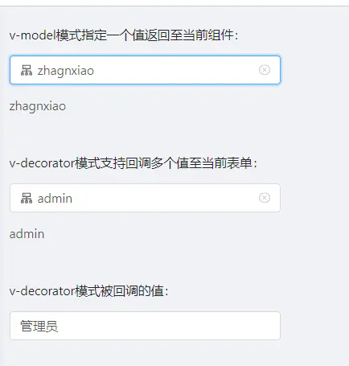
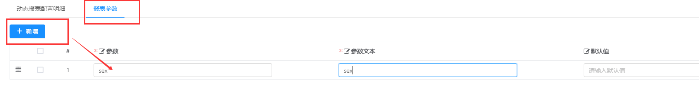

JPopup 弹窗选择组件
===

1.参数配置

| 参数           | 类型   | 必填 |说明| 版本 |
|--------------|---------|----|---------|  --- |
| placeholder      |string   | | placeholder ||
| code      |string   | | online报表编码 ||
| orgFields      |string   | | online报表中显示的列,多个以逗号隔开 ||
| destFields      |string   | | 回调对象的属性,多个以逗号隔开,其顺序和orgFields一一对应 ||
| field      |string   | | v-model模式专用,表示从destFields中选择一个属性的值返回给当前组件 ||
| triggerChange      |Boolean   | | v-decorator模式下需设置成true ||
| callback(事件)      |function   | | 回调事件,v-decorator模式下用到,用于设置form控件的值 ||
|multi     |Boolean   | | 是否支持多选，默认值false ||
|param  |object   | | 动态参数对象，在online报表参数里手动新增记录，然后就可以在自己页面里传递同名参数，作为数据查询条件，如果是字符串类型需要设置成**双引号内套单引号**的格式 如{name:"'admin'"}。以上用法说明适用于2.4.6及其以前版本  |2.4.6-  |
|param   |object   | | 动态参数对象，支持传入和查询字段、报表参数同名的属性，如：{name:'admin'}，如果实际数据是数值需要配置类型为：数值类型。以上用法说明适用于3.0.0及其以后版本 ，具体参考下方## param用法详解 |3.0.0+|
| sorter | String | | 默认排序列，使用方法：列名=desc\|asc。例：`age=asc` | `v_3.4.5` |

2.使用示例

----
```vue
<template>
  <a-form :form="form">
    <a-form-item label="v-model模式指定一个值返回至当前组件" style="width: 300px">
      <j-popup
        v-model="selectValue"
        code="user_msg"
        org-fields="username,realname"
        dest-fields="popup,other"
        field="popup"/>
      {{ selectValue }}
    </a-form-item>

    <a-form-item label="v-decorator模式支持回调多个值至当前表单" style="width: 300px">
      <j-popup
        v-decorator="['one']"
        :trigger-change="true"
        code="user_msg"
        org-fields="username,realname"
        dest-fields="one,two"
        @callback="popupCallback"/>
      {{ getFormFieldValue('one') }}
    </a-form-item>

    <a-form-item label="v-decorator模式被回调的值" style="width: 300px">
      <a-input v-decorator="['two']"></a-input>
    </a-form-item>


  </a-form >
</template>

<script>
  import JPopup from '@/components/jeecgbiz/JPopup'
  export default {
    components: {JPopup},
    data() {
      return {
        form: this.$form.createForm(this),
        selectValue:"",
      }
    },
    methods:{
      getFormFieldValue(field){
        return this.form.getFieldValue(field)
      },
      popupCallback(row){
        this.form.setFieldsValue(row)
      }
    }
  }
</script>
```


----
param参数使用示例：
~~~
<template>
  <a-card>

    <div>


      <a-form layout="inline" :form="form">
        <a-button @click="toggleTempParam('admin')">admin</a-button>
        <a-button @click="toggleTempParam('jeecg')">jeecg</a-button>

        <!-- JPopup示例 -->
        <a-row :gutter="24">
          <a-col :span="12">
            <a-form-item label="JPopup示例">
              <j-popup :param="tempParam" v-model="formData" code="report_user" field="name" orgFields="username" destFields="name" :multi="true"/>
            </a-form-item>
          </a-col>
          <a-col :span="12">选择的值(v-model)：{{ formData }}</a-col>
        </a-row>

      </a-form>
    </div>

  </a-card>
</template>
<script>

  export default {
    data() {
      return {
         form: this.$form.createForm(this),
         tempParam:{username:"'admin'"},
         formData:''
      }
    },
    methods:{
        toggleTempParam(key){
          this.tempParam['username'] = "'"+key+"'"
        }
    }
  }
</script>
~~~

-------------------------------
## param用法详解：
`version 3.0`
#### 场景1：使用现有的参数传值
报表sql：`select username from sys_user where sex = '${sex}'`
描述：上述sql中，有一个参数sex，那么在实际页面中使用j-popup组件时可以给其传值：
~~~
<j-popup :param="popParam" ....../>
...
export default {
    data() {
      return {
         popParam:{sex:'1'}
      }
    }
  }

~~~
*注意：这里是sql语句中申明的参数才能通过param传值*

---

#### 场景2：使用现有的结果字段传值
报表sql：`select username,realname from sys_user`
描述：上述sql中，有两个查询字段username,realname,想要在param中使用这两个字段，必须勾选字段的查询状态

~~~
<j-popup :param="popParam" ....../>
...
export default {
    data() {
      return {
         popParam:{username:'admin'}
      }
    }
  }

~~~
*注意：这里是select结果字段+配置了查询条件 才能通过param传值*

---

#### 场景3：使用自定义参数传值
报表sql：`select username,realname,sex from sys_user`
描述：上述sql中，没有显示的在sql语句中申明参数，然后字段配置时也没有设置查询条件，但是页面使用j-popup组件时需要根据性别(sex)字段筛选数据
配置：手动增加报表参数

页面代码如下：
~~~
<j-popup :param="popParam" ....../>
...
export default {
    data() {
      return {
         popParam:{sex:'1'}
      }
    }
  }

~~~
*注意： 这里sex必须在select查询出的字段中，然后手动添加报表参数后才能通过param传值，即如果sys_user有字段birthday，但是并没有查询，则无法使用param传值。*

---