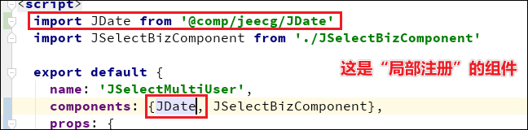
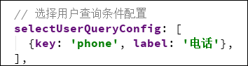
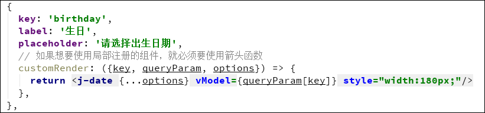

# JSelectMultiUser 用户多选组件

[TOC=2,9]

## 参数配置

| 参数           | 类型   | 必填 |说明|
|--------------|---------|----|---------|
| value      |Number   | | 选中默认值 |
| valueKey|String| | 自定义用于存储的字段 默认`username`|
| displayKey|String| | 自定义用于展示的字段 默认`realname `|
| multi      |Boolean   | | 是否多选 默认false |
| disabled      |Boolean   | | 是否禁用 默认false|
| queryConfig | Array | | 自定义查询条件 |


### queryConfig参数配置

>[info] 注：不止`JSelectMultiUser`可以使用`queryConfig`属性来自定义查询条件，任何基于`JSelectBizComponent`的组件都可以使用该属性，配置方式不变。

| 参数           | 类型   | 必填 |说明|
|--------------|---------|----|---------|
| key | string | ✔️ | 唯一key，查询条件传给后台的字段名 |
| label | string | | 组件左侧标签 |
| dictCode | string | | 如果包含 dictCode，那么就会显示成下拉框 |
| placeholder | string | | 占位符，默认值：请输入[label] \| 请选择[label] |
| customRender| function({key, queryParam, options}) | | 自定义组件渲染，如果想要使用`局部注册`的组件，就必须要使用箭头函数。 |

## 使用示例


--------

```html
<template>
  <a-form :form="form">
    <a-form-item label="用户选择v-decorator" style="width: 500px">
      <j-select-multi-user v-decorator="['users']"/>
      {{ getFormFieldValue('users') }}
    </a-form-item>

    <a-form-item label="用户选择v-model" style="width: 500px">
      <j-select-multi-user v-model="users" ></j-select-multi-user>
      {{ users }}
    </a-form-item>

  </a-form >
</template>

<script>
  import JSelectMultiUser from '@/components/jeecgbiz/JSelectMultiUser'
  export default {
    components: {JSelectMultiUser},
    data() {
      return {
        form: this.$form.createForm(this),
        users:"",
      }
    },
    methods:{
      getFormFieldValue(field){
        return this.form.getFieldValue(field)
      }
    }
  }
</script>
```

### 自定义查询条件示例





> customRender 示例
```js
  {
    key: 'birthday',
    label: '生日',
    placeholder: '请选择出生日期',
    // 如果想要使用局部注册的组件，就必须要使用箭头函数
    customRender: ({key, queryParam, options}) => {
      return <j-date {...options} vModel={queryParam[key]} style="width:180px;"/>
    },
  }
```



---------

### 自定义存储、展示字段

```html
<template>
  <a-form :form="form">
    <a-form-item label="用户选择v-decorator" style="width: 500px">
    <j-select-multi-user valueKey="realname" displayKey="username" v-decorator="['users']"/>
      {{ getFormFieldValue('users') }}
    </a-form-item>

    <a-form-item label="用户选择v-model" style="width: 500px">
     <j-select-multi-user valueKey="realname" displayKey="username" v-model="users" />
      {{ users }}
    </a-form-item>

  </a-form >
</template>

<script>
  import JSelectMultiUser from '@/components/jeecgbiz/JSelectMultiUser'
  export default {
    components: {JSelectMultiUser},
    data() {
      return {
        form: this.$form.createForm(this),
        users:"",
      }
    },
    methods:{
      getFormFieldValue(field){
        return this.form.getFieldValue(field)
      }
    }
  }
</script>
```

