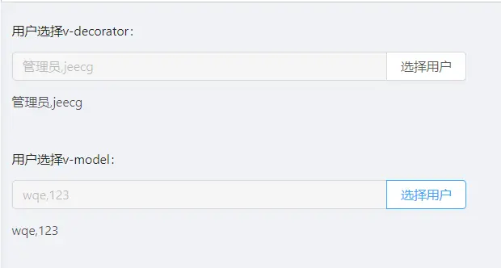

JSelectUserByDep 根据部门选择用户
===

1.参数配置

| 参数           | 类型   | 必填 |说明|
|--------------|---------|----|---------|
| modalWidth      |Number   | | 弹框宽度 默认1250 |
| disabled      |Boolean   | | 是否禁用 |
| store|String| | 存储字段 |
| text|String| | 显示字段|
| multi|Boolean   | | 是否多选 默认true |

2.使用示例

----
```vue
<template>
  <a-form :form="form">
    <a-form-item label="用户选择v-decorator" style="width: 500px">
      <j-select-user-by-dep v-decorator="['users']"/>
      {{ getFormFieldValue('users') }}
    </a-form-item>

    <a-form-item label="用户选择v-model" style="width: 500px">
      <j-select-user-by-dep v-model="users" ></j-select-user-by-dep>
      {{ users }}
    </a-form-item>

  </a-form >
</template>

<script>
  import JSelectUserByDep from '@/components/jeecgbiz/JSelectUserByDep'
  export default {
    components: {JSelectUserByDep},
    data() {
      return {
        form: this.$form.createForm(this),
        users:"",
      }
    },
    methods:{
      getFormFieldValue(field){
        return this.form.getFieldValue(field)
      }
    }
  }
</script>
```

