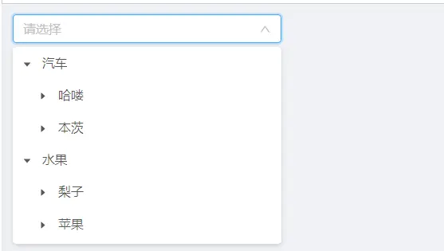

JTreeDict 分类字典树形下拉组件
===

1.参数配置

| 参数           | 类型   | 必填 |说明|
|--------------|---------|----|---------|
| placeholder      |string   | | placeholder |
| disabled      |Boolean   | | 是否禁用 |
| parentCode    |string   | | 指定一个节点的编码,加载该节点下的所有字典数据,若不指定，默认加载所有数据 |
| field         |string   | | 指定当前组件需要存储的字段 可选: id(主键)和code(编码) 默认是id|
| async         |Boolean  | | 是否异步加载,对于数据量大的字典数据,建议设置成true |

2.使用示例

```
<template>
  <div>
    <j-tree-dict v-model="editorValue" field="code" :async="false" style="width: 300px"/>
    {{ editorValue }}
  </div>
</template>

<script>
  import JTreeDict from '@/components/jeecg/JTreeDict'
  export default {
    components: {JTreeDict},
    data() {
      return {
        form: this.$form.createForm(this),
        editorValue:'',
      }
    }
  }
</script>
```

