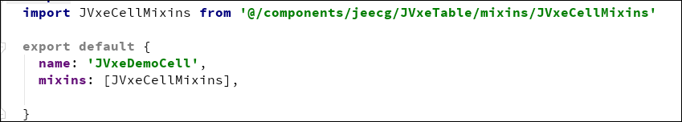
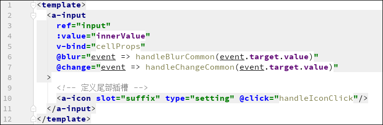
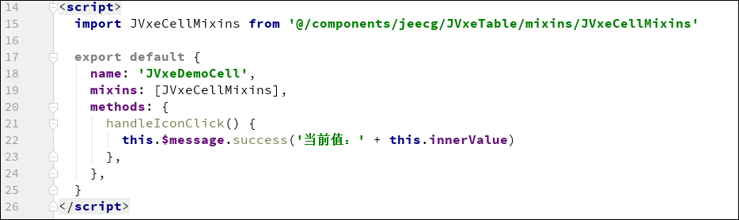
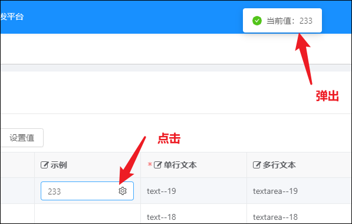
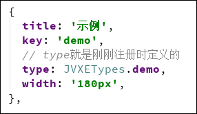

# 封装自定义组件详细教程

[TOC]

本篇文章将带领你编写行编辑的自定义组件，实现更加高级的功能。

## 一、准备工作

建议自定义组件都放到`src/components/JVxeCells`目录下，方便管理。
如果需要分类，可以在该目录下新建个目录，例如本次示例新建一个`demo`文件夹

然后再新建一个`.vue`文件，该文件就是自定义组件的实际实现。

如上图所示，我新建了一个 `JVxeDemoCell.vue` 文件，接下来就需要在这个文件里写组件的实际功能代码了。

## 二、封装功能
打开组件文件，引入公共混入 **（重要）** ，
`import JVxeCellMixins from '@/components/jeecg/JVxeTable/mixins/JVxeCellMixins'`

每个自定义组件都**必须**引入该混入，因为这里面封装了组件所必要的参数、变量和方法。

### JVxeCellMixins详解
#### 混入参数（props）
| 参数名        | 类型   | 解释                                 |
|---------------|--------|--------------------------------------|
| value         | any    | 绑定的值                             |
| row           | object | 当前行的数据                         |
| column        | object | 当前列的配置                         |
| params        | object | 组件公共参数                         |
| renderOptions | object | 渲染选项                             |
| renderType    | string | 渲染类型（ editer、spaner、default） |
#### 混入变量（data）
| 变量名     | 类型 | 解释                                  |
|------------|------|---------------------------------------|
| innerValue | any  | `value`经过`setValue()`增强（详见：“自定义组件增强”章节）处理后的值 |
#### 混入计算属性（computed）
| 属性名       | 类型   | 解释                                                                                              |
|--------------|--------|---------------------------------------------------------------------------------------------------|
| caseId       | string | JVXETable实例的唯一ID                                                                             |
| type         | string | 组件type，对应`JVXETypes`，对应注册时填写的`type`，用去区别多个不同的type但用相同的一个组件时判断 |
| originColumn | object | 原始列配置（用户手写的配置列，可以在这里获取自定义参数）                                          |
| cellProps    | object | 当前组件绑定的props                                                                               |
#### 混入方法（methods）
* `trigger(name, event = {}, args = [])
`
    触发事件
* `handleBlurCommon(value)
`
    公共处理blur事件
* `handleChangeCommon(value)
`
    公共处理change事件

### 示例：简单封装
简单封装就是只封装`可编辑`模式下的组件，在实际使用中，组件是不显示出来的，只有当点击单元格的时候才会显示出组件，好处就是可以极大的提升性能。
所以简单封装只需要一个vue组件就可完成。
完整示例：

注册并查看效果（注册方法见：三、最终注册）

### 示例：高级封装

##  三、最终注册

推荐在`src/components/JVxeCells/install.js`文件内完成注册，可以做到开箱即用。
注册只需要引入组件文件、扩展JVXETypes、调用installCell方法即可完成注册。
示例：

## 四、使用示例

# 参考示例

简单封装：`src/components/jeecg/JVxeTable/components/cells/JVxeCheckboxCell.vue`
高级封装：`src/components/JVxeCells/JVxeSelectDictSearchCell.js`
