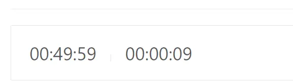
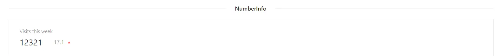
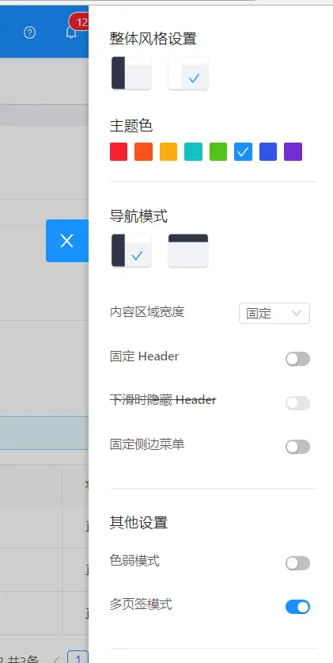
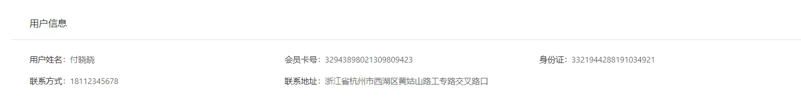
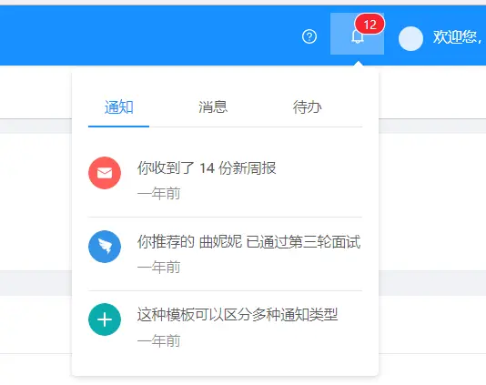
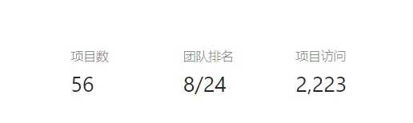
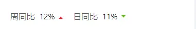

components包下文件描述
===

> ### 1._util
> 存放自定义函数 详细见代码注释

> ### 2.AvatarList
> 显示头像群并支持tip，用法参考src\views\Home.vue（如下图）
> 

> ### 3.chart
> 存放各种图表相关的组件,条形图柱形图折线图等等 具体用法参考首页

> ### 4.countDown
> 一个倒计时组件，用法参考home页,简单描述,该组件有3个属性,
> target(时间/毫秒数)必填，
> format(function,该方法接收一个毫秒数的参数,用于格式化显示当前倒计时时间)非必填,
> onEnd倒计时结束触发函数
> 

> ### 5.dict
> 数据字典专用，用法参考文件夹下readme文件

> ### 6.Ellipsis
> 字符串截取组件,可以指定字符串的显示长度,并将全部内容显示到tip中,简单使用参考src\views\system\PermissionList.vue

> ### 7.jeecg
> 该包下自定义了很多列表/表单中用到的组件 参考包下readme文件

> ### 8.jeecgbiz
> 该包下定义了一些业务相关的组件，比如选择用户弹框,根据部门选择用户等等

> ### 9.layouts+page
> 系统页面布局相关组件，比如登陆进去之后页面顶部显示什么，底部显示什么，菜单点击触发多个tab的布局等等 一般情况不需要修改

> ### 10.menu
> 菜单组件，俩个，一个折叠菜单一个正常显示的菜单

> ### 11.NumberInfo
> 数字信息显示组件 如下图
> 

> ### 12.online
> 该包下封装了online表单的相关组件,用于展示表单各种控件,验证表单等等,相关用法参考readme

> ### 13.setting
> 该包下封装了首页风格切换等功能如下图
> 

> ### 14.table
> 一个二次封装的table组件,用于展示列表，参考readme

> ### 15.tools
> #### Breadcrumb.vue：面包屑二次封装,支持路由跳转
> #### DetailList.vue：详情展示用法参考src\views\profile\advanced\Advanced.vue(效果如下图)
> 
> ````
> 个人认为该页面代码有两点值得学习：
> 1.vue provide/inject的使用
> 2.该页面css定义方式,只定义一个顶层class,其余样式都定义在其下,这样只要顶层class不和别的页面冲突,整个页面的样式都是唯一生效的
> ````
> #### FooterToolBar.vue:fixed定位的底部，通过是否定义内部控件的属性slot="extra"决定是左浮动或是右浮动
> #### HeaderNotice.vue:首页通知(如下图)
> 
> #### HeaderInfo.vue:上下文字布局（如下图）
> 
> #### Logo.vue:首页左上侧的log图
> 
> #### UserMenu.vue:首页右上侧的内容
> 

> ### 16.trend
> 趋势显示组件参考首页（如下图）
> 

