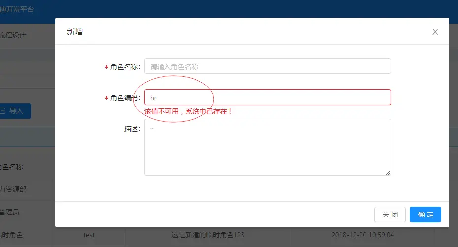

duplicateCheck 表单字段重复校验通用JS
===

重复校验效果：


- **编码排重使用示例**   

1.引入排重接口,代码如下:  
 
```
import { duplicateCheck } from '@/api/api'
  ```
2.找到编码必填校验规则的前端代码,代码如下:  
  
```
<a-input placeholder="请输入编码" v-decorator="['code', validatorRules.code ]"/>

code: {
            rules: [
              { required: true, message: '请输入编码!' },
              {validator: this.validateCode}
            ]
          },
  ```
3.找到rules里validator对应的方法在哪里,然后使用第一步中引入的排重校验接口.  
  以用户online表单编码为示例,其中四个必传的参数有:  
    
```
  {tableName:表名,fieldName:字段名,fieldVal:字段值,dataId:表的主键},
  ```
 具体使用代码如下:  
 
```
    validateCode(rule, value, callback){
        let pattern = /^[a-z|A-Z][a-z|A-Z|\d|_|-]{0,}$/;
        if(!pattern.test(value)){
          callback('编码必须以字母开头，可包含数字、下划线、横杠');
        } else {
          var params = {
            tableName: "onl_cgreport_head",
            fieldName: "code",
            fieldVal: value,
            dataId: this.model.id
          };
          duplicateCheck(params).then((res)=>{
            if(res.success){
             callback();
            }else{
              callback(res.message);
            }
          })
        }
      },
```

