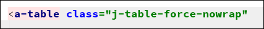
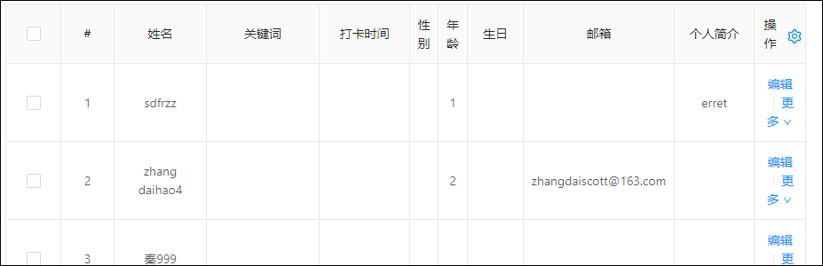
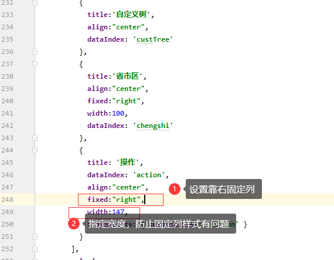
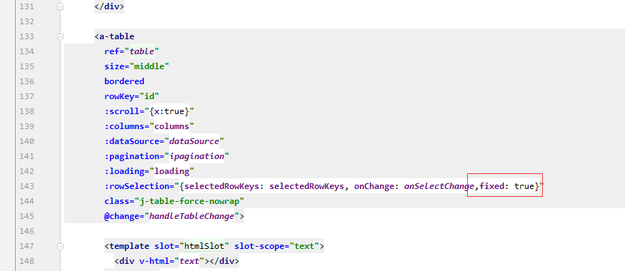
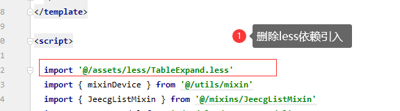
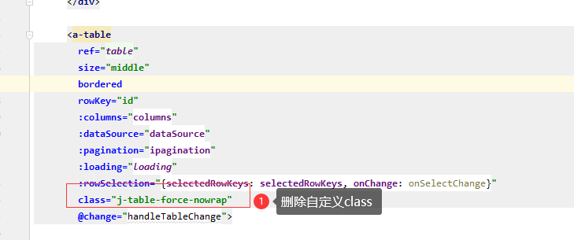
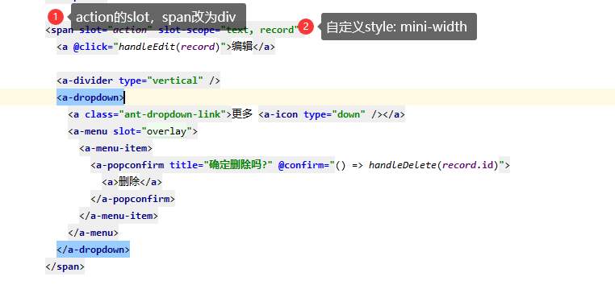
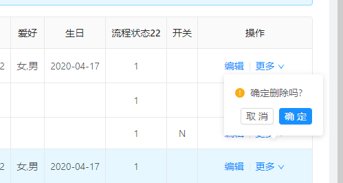

# 表格的换行与不换行

[TOC]

 

## 一、强制表格所有列不换行
> 此功能可以强制表格所有列不换行，过长会显示滚动条

### 弊端提醒
```
   *  1.会导致fixed属性失效，无法固定列。
   *  2.会导致列宽属性 width失效。
```
### 引入样式
首先必须引用以下样式代码
```
import '@/assets/less/TableExpand.less'
```

### Table添加class

仅需在 `a-table` 上添加一个 class 样式即可


```
class="j-table-force-nowrap"
```

### 添加前效果


### 添加后效果


## 二、强制表格不换行后，如何固定列和设置width呢？
>  20200506升级，代码生成器改造点：
> 1. 列表默认加上 class="j-table-force-nowrap"，强制列表不换行
> 2. 取消了操作列的默认固定（为了更好的移动自适应）
>   如果需要固定操作列，参考此文档

需在 `a-table` 上添加一个 属性  :scroll="{x:true}" 即可

需在 `column` 上添加一个 属性 fixed:"right", 同时最好指定宽度

如果需要固定选择框，则加上属性 `,fixed: true`

此时给非固定列字段加width也生效。

## 三、如何删除强制不换行样式，切换至原始写法
删除样式引入

删除样式属性



## 常见问题解答

### 1. 操作列太窄，导致删除提示框变形
解决方案
 

修改后的代码
```
<div style="min-width: 150px" slot="action" slot-scope="text, record">
  <a @click="handleEdit(record)">编辑</a>

  <a-divider type="vertical" />
  <a-dropdown>
    <a class="ant-dropdown-link">更多 <a-icon type="down" /></a>
    <a-menu slot="overlay">
      <a-menu-item>
        <a-popconfirm title="确定删除吗?" @confirm="() => handleDelete(record.id)">
          <a>删除</a>
        </a-popconfirm>
      </a-menu-item>
    </a-menu>
  </a-dropdown>
</div>
```

改之前效果

改之后的效果
