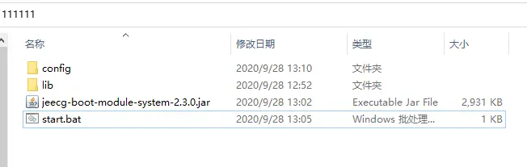

#  Springboot瘦身（lib和程序分开打包）
>[info] Version: 3.4.1+ 版本


## 1. 首先用mvn clean package正常打出jar包
这个jar包可能有几百兆大小，lib占了绝大多数
将jar包解压，将 BOOT-INF 下的 lib 包拿出单独存放

##  2. 修改jeecg-system-start 项目的pom重新打包
```
<build>
	<plugins>
		<plugin>
			<groupId>org.springframework.boot</groupId>
			<artifactId>spring-boot-maven-plugin</artifactId>
			<configuration>
				<layout>ZIP</layout>
				<includes>
					<include>
						<groupId>nothing</groupId>
						<artifactId>nothing</artifactId>
					</include>
				</includes>
			</configuration>
			<executions>
				<execution>
					<goals>
						<goal>repackage</goal>
					</goals>
				</execution>
			</executions>
		</plugin>
	</plugins>
</build>
```


再次用 mvn clean package 打出来的包就不包含lib了

##  3. 运行jar包
#`C:\111111\lib`为lib包路径，执行下面命令启动项目。

`java -Dloader.path=C:\111111\lib -jar jeecg-system-start-3.4.0.jar`

## 4.目录结构
>[warning] 注意：必须jar同级目录创建config，并把system下的yml拷贝到config里面





config内容截图


