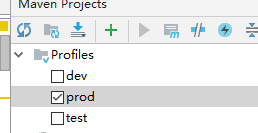
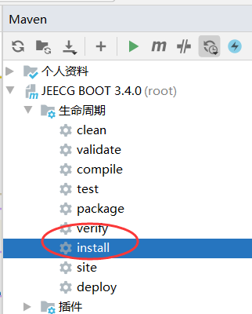
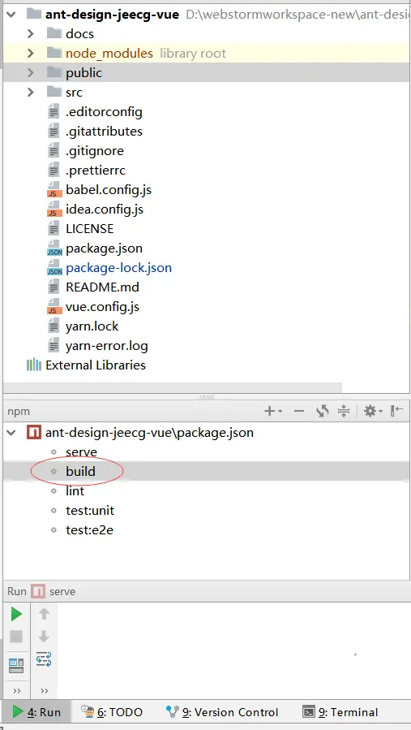
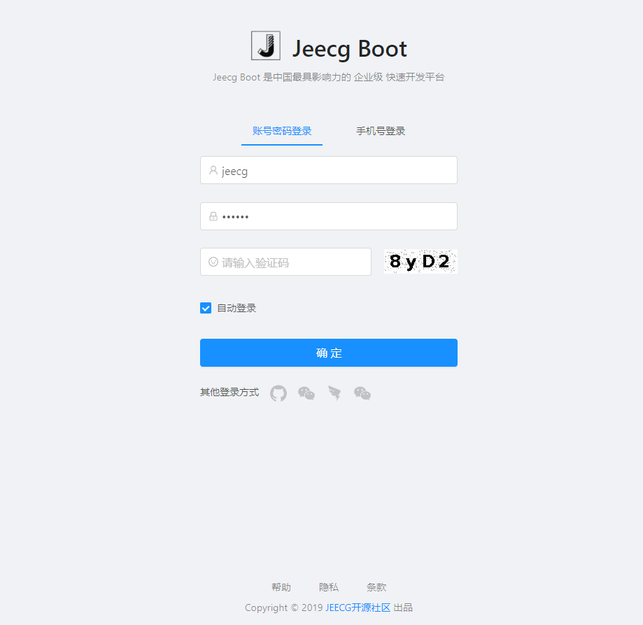

JAR部署方案 
===
>[info] Version: 3.4.2+ 版本

[TOC]

## 正式环境部署
>[info] - 后端服务通过JAR方式运行
> - 前端项目build的dist，部署到nginx

### 一、jeecg-boot项目打JAR包

- 1、修改配置文件 application-prod.yml
>[warning] 修改 数据库连接、缓存redis、上传附件等配置
> 


- 2、切换Maven为生产模式

  


- 3、通过jeecg-boot-parent打包
   


- 4、拿到 `jeecg-system-start-{版本号}.jar` 包


### 二、通过JAR方式启动后台
通过命令启动项目
```
Window启动命令：
java -jar jeecg-system-start-3.4.0.jar

Linux下后台进程启动命令：
nohup java -jar jeecg-system-start-3.4.0.jar >catalina.out 2>&1 &

关掉项目：
ps -ef|grep java
kill 进程号 
```

### 三、前台Vue2项目 `ant-design-vue-jeecg` build打包
- 1、修改接口地址配置 ` .env.production`
```
NODE_ENV=production
VUE_APP_API_BASE_URL=https://api.boot.jeecg.com
VUE_APP_ONLINE_BASE_URL=http://fileview.jeecg.com/onlinePreview
```

- 2、build打包
使用build命令打包项目

build完成后 ，会生成一个dist的目录。

- 3、nginx部署前端项目
拷贝dist下的代码到nginx安装目录下html目录中，即可

### 四、前台Vue2项目的nginx配置
> 方案说明：前端配置一个域名、后端配置一个域名，分别通过nginx映射。
- 示例中：java api的服务域名 `api.boot.jeecg.com` 通过ngnix映射域名到8080端口
- 示例中：vue2前端域名 `boot.jeecg.com`
>[warning] 提醒：请把配置中涉及的 `api.boot.jeecg.com` `boot.jeecg.com` 换成自己的域名

#### 前端nginx配置
- nginx监听：80端口
- 绑定域名(示例)：boot.jeecg.com
```
server {
		listen       80;
		server_name  前端访问域名;
		#解决Router(mode: 'history')模式下，刷新路由地址不能找到页面的问题
		location / {
			root   html;
			index  index.html index.htm;
			if (!-e $request_filename) {
				rewrite ^(.*)$ /index.html?s=$1 last;
				break;
			}
		}
	}
```

####  后端nginx配置
- nginx监听：80端口
- 绑定域名(示例)：api.boot.jeecg.com
```
    upstream api.boot.jeecg.com {
      server 127.0.0.1:8080;
     }  
	 
    server {
        listen       80;
        server_name  api.boot.jeecg.com;
        location / {
            root   html;
            index  index.html index.htm;
			proxy_pass  http://api.boot.jeecg.com;
			
			#ip remote_addr
			proxy_set_header X-Forwarded-Scheme  $scheme;
			proxy_redirect    off;     
			proxy_set_header  Host             $host;
			proxy_set_header  X-Real-IP        $remote_addr;
			proxy_set_header  X-Forwarded-For  $proxy_add_x_forwarded_for;
        }
    }
```
>[info] 提醒： 有的版本nginx配置需要加上 Upgrade 和Connection 协议头，不然WebSocket会404


### 五、访问应用
通过：http://你的域名 访问项目，出现如下页面，使用账户/密码：admin/123456 登录成功即可


### 六、Vue3前端部署
   [点击查看Vue3文档](http://help.jeecg.com/publish/quick.html)


