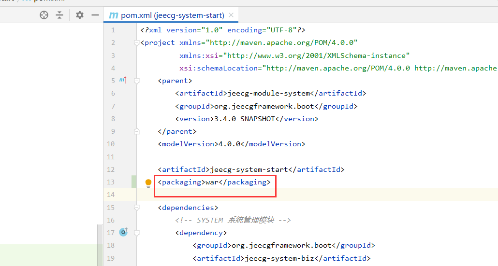
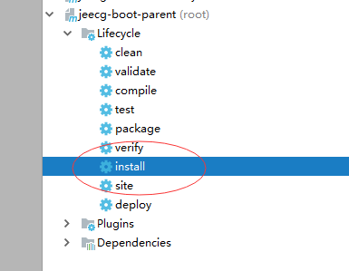

WAR部署方案
===
>[info] Version: 3.4+ 版本

## 正式环境部署
>[info] 采用nginx+tomcat部署方案
> 后端服务发布到tomcat中
> 前端部署到nginx中

### 一、后台项目jeecg-boot打war包
#### （1）后台项目 jeecg-module-system/jeecg-system-start 打war包之前要进行如下改动
1、pom.xml文件中项目格式设置为war
```
<packaging>war</packaging>
```
参考配置如下：


2、pom.xml文件删除插件spring-boot-maven-plugin
下面配置删除
```
<build>
   <plugins>
	<plugin>
		<groupId>org.springframework.boot</groupId>
		<artifactId>spring-boot-maven-plugin</artifactId>
	</plugin>
   </plugins>
</build>
```

3、注释掉WebSocketConfig的 ServerEndpointExporter注册方法
路径：`jeecg-boot-base/jeecg-boot-base-core/org.jeecg.config.WebSocketConfig`


5、修改配置文件application-prod.yml
- a.修改数据库连接 
- b.修改缓存redis配置
- c.修改上传附件配置

- d.切换生产模式打包

   
首先执行下jeecg-boot-parent的install 操作

然后 maven package 打war包


### 二、后台项目jeecg-boot部署到tomcat中
1、设置tomcat端口号 8080，设置tomcat编码 URIEncoding="UTF-8"
2、部署项目到tomcat的目录webapps/jeecg-boot工程目录下
部署完后通过http://localhost:8080/jeecg-boot/doc.html 访问项目接口地址，说明部署成功！！

```
注意：
1.tomcat解压war后的目录名称即你访问的根路径，这里是jeecg-boot
```
### 三、前台Vue2项目 `ant-design-vue-jeecg` build打包
- 1、修改接口地址配置 ` .env.production`
```
NODE_ENV=production
VUE_APP_API_BASE_URL=https://api.boot.jeecg.com
VUE_APP_ONLINE_BASE_URL=http://fileview.jeecg.com/onlinePreview
```

- 2、build打包
使用build命令打包项目

build完成后 ，会生成一个dist的目录。

- 3、nginx部署前端项目
拷贝dist下的代码到nginx安装目录下html目录中，即可

### 四、前台Vue2项目的nginx配置
> 方案说明：前端配置一个域名、后端配置一个域名，分别通过nginx映射。
- 示例中：java api的服务域名 `api.boot.jeecg.com` 通过ngnix映射域名到8080端口
- 示例中：vue2前端域名 `boot.jeecg.com`
>[warning] 提醒：请把配置中涉及的 `api.boot.jeecg.com` `boot.jeecg.com` 换成自己的域名

#### 前端nginx配置
- nginx监听：80端口
- 绑定域名(示例)：boot.jeecg.com
```
server {
		listen       80;
		server_name  前端访问域名;
		#解决Router(mode: 'history')模式下，刷新路由地址不能找到页面的问题
		location / {
			root   html;
			index  index.html index.htm;
			if (!-e $request_filename) {
				rewrite ^(.*)$ /index.html?s=$1 last;
				break;
			}
		}
	}
```

####  后端nginx配置
- nginx监听：80端口
- 绑定域名(示例)：api.boot.jeecg.com
```
    upstream api.boot.jeecg.com {
      server 127.0.0.1:8080;
     }  
	 
    server {
        listen       80;
        server_name  api.boot.jeecg.com;
        location / {
            root   html;
            index  index.html index.htm;
			proxy_pass  http://api.boot.jeecg.com;
			
			#ip remote_addr
			proxy_set_header X-Forwarded-Scheme  $scheme;
			proxy_redirect    off;     
			proxy_set_header  Host             $host;
			proxy_set_header  X-Real-IP        $remote_addr;
			proxy_set_header  X-Forwarded-For  $proxy_add_x_forwarded_for;
        }
    }
```
>[info] 提醒： 有的版本nginx配置需要加上 Upgrade 和Connection 协议头，不然WebSocket会404


五、访问应用

通过 `http://你的前端域名` 访问项目，出现如下页面说明成功。
账户/密码：admin/123456 


