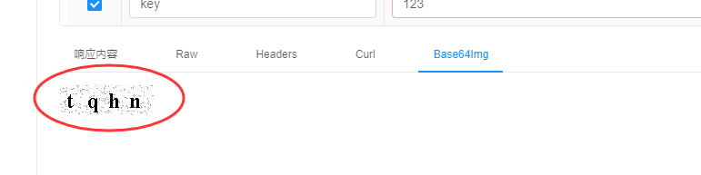
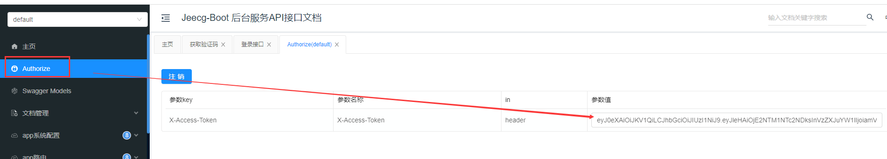
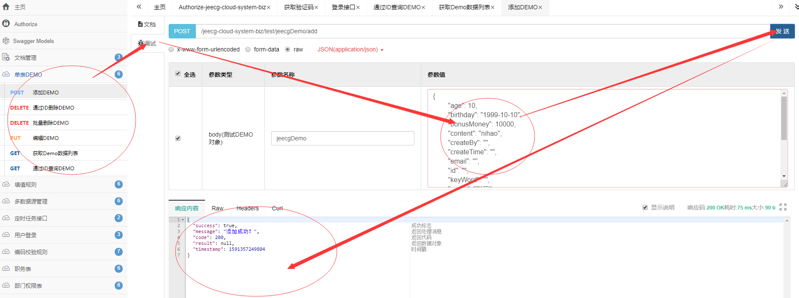
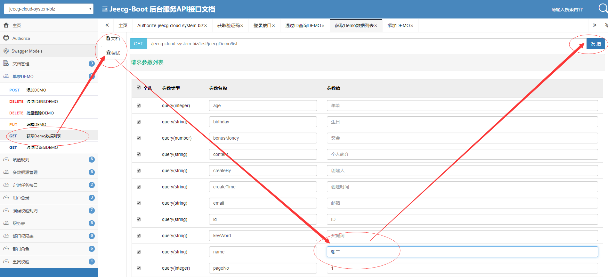
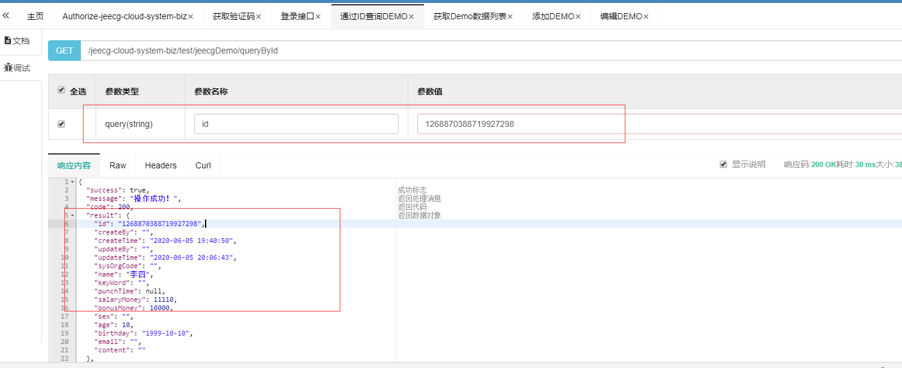
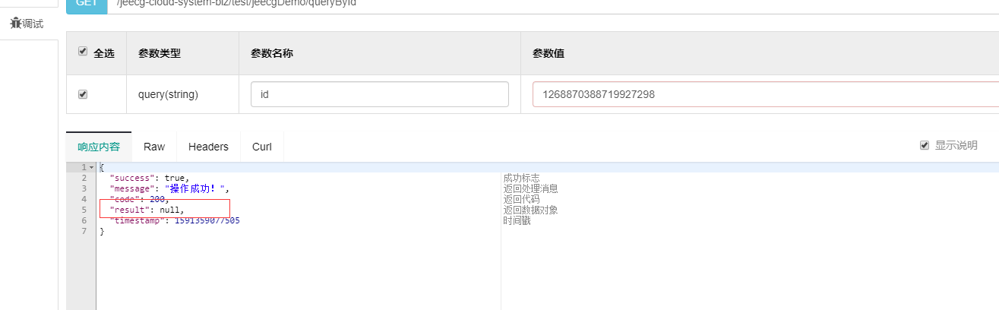

*前言 :使用swagger需要模拟登录获取token，这是测试接口的前提。*

**1.启动system项目,访问路径**：[http://localhost:8080/jeecg-boot](http://localhost:8080/jeecg-boot)

**2.获取验证码，按图操作，输入参数key的值，此处输入123，点击发送，获取验证码图片**

**3.登录,获取token**

登录参数说明
|  参数   |  说明   |
| --- | --- |
|   captcha  |   验证码  |
|   checkKey  |   获取验证码是输入的key的值，此例中为123  |
|   password  |   登录密码  |
|   username  |   登录用户账号  |

**4.拿到token，按图操作，保存token信息到请求头**

**5.测试接口-新增**

**6.测试接口-查询 根据name查询，拿到该用户的id**

**7.测试接口-修改 输入上述id和新的name,即可根据id修改name**

**8.根据id查询，输入上述id**

**9.根据id删除**

再次查询，result为空

