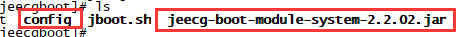

# JAR方式发布 配置代码生成

 
>[info]  Version: 2.2.0+ ，以JAR方式发布后，支持在线生成代码并下载。

## 配置步骤

### 1.  在JAR同级目录下创建一个config目录。

### 2.  将 `jeecg-boot-module-system\src\main\resources\jeecg` 整个目录，上传到config里面

上传后结果：

### 3. 重启JAR，即可支持代码生成
修改数据库和模板直接覆盖这个目录即可
