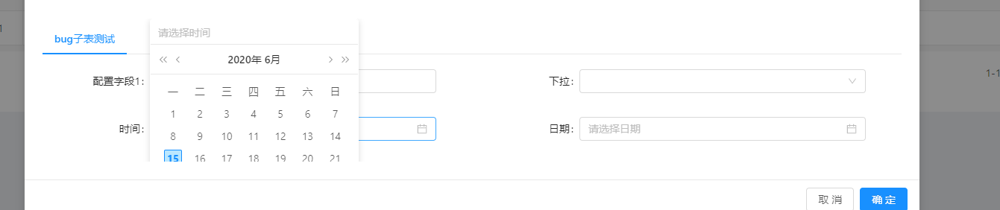

**样式问题：** 
`使用代码生成器生成主子表，一对一的子表有字段是日期或者下拉框的情况，表单页面可能会出现被遮挡的效果`
**如下：**

**优化步骤：**
1.给弹窗modal添加一个class

~~~
:class="'jee-outer-modal'"
~~~

2.在子表的form页面添加method：

~~~
getParentModal(){
  return document.querySelector('.jee-outer-modal')
},
~~~

3.在日期框或者下拉框上添加属性：

~~~
日期框
:getCalendarContainer="getParentModal"
~~~

~~~
下拉框
:getPopupContainer="getParentModal"
~~~