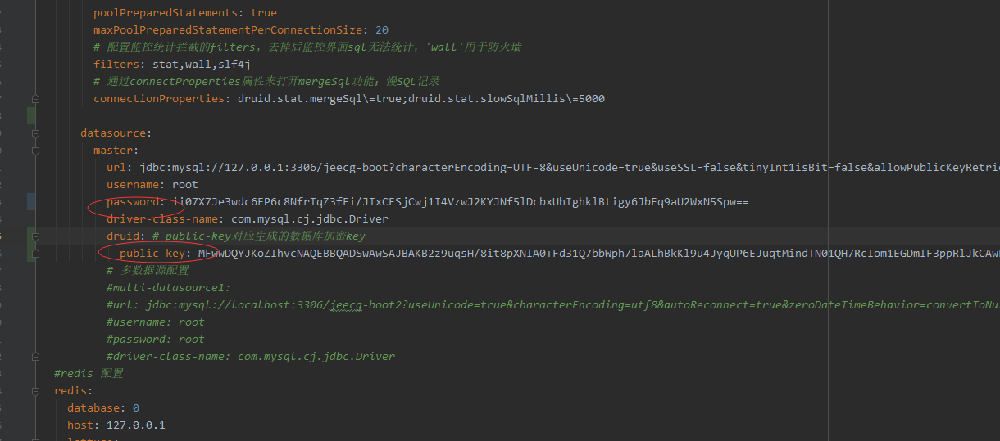

#### 第一步：执行如下命令
```
 java -cp [druid-1.1.17.jar仓库路径] [com.alibaba.druid.filter.config.ConfigTools] [密码]
```

 #命令示例
```
java -cp D:\druid\druid-1.1.21.jar com.alibaba.druid.filter.config.ConfigTools 123456

执行结果：
privateKey:MIIBVQIBADANBgkqhkiG9w0BAQEFAASCAT8wggE7AgEAAkEAoHbP26qwf/yK3ylc0gDT4V3fVDtttamHuVoAuEGQqX27gnKpQ/oQm6q0yKd1M3TVAftFwiibUQYOYgXemlGUmQIDAQABAkAa6dKTFV3lGYZxR4656kmfUw9SIWWVQonxHJdiUBzjUF9DJG87Y9A0LH2vINg5ElzyqbHO8oYjBqmx/qeq0EABAiEA1EVnjxY3sF1oYq3Yyf+SiJIcNBg7jeNSn46YZP/UnBkCIQDBhT+WpI8OE9sOwobzoq68HD8ax0NiofG9QArf24PMgQIgd1HYJ4deoGWxMp70WH+v99LhxarFdzmMDSKTqVphQakCIQCU5OjgBwzqT+yjlpgurGS05ybGe7olEWTlr3iudD8cAQIhAKUiw4GkHtb52wPFodIJ0CqsDZx8ArIhkr7HlCkH4laJ
publicKey:MFwwDQYJKoZIhvcNAQEBBQADSwAwSAJBAKB2z9uqsH/8it8pXNIA0+Fd31Q7bbWph7laALhBkKl9u4JyqUP6EJuqtMindTN01QH7RcIom1EGDmIF3ppRlJkCAwEAAQ==
password:ii07X7Je3wdc6EP6c8NfrTqZ3fEi/JIxCFSjCwj1I4VzwJ2KYJNf5lDcbxUhIghklBtigy6JbEq9aU2WxN5Spw==
```

 #截图示例


#### 第二步：修改配置，将publicKey和密码填写到application-dev.xml对应位置
