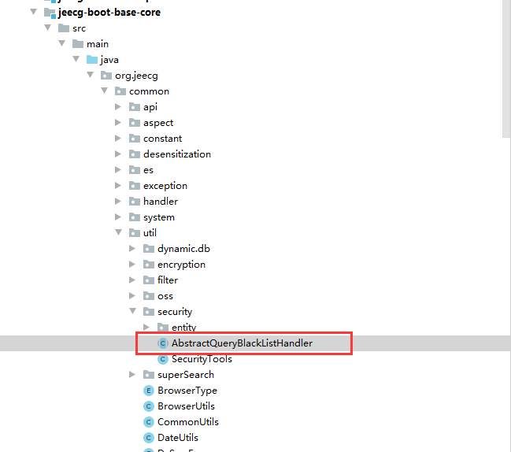

### 前言:
在jeecg系统中有很多地方允许用户自己定义sql语句，如**online报表配置sql**、如**字典组件配置查询字段**等等，这些定义的sql语句或是配置的查询字段名，可能会造成一些敏感数据的泄露。所以需要一个配置，申明特定的表或字段是禁止查询的。
### 配置类：
`org.jeecg.common.util.security.AbstractQueryBlackListHandler`

### 配置说明：

1.往ruleMap中配置键值对，key是表名，value是字段，多个字段以逗号隔开
2.`ruleMap.put("sys_user", "*")` 表示 sys_user所有的字段不支持查询
3.`ruleMap.put("sys_user", "username,password")`表示sys_user中的username和password不支持查询

### 测试online报表效果
定义sql： `select password from sys_user` 解析报错：
