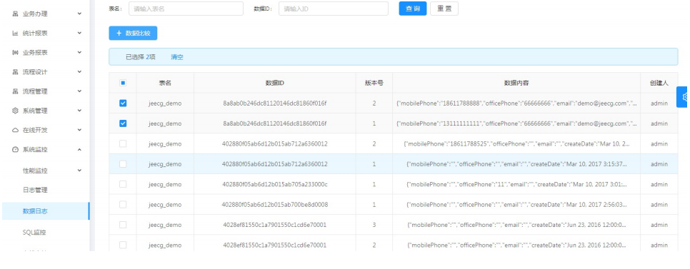
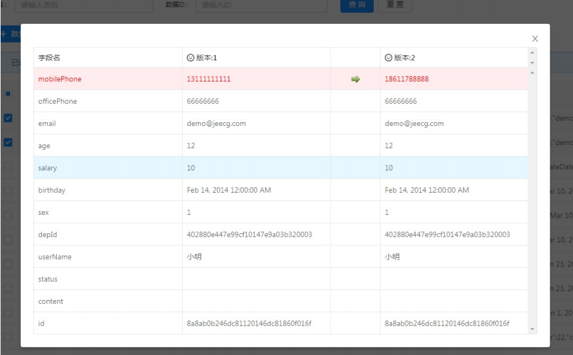

数据快照功能如何用？
===
>[info] 对应菜单[系统监控]->[数据日志]

> 数据快照功能： 记录每次单据变更内容，保存版本号
> 如果你需要记录某个表单的每次详细更新记录，就需要用到这个
> 此功能会将表单每次变更的数据内容以版本方式存储，提供对比功能，查看每个字段变更情况

1. 记录数据快照接口
```
//业务表单记录数据变更日志
sysDataLogService.addDataLog(String tableName, String dataId, String dataContent)
```

2. 对比数据快照变更内容



