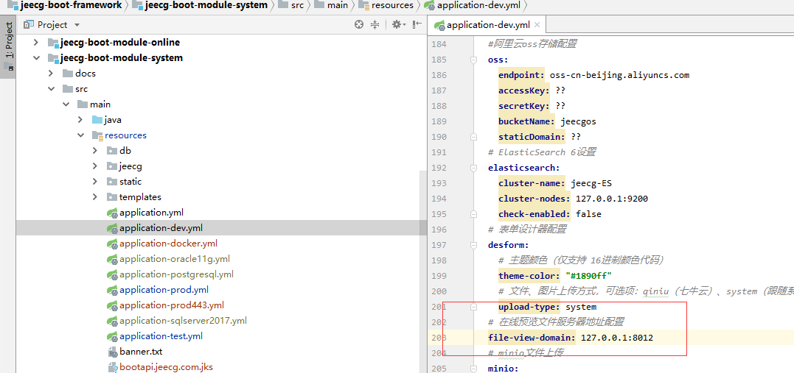
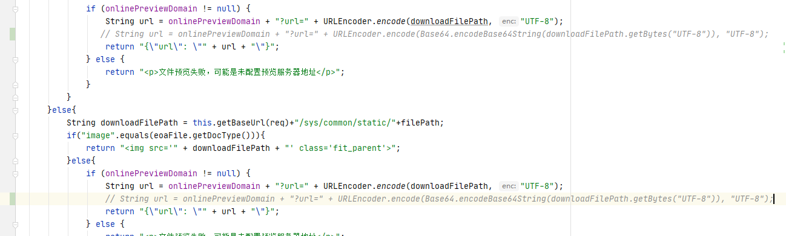

# 在线预览服务软件 kkFileView
*使用: OA模块 【我的文档】*


### Docker容器环境环境运行

*   拉取镜像

~~~bash
docker pull keking/kkfileview:v2.2.1
~~~

*   运行

~~~bash
docker run -it -p 8012:8012 keking/kkfileview:v2.2.1
~~~


部署文档 （docker拉取失败的话可以按此文档下载发行版运行）
https://kkfileview.keking.cn/zh-cn/docs/production.html


开源项目
https://gitee.com/kekingcn/file-online-preview/releases

默认端口
http://127.0.0.1:8012


服务安装完成，修改服务地址配置



-------
备注：

```
docker pull keking/kkfileview
docker run -it -p 8012:8012 keking/kkfileview
```

自[KkFileview-v3.3.0](https://gitee.com/kekingcn/file-online-preview/releases/v3.3.0)之后，文件预览地址采用base64+urlencode双编码，但是jeecg中使用的依然只有urlencode编码，所以采用新版的需要修改代码(使用注释的代码)：
~~~
FileManageApiController类 doPreview方法
~~~


----
如果跳转预览的地址带上了原项目的路径，需要修改yml文件配置的地址（带上http即可）：
~~~
# 在线预览文件服务器地址配置
file-view-domain: http://127.0.0.1:8012
~~~
