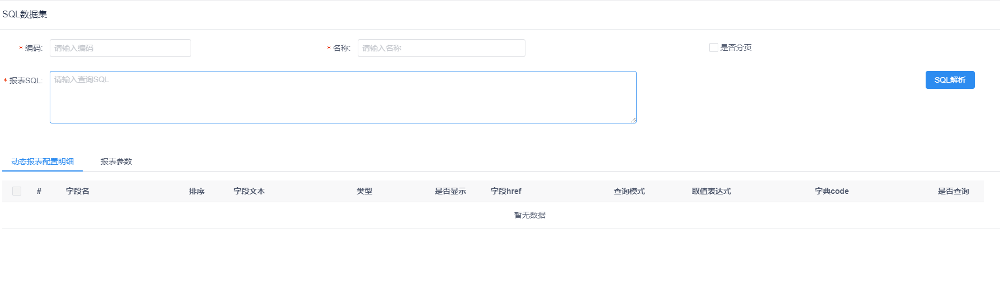
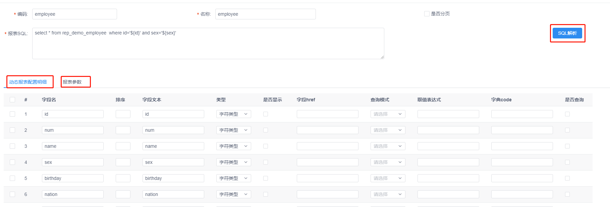
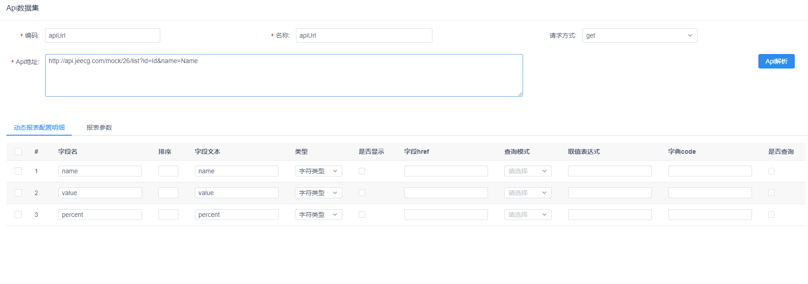

# 积木报表设计器数据集使用
在线设计报表时,在设计报表页面,通过添加SQL数据集和api数据集来完成报表的设计和展示

[TOC]
## 1. SQL数据集
在报表设计页面,在数据集管理中选择SQL数据集

填写必填参数 再填写报表SQL
> 需要注意 填写的SQL必须是在项目数据库中查询到数据
> SQL语句支持参数查询,传递的参数必须符合规范,填写完成后点击右边的SQL解析按钮

解析后的动态报表配置明细为SQL查询的实体字段名,报表参数为SQL语句中动态参数
在报表参数中参数和参数文本对应SQL语句中参数 填写默认值后预览可根据默认值展示数据

## 2. api数据集
在报表设计页面,在数据集管理中选择api数据集

填写编码和名称后选择请求方式,在api地址中填写api的请求地址
> 注意:api请求的参数必须是json格式并且json开头为data,后面的数据为json数组或json对象
> 如果没有data直接返回json数组或json对象

api请求的地址支持传递参数,在api地址后拼接参数后,需要在报表参数中手动添加参数以及参数文本和默认值

填写完成后点击api解析将解析的参数和api参数保存,即可在设计页面根据报表参数设计报表

