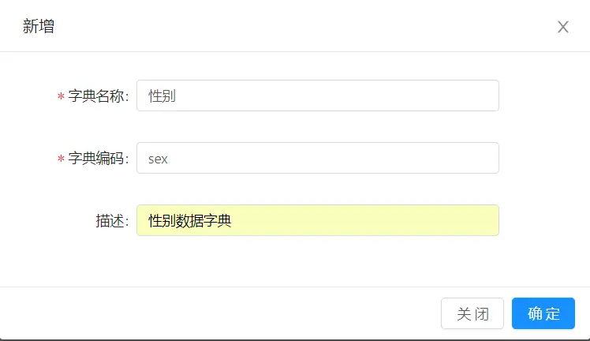
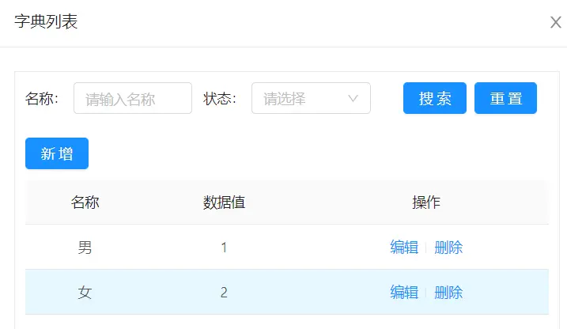

字典翻译注解@Dict
===

> 字典翻译注解@Dict： 用于列表字段字典翻译（比如字段sex存的值是1，会自动生成一个翻译字段 sex_dictText 值是‘男’）


#### 一、功能说明
将数据库某一列的值按照字典配置翻译成对应的文字描述
比如： 用户表有一字段:性别,数据库存储的1,2分别表示男,女,当数据被查询展示在列表上时,就需要将1,2翻译成男女,这就要用到@Dict
#### 二、使用说明（以用户管理翻译性别列为例说明）
1.配置字典


2.后端实体属性上加注解(此处dicCode 对应上述字典编码)
```
 /**
  * 性别（1：男 2：女）
  */
 @Dict(dicCode = "sex")
  private Integer sex;
```
3.前端定义column(**此处dataIndex原字段名为sex ,这里需要定义为sex_dictText,即原字段名+'__dictText'**)
```
 columns: [
    //...省略其他列
    {
     title: '性别',
     align: "center",
     width: 80,
     dataIndex: 'sex_dictText'
     }]
```

4.字典表翻译用法

```
@Dict(dicCode = "id",dictTable="sys_user",dicText="realname")
```

截图：


