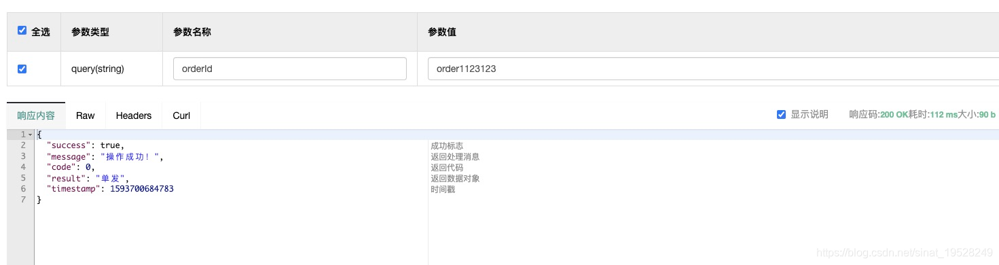

@author [ksf](https://blog.csdn.net/sinat_19528249)
处理的方式有两种，本次介绍普适性方案，解决问题1。

1.正常业务请求的防止限制

2.极端情况下的请求，rediskey过期带来的重复请求。


**代码结构比较清晰，直接贴代码啦：**
```java

@Target(ElementType.METHOD)
@Retention(RetentionPolicy.RUNTIME)
@Documented
@Inherited
public @interface LimitSubmit {
    String key() ;
    /**
     * 默认 10s
     */
    int limit() default 10;

    /**
     * 请求完成后 是否一直等待
     * true则等待
     * @return
     */
    boolean needAllWait() default true;
}
```

```java

Component
@Aspect
@Slf4j
public class LimitSubmitAspect {
    //封装了redis操作各种方法
    @Autowired
    private RedisUtil redisUtil;
    @Pointcut("@annotation(org.jeecg.common.aspect.annotation.LimitSubmit)")
    private void pointcut() {}

    @Around("pointcut()")
    public Object handleSubmit(ProceedingJoinPoint joinPoint) throws Throwable {
        LoginUser sysUser = (LoginUser)SecurityUtils.getSubject().getPrincipal();
        Method method = ((MethodSignature) joinPoint.getSignature()).getMethod();
        //获取注解信息
        LimitSubmit limitSubmit = method.getAnnotation(LimitSubmit.class);
        int submitTimeLimiter = limitSubmit.limit();
        String redisKey = limitSubmit.key();
        boolean needAllWait = limitSubmit.needAllWait();
        String key =  getRedisKey(sysUser,joinPoint, redisKey);
        Object result = redisUtil.get(key);
        if (result != null) {
            throw new JeecgBootException("请勿重复访问！");
        }
        redisUtil.set(  key,  sysUser.getId(),submitTimeLimiter);
        try {
            Object proceed = joinPoint.proceed();
            return proceed;
        } catch (Throwable e) {
            log.error("Exception in {}.{}() with cause = \'{}\' and exception = \'{}\'", joinPoint.getSignature().getDeclaringTypeName(),
                joinPoint.getSignature().getName(), e.getCause() != null? e.getCause() : "NULL", e.getMessage(), e);
            throw e;
        }finally {
            if(!needAllWait) {
                redisUtil.del(redisKey);
            }
        }
    }

    /**
     * 支持多参数，从请求参数进行处理
     */
    private String   getRedisKey(LoginUser sysUser,ProceedingJoinPoint joinPoint ,String key ){
        if(key.contains("%s")) {
            key = String.format(key, sysUser.getId());
        }
        Method method = ((MethodSignature) joinPoint.getSignature()).getMethod();

        LocalVariableTableParameterNameDiscoverer  discoverer = new LocalVariableTableParameterNameDiscoverer();
        String[] parameterNames = discoverer.getParameterNames(method);
        if (parameterNames != null) {
            for (int i=0; i < parameterNames.length; i++  ) {
                String item = parameterNames[i];
                if(key.contains("#"+item)){
                    key = key.replace("#"+item, joinPoint.getArgs()[i].toString());
                }
            }
        }
        return key.toString();
    }
}
```

**使用效果：**

```java
使用： 
 @LimitSubmit(key = "testLimit:%s:#orderId",limit = 10,needAllWait = true)
	%S 代表当前登录人
	#参数 代表从参数中获取，支持多个参数
生成的redis key： testLimit:e9ca23d68d884d4ebb19d07889727dae:order1123123
```
1.限制对某个接口的访问，针对所有人 ，则去除%S
2.限制某个人对某个接口的访问，则 %S
3.限制某个人对某个接口的业务参数的访问，则 %S:#参数1:#参数2
 
 
