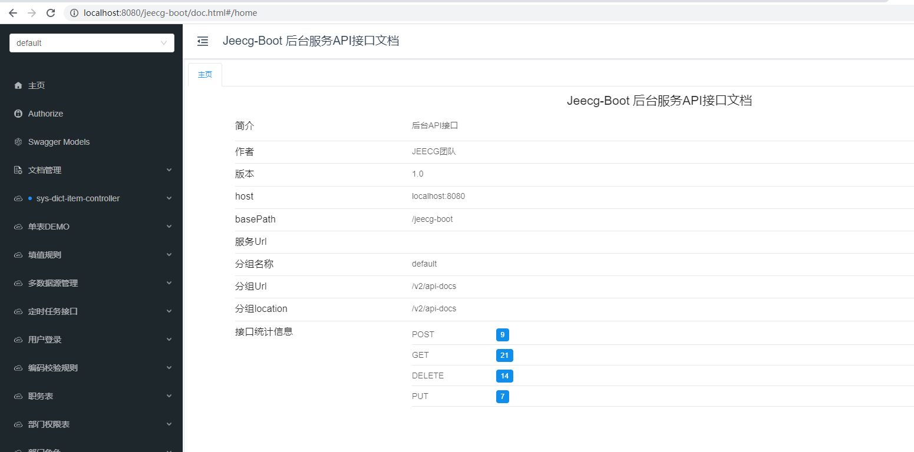

Docker镜像单体启动项目
===
>[info] Version: 3.4.1+ 版本

### 1. 下载项目
```
git clone https://gitee.com/jeecg/jeecg-boot.git
```

### 2. 本地配置host

    # jeecgboot
    127.0.0.1   jeecg-boot-mysql
    127.0.0.1   jeecg-boot-redis
    127.0.0.1   jeecg-boot-system

>[warning] 注意： 如果本地安装了mysql和redis，启动容器前先停掉本地服务，不然端口冲突。
```
 net stop redis
 net stop mysql
```

### 3. 修改数据库和redis配置
```
cd jeecg-boot\jeecg-module-system\jeecg-system-start\src\main\resources
```
修改`application-dev.yml` 的数据库连接和redis连接，将连接改成host方式


### 4. 进入 jeecg-boot 项目根目录，执行maven打包命令
进入项目
```
cd jeecg-boot
```

```
mvn clean install
```
 
### 5. 进入jeecg-boot根路径，执行docker命令, 启动镜像容器组
    docker-compose up -d

生成的镜像组效果：


### 6. 访问后台接口地址
>[info] 等待一分钟，待docker容器启动完成后，访问下面链接

   http://jeecg-boot-system:8080/jeecg-boot/doc.html
   看到下面接口文档，说明后台启动成功


### 7. 前端UI采用docker启动
- [Docker启动Vue3版前端](http://help.jeecg.com/publish/docker.html)
- [Docker启动Vue2版前端](http://doc.jeecg.com/3043612)

## 其他文档

### 1. 重新构建镜像__容器组
    docker-compose build
> 当你改变本地代码，可以通过这个命令重新构建镜像。


