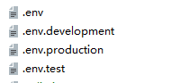

前端多环境构建配置
===

>[info] Version: 2.4+版开始，前端支持多环境构建，将配置与环境隔离


 引入`.env.*`配置文件，根目录新增以下4个环境配置文件
 


### 配置文件说明
####  .env                          在所有的环境中被载入
```
NODE_ENV=production
VUE_APP_PLATFORM_NAME=JeecgBoot 企业级快速开发平台
#SSO单点登录开关
VUE_APP_SSO=false     
```
####  .env.development      开发环境中载入（程序启动默认走此配置）

```
NODE_ENV=development
#接口地址
VUE_APP_API_BASE_URL=http://localhost:8080/jeecg-boot
#单点登录地址
VUE_APP_CAS_BASE_URL=http://cas.example.org:8443/cas
#online地址
VUE_APP_ONLINE_BASE_URL=http://fileview.jeecg.com/onlinePreview
```


####  .env.production           生产环境中加载（项目打包默认走此配置）
```
NODE_ENV=production
VUE_APP_API_BASE_URL=https://bootapi.jeecg.com
VUE_APP_CAS_BASE_URL=http://localhost:8888/cas
VUE_APP_ONLINE_BASE_URL=http://fileview.jeecg.com/onlinePreview
```

####  .env.test      测试环境中加载

```
NODE_ENV=production
VUE_APP_API_BASE_URL=http://boot.jeecg.com:8080/jeecg-boot
VUE_APP_CAS_BASE_URL=http://cas.example.org:8443/cas
VUE_APP_ONLINE_BASE_URL=http://fileview.jeecg.com/onlinePreview
```
 如果需要用此配置打包，请点击命令


####  #更多配置请参考

https://cli.vuejs.org/zh/guide/mode-and-env.html#模式

