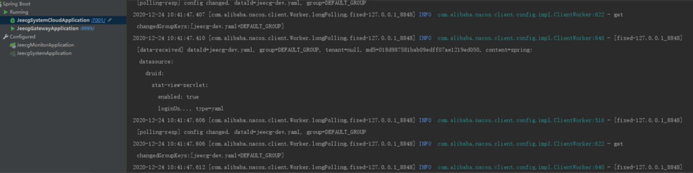
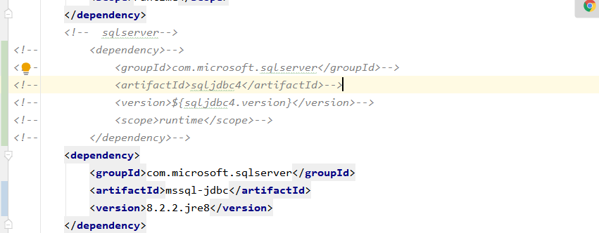

数据库切换 
===
>[info] 提供Oracle、SqlServer、Postgresql 切换具体配置文档

[TOC]

## 1. Oracle数据
### 1.1 添加oracle驱动，修改pom.xml
```
<!-- oracle驱动 -->
<dependency>
	<groupId>com.oracle</groupId>
	<artifactId>ojdbc6</artifactId>
	<version>11.2.0.3</version>
</dependency>
```
### 1.2 修改数据库连接
```
修改druid配置
validationQuery: SELECT 1 FROM DUAL

driver-class-name: oracle.jdbc.OracleDriver
url: jdbc:oracle:thin:@192.168.1.200:1521:ORCL
username: jeecgboot
password: jeecgboot
```


## 2. SQL server数据
### 2.1 添加SQL server驱动，修改pom.xml
```
<!--  sqlserver-->
<dependency>
	<groupId>com.microsoft.sqlserver</groupId>
	<artifactId>sqljdbc4</artifactId>
	<version>4.0</version>
	<scope>runtime</scope>
</dependency>
```
### 2.2 修改数据库连接
```
修改druid配置
validationQuery: SELECT 1
filters: stat,slf4j


driver-class-name: com.microsoft.sqlserver.jdbc.SQLServerDriver
url: jdbc:sqlserver://192.168.1.200:1433;SelectMethod=cursor;DatabaseName=jeecg-boot
username: sa
password: SA

修改JPA加上database-platform参数
jpa:
  open-in-view: false
  database-platform: org.hibernate.dialect.SQLServerDialect
```
### 2.3 sqlserver下定时任务报错处理
```
报错信息org.quartz.impl.jdbcjobstore.LockException: Failure obtaining db row lock: sql injection violation, syntax error: syntax error, not support option : UPDATE, pos 86, line 1, column 80, token UPDATE
```
修改配置如下：将selectWithLockSQL: SELECT* FROM {0}LOCKS UPDLOCK WHERE LOCK_NAME = ?配置在jobStore下

```
quartz:  
  .....省略其他配置.....  
  properties:  
     org:  
       quartz:  
          jobStore:  
            selectWithLockSQL: SELECT* FROM {0}LOCKS UPDLOCK WHERE LOCK_NAME = ?
```
### 2.4 sqlserver下启动后，如果控制台一直滚动如下图信息

可修改配置文件  

```
web-stat-filter:
       enabled:false
 ```

### 2.5 sqlserver启动失败，报错--- 不支持“variant”数据类型
修改sqlserver版本即可解决，将sqljdbc4替换为mssql-jdbc
~~~
<dependency>
   <groupId>com.microsoft.sqlserver</groupId>
   <artifactId>mssql-jdbc</artifactId>
   <version>8.2.2.jre8</version>
</dependency>
~~~
报错信息：

修改依赖jar包：


## 3. postgresql数据库
### 3.1 添加postgresql驱动，修改pom.xml

(根据不同版本的数据库引入对应版本的驱动，下载地址：https://jdbc.postgresql.org/download.html)

```
<!--  postgresql-->
<dependency>
   <groupId>org.postgresql</groupId>
   <artifactId>postgresql</artifactId>
   <version>42.2.6</version>
</dependency>
```
### 3.2 修改数据库连接
```
增加spring下的配置

spring:
  #postgresql 报错问题
  jpa:
    database-platform: org.hibernate.dialect.PostgreSQLDialect
    properties:
      hibernate:
        temp:
          use_jdbc_metadata_defaults: false


修改druid配置
validationQuery: SELECT 1


url: jdbc:postgresql://localhost:5432/postgres
username: postgres
password: root
driver-class-name: org.postgresql.Driver

```

修改quartz配置
~~~
spring.quartz.properties.org.quartz.jobStore.driverDelegateClass=org.quartz.impl.jdbcjobstore.PostgreSQLDelegate
~~~

## 4. JeecgBoot平台支持哪些数据库

| 数据库 | 支持 |
| --- | --- |
| MySQL | √ |
| Oracle11g | √ |
| Sqlserver2017 | √ |
| PostgreSQL | √ |
| MariaDB | √ |
| TIDB| √ |
| 达梦、人大金仓| √ |

## 5.jimureport支持哪些数据库

| 数据库 | 支持 |
| --- | --- |
| MySQL | √ |
| Oracle11g | √ |
| Sqlserver2017 | √ |
| PostgreSQL | √ |
| DB2、Informix | √ |
| MariaDB | √ |
| SQLite、Hsqldb、Derby、H2 | √ |
| 达梦、人大金仓、神通 | √ |
| 华为高斯、虚谷、瀚高数据库 | √ |
| 阿里云PolarDB、PPAS、HerdDB | √ |
| Hive、HBase、CouchBase | √ |

更多文档：
- [配置对接达梦数据库](JeecgBoot连接达梦数据库.md)