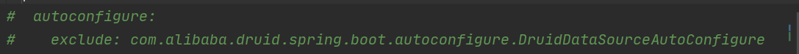
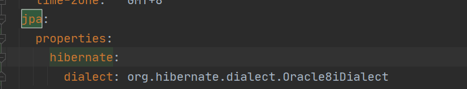
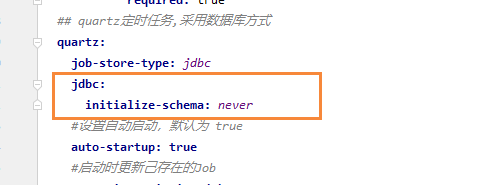
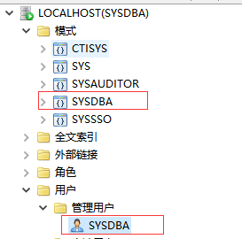

[TOC]

## JeecgBoot连接达梦数据库配置

一、添加达梦数据库驱动
pom文件

```
<dependency>
    <groupId>com.dameng</groupId>
    <artifactId>DmJdbcDriver18</artifactId>
    <version>1.0</version>
</dependency>
<dependency>
   <groupId>com.dameng</groupId>
   <artifactId>DmDialectForHibernate</artifactId>
   <version>5.3</version>
</dependency>
```
二、修改`application-dev.yml`文件
1. 将 `spring.datasource` 下面配置全部删掉，并新增下面语句
 ```
#  autoconfigure:
#    exclude: com.alibaba.druid.spring.boot.autoconfigure.DruidDataSourceAutoConfigure
  datasource:
    type: com.alibaba.druid.pool.DruidDataSource
    druid:
      driverClassName: dm.jdbc.driver.DmDriver
      url: jdbc:dm://127.0.0.1:5236/?JEECG&zeroDateTimeBehavior=convertToNull&useUnicode=true&characterEncoding=utf-8
      username: JEECG
      password: ??
```


2. 注释掉下面的语句


3. jpa新增语句
```
jpa:
  properties:
    hibernate:
      dialect: org.hibernate.dialect.Oracle8iDialect
```


4. 如果springboot升级到2.6+，还需要修改quartz 配置
~~~
spring.quartz.jdbc.initialize-schema=never
~~~


## 达梦数据库可视化工具和数据库迁移工具
按win键找到达梦数据库，打开后可看见


DM管理工具为可视化工具
数据库迁移可将mysql、orcale等数据库转换成达梦数据库
注意：当数据迁移时，



用户名称需和模式名称一致，否则sql语句需要模式名.表名才能访问数据库，不然会报错

    

## 达梦数据库官网下载地址
```
项目采用DMB8开发版（windows64位）
```
- https://eco.dameng.com/docs/zh-cn/start/dm-install-docker.html


            