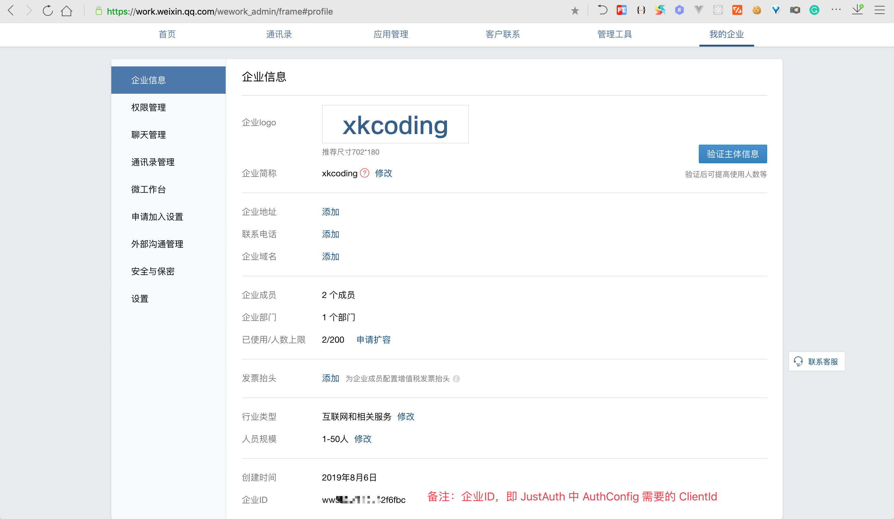
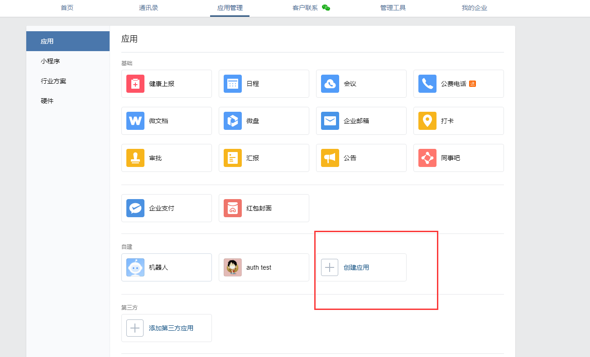
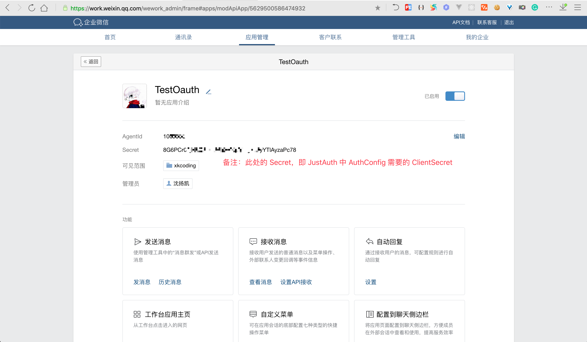
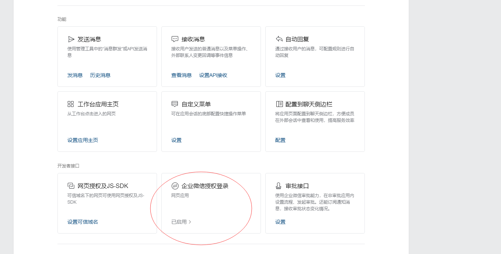

查看application.yml  **justauth.type.WECHAT_ENTERPRISE** 配置，需要配置四个信息
1. **client-id**  ：登录企业微信后台，获取企业ID即client-id

2.进入应用管理，创建应用

3. **client-secret** ：应用的Secret
4.  **agent-id** ：应用的AgentId

4.进入登录授权界面

5.配置回调域名，需带上端口，不用http开头

6. **redirect-uri**： 需和上述域名保持一致，其他参数不变