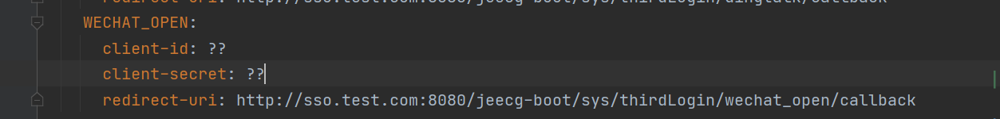
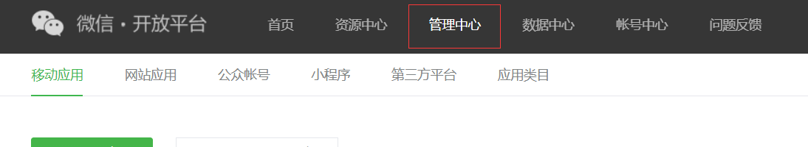
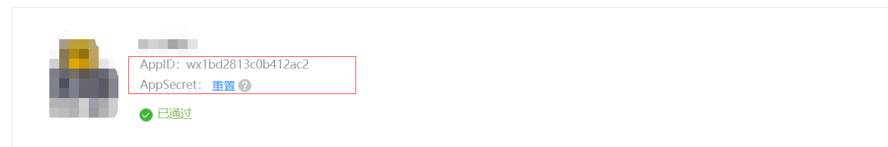

查看application.yml  **justauth.type.WECHAT_OPEN** 配置，需要配置三个信息


进入微信开放平台点击管理中心，进入网站应用


此过程需要网站应用，如果没有需要创建

创建成功后进入查看获取到appid和AppSecret，并将之填写到对应的yml中
 ```
client-id -> appid
client-secret -> AppSecret
```


修改回调地址
网页滑到最下方，点击修改即可
注意：回调地址不用带http和https

将回调地址填入yml中即可


