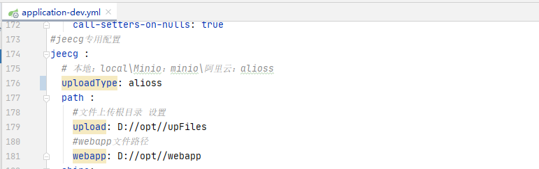

# 文件上传接口(图片/文件)
jeecg-boot 提供了文件及图片上传功能，前两个文件已介绍了MinIO和OSS配置，现在可根据需要选择上传方式。

[TOC]
## 在yml文件中可切换图片/文件存储方式

local为本地存储，还需要配置jeecg.path.upload
minio为使用MinIO线上存储
alioss为使用阿里云线上存储
## 访问路径
~~~
http://127.0.0.1:8080/jeecg-boot/sys/common/upload
~~~
~~~
@PostMapping(value = "/upload")
public Result<?> upload(HttpServletRequest request, HttpServletResponse response) {
   Result<?> result = new Result<>();
   String savePath = "";
   String bizPath = request.getParameter("biz");
   MultipartHttpServletRequest multipartRequest = (MultipartHttpServletRequest) request;
   MultipartFile file = multipartRequest.getFile("file");// 获取上传文件对象
~~~
## 上送参数说明
| 名称 | 类型 | 说明
|---|---|----|
|  biz | String | 自定义文件存储路径，alioss为必传 |

