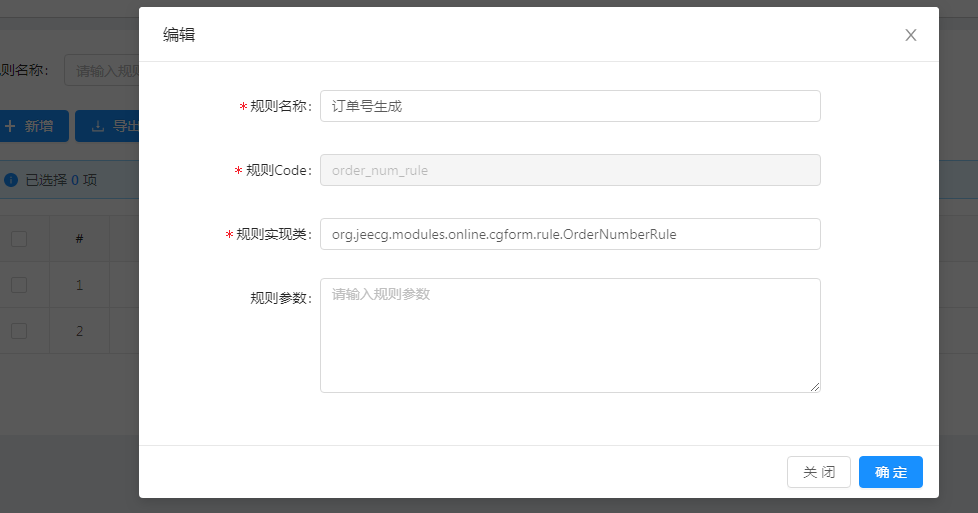
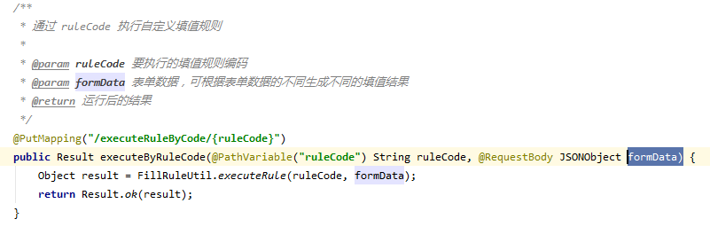

> 自动生成规则编码，比如: 订单号的生成，前缀+年月日时分秒 时间戳

如果创建一个规则实现？

* 第一步：实现接口 IFillRuleHandler

参考实例：
```
/**
 * 填值规则Demo：生成订单号
 * 【测试示例】
 */
public class OrderNumberRule implements IFillRuleHandler {

    @Override
    public Object execute(JSONObject params, JSONObject formData) {
        String prefix = "CN";
        //订单前缀默认为CN 如果规则参数不为空，则取自定义前缀
        if (params != null) {
            Object obj = params.get("prefix");
            if (obj != null) prefix = obj.toString();
        }
        SimpleDateFormat format = new SimpleDateFormat("yyyyMMddHHmmss");
        int random = RandomUtils.nextInt(90) + 10;
        String value = prefix + format.format(new Date()) + random;
        // 根据formData的值的不同，生成不同的订单号
        String name = formData.getString("name");
        if (!StringUtils.isEmpty(name)) {
            value += name;
        }
        return value;
    }

}

```
* 第二步：在规则管理里面配置


* 第三步：通过接口执行规则生成

参数：

ruleCode  | 规则编码
formData  | 表单数据JSON

接口URL:  /sys/fillRule/executeRuleByCode/{ruleCode}




* 第四步：批量编码规则生成接口

/sys/fillRule/executeRuleByCode/executeRuleByCodeBatch

具体用法参考：
org.jeecg.modules.system.controller.SysFillRuleController#executeByRuleCodeBatch


 

## 其他技巧

### JAVA代码里，如何直接调用生成编码？

~~~
 * @param ruleCode 填值规则Code
 * @param formData  表单参数
FillRuleUtil.executeRule(String ruleCode, JSONObject formData)
~~~

### 前端JS里如何调用生成编码？

可通过`put`请求调用后台填值规则接口来实现生成编码。

#### 示例

``` js
import { putAction } from '@api/manage'

const ruleBaseURL = '/sys/fillRule/executeRuleByCode/'
export default {
  name: 'App',
  data() {
    return {
      // 页面的数据
      model: { orderNum: '' },
      // 请求的url
      url: {
        rule: {
          orderNum: ruleBaseURL + 'order_num_rule'
        },
      }
    }
  },
  methods: {
    getOrderNum() {
      putAction(this.url.rule.orderNum, this.model).then(res => {
        // 执行成功，获取返回的值，并赋到页面上
        if (res.success) {
          this.model.orderNum = res.result
        }
      })
    }
  }
}
```

### Online表单的JS增强里如何调用生成编码？

和前端JS里一样，可通过`putAction`方法来调用接口生成编码

### 表单设计器 JS 增强里如何调用生成编码？

可以通过`api.put()`方法实现获取填值规则的值，获取到之后再通过`api.setFormData()`方法赋到页面上。
api的使用方法可见 `表单设计器-->高级操作手册-->JS增强`文档

#### 示例

``` js
// 获取所有 form data
var formData = api.getFormData() || {}
// 请求后台的填值规则接口地址
var url = '/sys/fillRule/executeRuleByCode/'
var ruleCode = 'order_num_rule'
api.put(url + ruleCode, formData).then(res => {
  // 执行成功，获取返回的值，并赋到页面上
  if (res.success) {
    var value = res.result
    api.setFormData('orderNum', value)
  }
})
```
