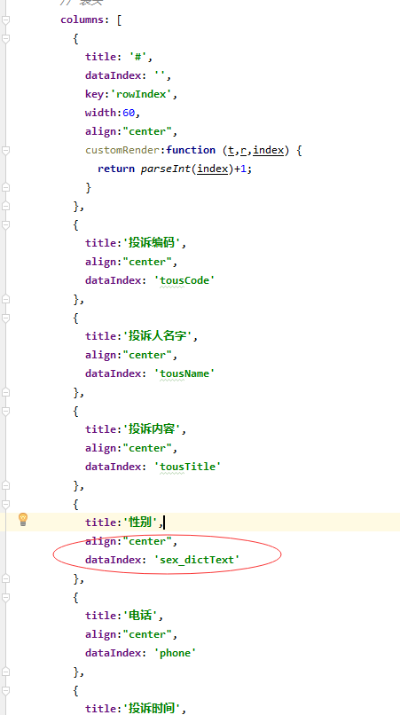

数据列表`列字段`权限控制
===

>[info] 针对数据列表的列字段进行权限控制，控制列字段的展示与不展示，需要菜单的权限配置与页面代码配合使用。

**配置权限步骤：** `增加了有效的菜单权限配置与代码后，未授权时隐藏，授权时显示`

**举例：** 针对常用示例列表的，字段`用户名`，控制他的显示与隐藏


### 权限控制步骤

#### 1. 针对列表列配置权限

```
在配置前需要对需要控制的列表权限编码定义一个前缀，规则自己设计，不同的列表定义不同前缀最好不要重复
例如：定义前缀“testdemo:”  则需要对列表中的name列进行控制，权限编码为，前缀+列字段名 （“testdemo:name”）
```
在对应的列表页面菜单下配置权限：


配置说明：

- 菜单类型：选择“按钮/权限”
- 授权标识：前缀+列字段名 （“testdemo:name”）
- 授权策略：选择“显示/访问(授权后显示/可访问)”
- 状态：选择“有效”

#### 2. 增加页面控制代码

（1）引入工具方法
```
import { colAuthFilter } from "@/utils/authFilter"
```
（2）created方法中增加方法调用，根据权限过滤展示的列
```
created() {
      this.disableMixinCreated=true;
      this.columns = colAuthFilter(this.columns,'testdemo:');
      this.loadData();
      this.initDictConfig();
    },

说明：
colAuthFilter方法：
第一个参数：列表定义的列信息
第二个参数：列权限控制定义的权限编码前缀“testdemo:”
```

#### 3.附录注意

权限编码为，前缀+列字段名 （“testdemo:name”）中的列名需要与前端vue页面中的属性columns中的字段保持一致

此图中： 用的字段翻译字段，所以配置权限编码的列字段名也得是：sex_dictText

