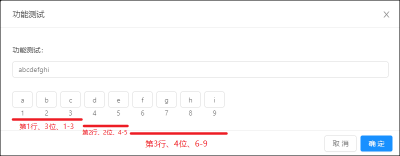
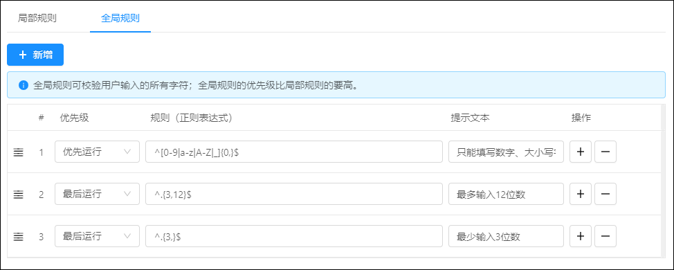
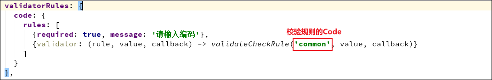
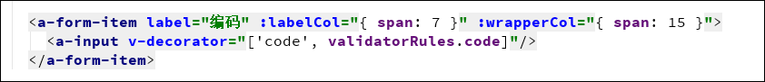
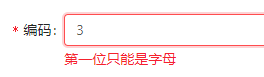
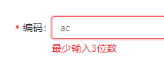
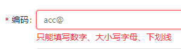
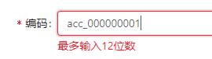
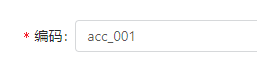

# 校验规则

[TOC]

校验规则可以对表单中的编码做出校验，例如校验复杂的编码等。

## 创建规则


### 局部规则

局部规则按照你输入的位数有序的校验。
可以添加多行局部规则，按照添加的顺序逐行进行判断
比如说第一行的位数是3，第二行的位数是2，第三行的位数是4，那么在实际校验的时候，第一行校验的是`1-3`位字符串，第二行从上一行结束的位置开始向后移2位，也就是`4-5`位，第三行以此类推，可得出是`6-9`位。



### 全局规则

全局规则跟局部规则不同的地方是：全局规则是对用户输入的整个字符串进行判断，而不是只判断第几位。
全局规则有运行的优先级，他们分别是：
    * `优先运行` 会在局部规则之前运行
    * `最后运行` 会在局部规则全部校验通过之后运行



## 使用方法

### 第一步：引入工具类

```
import { validateCheckRule } from '@/utils/util'
```

### 第二步：使用工具类实现校验规则



```
validatorRules: {
  code: {
    rules: [
      {required: true, message: '请输入编码'},
      // 如果想要更简洁，还可以缩写下面的参数名，只写首字母
      {validator: (r, v, c) => validateCheckRule('common', v, c)}
    ]
  }
},
```

### 第三步：在页面上调用



### 第四步：查看效果

未通过效果：




通过效果：

