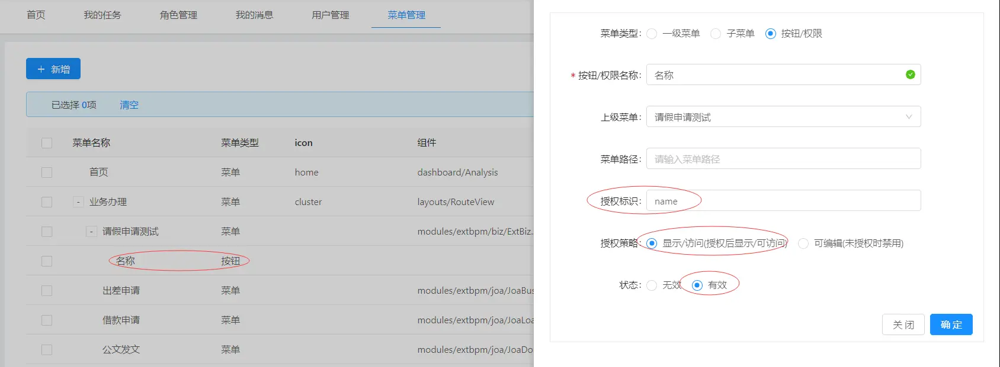

显示隐藏控制
===

[TOC]

## 一、用法

```
v-has="'name'"
```

代码示例：

```

<a-form-item v-has="'name'"
  :labelCol="labelCol"
  :wrapperCol="wrapperCol"
  label="请假人">
  <a-input placeholder="请输入请假人" v-decorator="['name', {}]" />
</a-form-item>

```
## 二、权限配置：


## 三、使用说明

- `v-has="'name'"` 指令值“name”为授权标识，可对该授权标识进行“显示/访问”控制
- 权限编码在【系统管理--菜单管理】中配置，添加按钮类型的菜单数据，授权标识配置值“name”，策略选择显示/访问，状态选择有效
- 控制规则：
- （1）使用`v-has`指令后，菜单权限中若没有对应指令编码的配置，则不显示控件，
- （2）权限配置无效状态时，则不进行权限控制，有效状态时进行控制
- （3）策略：显示/访问，未授权时不显示，授权后显示
- （4）灵活： 一个授权标识码，可以控制多个控件，也可用于列表列字段的控制（请灵活使用）

## 四、流程节点权限
（1）说明：

- 节点权限配置优先级高于菜单权限配置
- 节点权限应用于使用组件方式加载的附加表单页面，并对附加表单页面进行权限控制
- 显示控制用法见上面用法描述
- 节点权限是通过 props: ['formData'],来传递给节点表单页面的，因此页面一定要定义这个，否则，节点配置的权限不生效
- 权限配置无效状态时，则不进行权限控制，有效状态时进行控制

（2）权限配置：
在【流程管理-流程设计】中找到需要配置的流程，进入【流程配置-流程节点】选择需要进行权限控制的节点，
点击【更多-权限设置】，新增/编辑 来配置权限。


## 五、特殊情况处理
1. 如果给必填字段设置隐藏权限，将会导致字段隐藏了，但是校验还存在的问题。
    造成该问题的原因是表单的渲染顺序导致的。
    想要解决该问题，就不能仅仅使用 `v-has` 的形式来控制表单了，还需要通过编码的方式，动态给该表单的必填校验设置为false，将rules设置成computed计算属性可以获得更好的性能。
