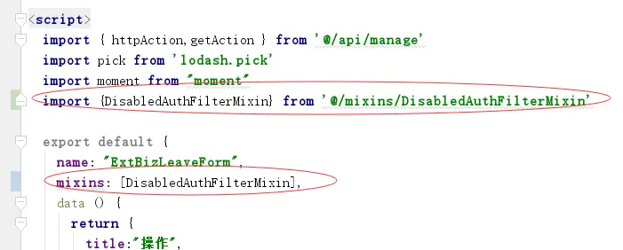
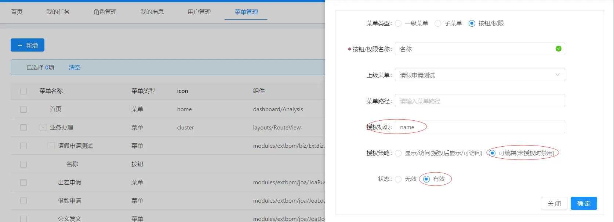

禁用控制用法
===

#### 一、用法

（1）页面引入混入代码
```
import {DisabledAuthFilterMixin} from '@/mixins/DisabledAuthFilterMixin'
```
```
mixins: [DisabledAuthFilterMixin],
```


（2）权限控制代码示例：

```

<a-input-number :disabled="isDisabledAuth('name')"   v-decorator="[ 'days', {}]" />

```
#### 二、权限配置：


#### 三、使用说明

- `:disabled="isDisabledAuth('name')" ` 调用方法disabledAuth，方法参数“name”为授权标识，该方法根据授权规则返回true/false，控制是否禁用
- 权限编码在【系统管理--菜单管理】中配置，添加按钮类型的菜单数据，授权标识配置值“name”，策略选择可编辑，状态选择有效
- 控制规则：
- （1）菜单权限中若没有对应指令编码的配置，则不进行禁用控制，
- （2）权限配置无效状态时，则不进行权限控制，有效状态时进行控制
- （3）策略：可编辑，未授权时控件禁用，授权后可编辑

#### 四、流程节点权限
（1）说明：

- 节点权限配置优先级高于菜单权限配置
- 节点权限应用于使用组件方式加载的附加表单页面，并对附加表单页面进行权限控制
- 显示控制用法见上面用法描述
- 节点权限是通过 props: ['formData'],来传递给节点表单页面的，因此页面一定要定义这个，否则，节点配置的权限不生效，节点表单开发方法见【流程节点对接表单页面开发方法】

- 权限配置无效状态时，则不进行权限控制，有效状态时进行控制

（2）权限配置：
在【流程管理-流程设计】中找到需要配置的流程，进入【流程配置-流程节点】选择需要进行权限控制的节点，
点击【更多-权限设置】，新增/编辑 来配置权限。


