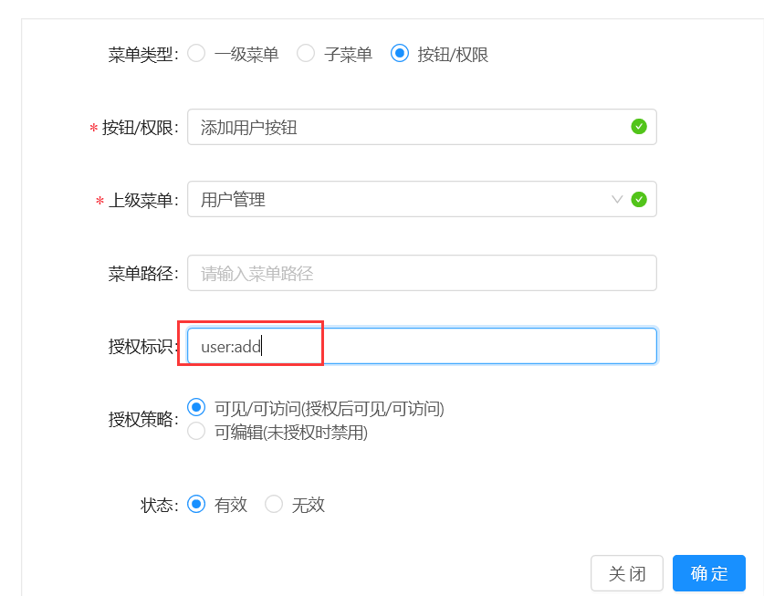

页面按钮权限用法
===

1.前端页面通过使用指令 v-has

```
<a-button @click="handleAdd" v-has="'user:add'" type="primary" icon="plus">添加用户</a-button>
```

2.后台进入菜单管理页面配置按钮权限菜单


3.进入角色管理授权按钮（授权后即可看见按钮）


备注： 授权标识支持多个，多个逗号分隔

