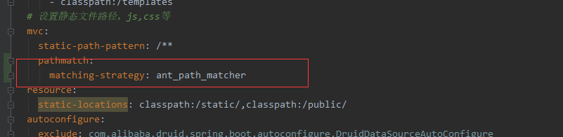
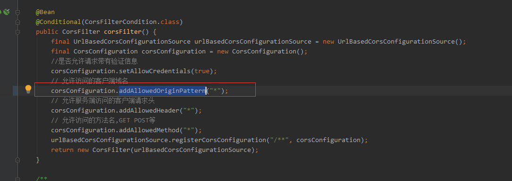
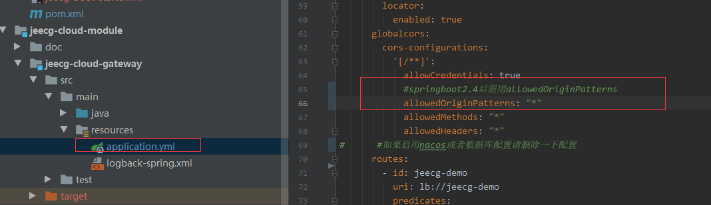

[TOC]
升级内容
|  jar   | 原版本    |新版本|
| --- | --- |---|
|   springboot   |  2.3.5.RELEASE  |2.6.3|
|   springcloud   |  Hoxton.SR8|2021.0.0|
|   spring-cloud-alibaba.version| 2.2.3.RELEASE|2021.1|
|   knife4j| 2.0.9|3.0.3|
|   mybatis-plus.version| 3.4.3.1|3.5.1|
|   nacos-client| 1.3.2|2.0.3|
## 1.RedisUtil报错问题
```
报错代码：redisTemplate.delete(CollectionUtils.arrayToList(key));
修正代码: redisTemplate.delete(Arrays.asList(key));
```
```
报错代码：Cursor<byte[]> cursor = connection.scan(new ScanOptions.ScanOptionsBuilder().match(realKey).count(Integer.MAX_VALUE).build());
修正代码: Cursor<byte[]> cursor = connection.scan(ScanOptions.scanOptions().match(realKey).count(Integer.MAX_VALUE).build());
```
## 2.JeecgRedisCacheWriter报错问题
升级后需要重新3个方法如下
```

private final CacheStatisticsCollector statistics = CacheStatisticsCollector.create();
@Override
public CacheStatistics getCacheStatistics(String cacheName) {
    return statistics.getCacheStatistics(cacheName);
}
@Override
public void clearStatistics(String name) {
}
@Override
public RedisCacheWriter withStatisticsCollector(CacheStatisticsCollector cacheStatisticsCollector) {
    return null;
}
```

## 3 Junit报错问题

在jeecg-boot-system-module模块的pom.xml文件中加入junit依赖
```
<dependency>
   <groupId>junit</groupId>
   <artifactId>junit</artifactId>
   <scope>test</scope>
</dependency>
```
## 4.定时器报错问题

spring-boot-starter-quartz 2.5.9 之前使用org.quartz.impl.jdbcjobstore.JobStoreTX定义quartz的默认数据源支持，即如下配置：
```
org.quartz.jobStore.class=org.quartz.impl.jdbcjobstore.JobStoreTX
```
jeecg-dev.yaml文件中修改为如下配置
```
org.quartz.jobStore.class=org.springframework.scheduling.quartz.LocalDataSourceJobStore
```

注：微服务需要修改nacos中jeecg-dev.yaml文件

## 5.循环依赖问题
在 Spring Boot 2.6 版本中，循环引用默认情况下已经被禁止了。如果你的项目存在循环引用问题，那你在启动项目的时候就会报错。

解决方案：
application.yml中加入如下配置
```
main:
  allow-circular-references: true
```
或者启动入口类使用如下代码方式
```
ConfigurableApplicationContext application=new SpringApplicationBuilder(JeecgSystemCloudApplication.class)
        // 允许循环引用
        .allowCircularReferences(true)
        .run(args);
```

## 6.Knife4j报错问题

出现这个问题的原因是：springboot2.6.x以及上版本默认使用的PATH\_PATTERN\_PARSER而knife4j的springfox使用的是ANT_PATH_MATCHER导致的，springboot的yml文件配置url匹配规则
解决方案：
1.application-dev.yml文件中加入如下配置
~~~
mvc:
  pathmatch:
    matching-strategy: ant_path_matcher
~~~

**注：微服务中需要修改nacos中application-dev.yml文件**
2.Swagger2Config.java加入如下代码
~~~
/**
 * 解决springboot2.6 和springfox不兼容问题
 * @return
 */
@Bean
public static BeanPostProcessor springfoxHandlerProviderBeanPostProcessor() {
    return new BeanPostProcessor() {

        @Override
        public Object postProcessAfterInitialization(Object bean, String beanName) throws BeansException {
            if (bean instanceof WebMvcRequestHandlerProvider || bean instanceof WebFluxRequestHandlerProvider) {
                customizeSpringfoxHandlerMappings(getHandlerMappings(bean));
            }
            return bean;
        }

        private <T extends RequestMappingInfoHandlerMapping> void customizeSpringfoxHandlerMappings(List<T> mappings) {
            List<T> copy = mappings.stream()
                    .filter(mapping -> mapping.getPatternParser() == null)
                    .collect(Collectors.toList());
            mappings.clear();
            mappings.addAll(copy);
        }

        @SuppressWarnings("unchecked")
        private List<RequestMappingInfoHandlerMapping> getHandlerMappings(Object bean) {
            try {
                Field field = ReflectionUtils.findField(bean.getClass(), "handlerMappings");
                field.setAccessible(true);
                return (List<RequestMappingInfoHandlerMapping>) field.get(bean);
            } catch (IllegalArgumentException | IllegalAccessException e) {
                throw new IllegalStateException(e);
            }
        }
    };
}
~~~
3.@EnableSwagger2WebMvc改为@EnableSwagger2
完整代码如下
```
package org.jeecg.config;


import com.github.xiaoymin.knife4j.spring.annotations.EnableKnife4j;
import io.swagger.annotations.ApiOperation;
import lombok.extern.slf4j.Slf4j;
import org.jeecg.common.constant.CommonConstant;
import org.springframework.beans.BeansException;
import org.springframework.beans.factory.config.BeanPostProcessor;
import org.springframework.boot.autoconfigure.condition.ConditionalOnProperty;
import org.springframework.context.annotation.Bean;
import org.springframework.context.annotation.Configuration;

import org.springframework.context.annotation.Import;
import org.springframework.util.ReflectionUtils;
import org.springframework.web.bind.annotation.RestController;
import org.springframework.web.servlet.config.annotation.EnableWebMvc;
import org.springframework.web.servlet.config.annotation.ResourceHandlerRegistry;
import org.springframework.web.servlet.config.annotation.WebMvcConfigurer;
import org.springframework.web.servlet.mvc.method.RequestMappingInfoHandlerMapping;
import springfox.bean.validators.configuration.BeanValidatorPluginsConfiguration;
import springfox.documentation.builders.ApiInfoBuilder;
import springfox.documentation.builders.ParameterBuilder;
import springfox.documentation.builders.PathSelectors;
import springfox.documentation.builders.RequestHandlerSelectors;
import springfox.documentation.schema.ModelRef;
import springfox.documentation.service.*;
import springfox.documentation.spi.DocumentationType;
import springfox.documentation.spi.service.contexts.SecurityContext;
import springfox.documentation.spring.web.plugins.Docket;
import springfox.documentation.spring.web.plugins.WebFluxRequestHandlerProvider;
import springfox.documentation.spring.web.plugins.WebMvcRequestHandlerProvider;
import springfox.documentation.swagger2.annotations.EnableSwagger2;
import springfox.documentation.swagger2.annotations.EnableSwagger2WebMvc;

import java.lang.reflect.Field;
import java.util.ArrayList;
import java.util.Collections;
import java.util.List;
import java.util.stream.Collectors;

/**
 * @Author scott
 */
@Configuration
@EnableSwagger2
@EnableKnife4j
@Import(BeanValidatorPluginsConfiguration.class)
public class Swagger2Config implements WebMvcConfigurer {

    /**
     *
     * 显示swagger-ui.html文档展示页，还必须注入swagger资源：
     *
     * @param registry
     */
    @Override
    public void addResourceHandlers(ResourceHandlerRegistry registry) {
        registry.addResourceHandler("swagger-ui.html").addResourceLocations("classpath:/META-INF/resources/");
        registry.addResourceHandler("doc.html").addResourceLocations("classpath:/META-INF/resources/");
        registry.addResourceHandler("/webjars/**").addResourceLocations("classpath:/META-INF/resources/webjars/");
    }

    /**
     * swagger2的配置文件，这里可以配置swagger2的一些基本的内容，比如扫描的包等等
     *
     * @return Docket
     */
    @Bean(value = "defaultApi2")
    public Docket defaultApi2() {
        return new Docket(DocumentationType.SWAGGER_2)
                .useDefaultResponseMessages(false)
                .apiInfo(apiInfo())
                .select()
                //此包路径下的类，才生成接口文档
                .apis(RequestHandlerSelectors.basePackage("org.jeecg"))
                //加了ApiOperation注解的类，才生成接口文档
                .apis(RequestHandlerSelectors.withClassAnnotation(RestController.class))
                .apis(RequestHandlerSelectors.withMethodAnnotation(ApiOperation.class))
                .paths(PathSelectors.any())
                .build()
                .securitySchemes(Collections.singletonList(securityScheme()))
                .securityContexts(securityContexts());
                //.globalOperationParameters(setHeaderToken());
    }

    /***
     * oauth2配置
     * 需要增加swagger授权回调地址
     * http://localhost:8888/webjars/springfox-swagger-ui/o2c.html
     * @return
     */
    @Bean
    SecurityScheme securityScheme() {
        return new ApiKey(CommonConstant.X_ACCESS_TOKEN, CommonConstant.X_ACCESS_TOKEN, "header");
    }
    /**
     * JWT token
     * @return
     */
    private List<Parameter> setHeaderToken() {
        ParameterBuilder tokenPar = new ParameterBuilder();
        List<Parameter> pars = new ArrayList<>();
        tokenPar.name(CommonConstant.X_ACCESS_TOKEN).description("token").modelRef(new ModelRef("string")).parameterType("header").required(false).build();
        pars.add(tokenPar.build());
        return pars;
    }

    /**
     * api文档的详细信息函数,注意这里的注解引用的是哪个
     *
     * @return
     */
    private ApiInfo apiInfo() {
        return new ApiInfoBuilder()
                // //大标题
                .title("Jeecg-Boot 后台服务API接口文档")
                // 版本号
                .version("v3.0.0")
//          .termsOfServiceUrl("NO terms of service")
                // 描述
                .description("后台API接口")
                // 作者
                .contact(new Contact("北京敲敲云科技有限公司","www.jeccg.com","jeecgos@163.com"))
               // .contact("JEECG团队")
                .license("The Apache License, Version 2.0")
                .licenseUrl("http://www.apache.org/licenses/LICENSE-2.0.html")
                .build();
    }

    /**
     * 新增 securityContexts 保持登录状态
     */
    private List<SecurityContext> securityContexts() {
        return new ArrayList(
                Collections.singleton(SecurityContext.builder()
                        .securityReferences(defaultAuth())
                        .forPaths(PathSelectors.regex("^(?!auth).*$"))
                        .build())
        );
    }

    private List<SecurityReference> defaultAuth() {
        AuthorizationScope authorizationScope = new AuthorizationScope("global", "accessEverything");
        AuthorizationScope[] authorizationScopes = new AuthorizationScope[1];
        authorizationScopes[0] = authorizationScope;
        return new ArrayList(
                Collections.singleton(new SecurityReference(CommonConstant.X_ACCESS_TOKEN, authorizationScopes)));
    }

    /**
     * 解决springboot2.6 和springfox不兼容问题
     * @return
     */
    @Bean
    public static BeanPostProcessor springfoxHandlerProviderBeanPostProcessor() {
        return new BeanPostProcessor() {

            @Override
            public Object postProcessAfterInitialization(Object bean, String beanName) throws BeansException {
                if (bean instanceof WebMvcRequestHandlerProvider || bean instanceof WebFluxRequestHandlerProvider) {
                    customizeSpringfoxHandlerMappings(getHandlerMappings(bean));
                }
                return bean;
            }

            private <T extends RequestMappingInfoHandlerMapping> void customizeSpringfoxHandlerMappings(List<T> mappings) {
                List<T> copy = mappings.stream()
                        .filter(mapping -> mapping.getPatternParser() == null)
                        .collect(Collectors.toList());
                mappings.clear();
                mappings.addAll(copy);
            }

            @SuppressWarnings("unchecked")
            private List<RequestMappingInfoHandlerMapping> getHandlerMappings(Object bean) {
                try {
                    Field field = ReflectionUtils.findField(bean.getClass(), "handlerMappings");
                    field.setAccessible(true);
                    return (List<RequestMappingInfoHandlerMapping>) field.get(bean);
                } catch (IllegalArgumentException | IllegalAccessException e) {
                    throw new IllegalStateException(e);
                }
            }
        };
    }


}
```
## 7 跨域问题
Springboot升级到2.4.0版本后，针对CorsConfiguration新增了效验

解决方案:
单体中：
将原来WebMvcConfiguration类中corsFilter方法设置跨域的addAllowedOrigin改为addAllowedOriginPattern
如下图

微服务：
需要修改jeecg-cloud-module/jeecg-cloud-gateway/src/main/resources/application.yml文件
如下图

## 8 微服务启动时加载nacos文件失败导致@Value注解报错问题
jeecg-boot-starter/jeecg-boot-starter-cloud/pom.xml文件中添加依赖
```
        <dependency>
            <groupId>org.springframework.cloud</groupId>
            <artifactId>spring-cloud-starter-bootstrap</artifactId>
        </dependency>
```
## 9 微服务启动时No Feign Client for loadBalancing defined. Did you forget to include spring-cloud-starter-loadbalancer?
jeecg-boot-starter/jeecg-boot-starter-cloud/pom.xml文件中添加依赖
```
<!-- SpringCloud 负载均衡 -->
<dependency>
    <groupId>org.springframework.cloud</groupId>
    <artifactId>spring-cloud-starter-loadbalancer</artifactId>
</dependency>
```
## 10 使用Jreble启动时报错问题
JRebel: ERROR Class 'org.springframework.boot.env.PropertiesPropertySourceLoader' could not be processed by org.zeroturnaround.javarebel.integration
解决方案：升级Jreble插件到最新版即可(2022.1.1)
## 11 sentinel控制台无法登录问题
jeecg-cloud-module/jeecg-cloud-sentinel/src/main/resources/application.properties 文件中添加如下配置
```
spring.mvc.pathmatch.matching-strategy=ant-path-matcher
```
## 12 解决metrics端点不显示jvm信息的问题
问题原因:spring boot中MeterRegistry初始化过早
解决方案：
在WebMvcConfiguration.java添加如下配置

~~~
@Bean
InitializingBean forcePrometheusPostProcessor(BeanPostProcessor meterRegistryPostProcessor, PrometheusMeterRegistry registry) {
    return () -> meterRegistryPostProcessor.postProcessAfterInitialization(registry, "");
}

~~~
添加依赖(放jeecg-boot-base/jeecg-boot-base-core/pom.xml即可)
~~~
<!--解决metrics端点不显示jvm信息的问题-->
<dependency>
   <groupId>io.micrometer</groupId>
   <artifactId>micrometer-registry-prometheus</artifactId>
</dependency>
~~~

