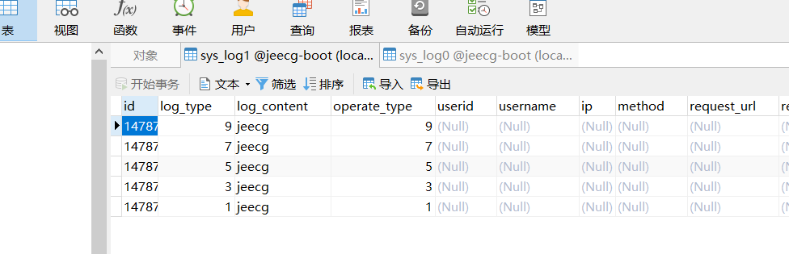
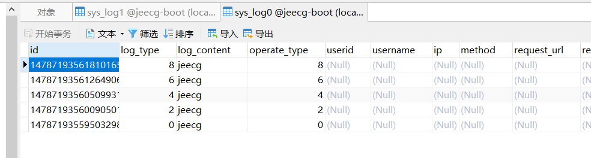
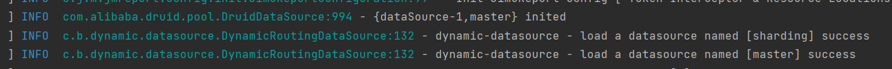
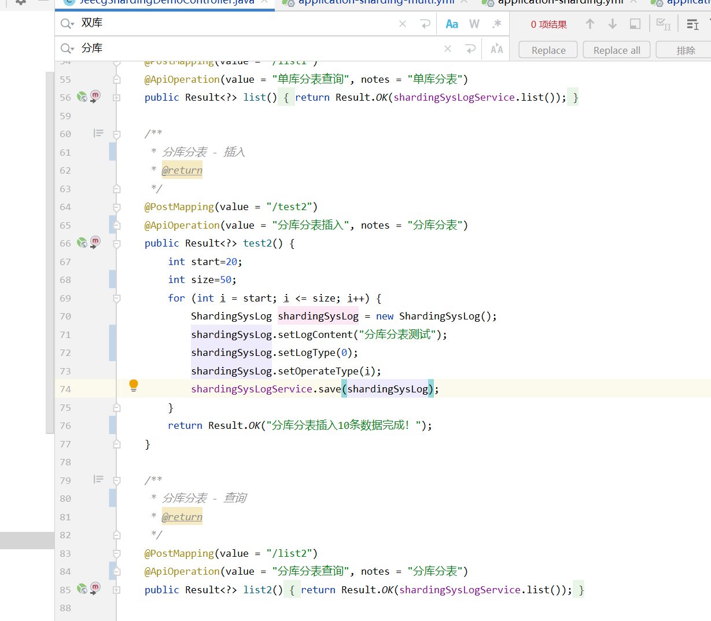
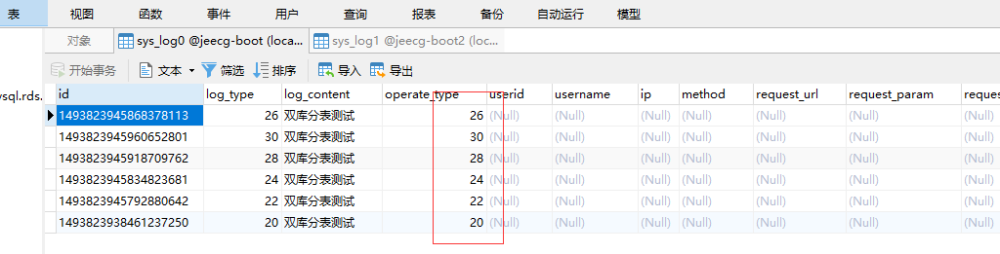
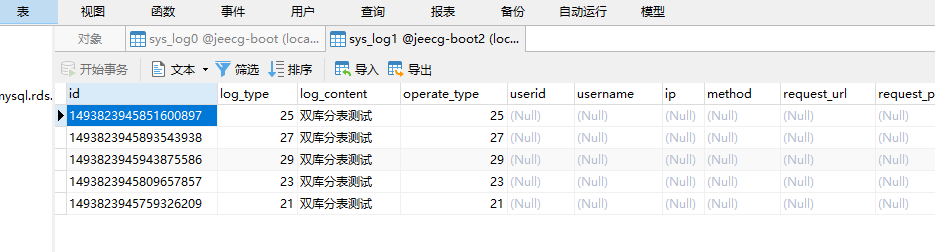

# 单体架构模式下集成分库分表整合案例

>[info] version: jeecgboot 3.4
本文旨在：通过jeecg-system-start项目集成分库分表例子，进行讲解单体架构模式下如何集成分库分表用法
ShardingSphere官方文档：https://shardingsphere.apache.org/document/current/cn/overview

[TOC]

## **准备环境**
1.  数据表：`sys_log0（日志分表1）`，`sys_log1（日志分表2）`拷贝复制系统`sys_log`表即可
2.  数据库: ` jeecg-boot2`(拷贝jeecg-boot即可,分库分表使用) 

### **引入依赖(下面2个依赖二选一)**
不含测试用例引入如下依赖
~~~
<dependency>
    <groupId>org.jeecgframework.boot</groupId>
    <artifactId>jeecg-boot-starter-shardingsphere</artifactId>
</dependency>
~~~
含测试用例引入如下依赖，jeecg-cloud-test-shardingsphere默认集成测试用例便于测试，该示例场景用于插入日志时对日志进行分表存放，分表规则是根据日志类型进行取余计算余数为0的存放到`sys_log0`表中，余数为1的存到`sys_log1`表中
~~~
<dependency>
    <groupId>org.jeecgframework.boot</groupId>
    <artifactId>jeecg-cloud-test-shardingsphere</artifactId>
    <version>${jeecgboot.version}</version>
</dependency>
~~~
### **编写分片规则**
对应配置文件中  
algorithmClassName: org.jeecg.sharding.algorithm.StandardModTableShardAlgorithm
~~~
package org.jeecg.sharding.algorithm;

import org.apache.shardingsphere.sharding.api.sharding.standard.PreciseShardingValue;
import org.apache.shardingsphere.sharding.api.sharding.standard.RangeShardingValue;
import org.apache.shardingsphere.sharding.api.sharding.standard.StandardShardingAlgorithm;

import java.util.Collection;
import java.util.Properties;

/**
 * 用于处理使用单一键
 * 根据分片字段的值和sharding-count进行取模运算
 * SQL 语句中有>，>=, <=，<，=，IN 和 BETWEEN AND 操作符，都可以应用此分片策略。
 *
 * @author zyf
 */
public class StandardModTableShardAlgorithm implements StandardShardingAlgorithm<Integer> {
    private Properties props = new Properties();

    /**
     * 用于处理=和IN的分片
     *
     * @param collection           目标分片的集合(表名)
     * @param preciseShardingValue 逻辑表相关信息
     * @return
     */
    @Override
    public String doSharding(Collection<String> collection, PreciseShardingValue<Integer> preciseShardingValue) {

        for (String name : collection) {
            Integer value = preciseShardingValue.getValue();
            //根据值进行取模，得到一个目标值
            if (name.indexOf(value % 2+"") > -1) {
                return name;
            }
        }
        throw new UnsupportedOperationException();
    }

    /**
     * 用于处理BETWEEN AND分片，如果不配置RangeShardingAlgorithm，SQL中的BETWEEN AND将按照全库路由处理
     *
     * @param collection
     * @param rangeShardingValue
     * @return
     */
    @Override
    public Collection<String> doSharding(Collection<String> collection, RangeShardingValue<Integer> rangeShardingValue) {

        return collection;
    }

    /**
     * 初始化对象的时候调用的方法
     */
    @Override
    public void init() {
    }

    /**
     * 对应分片算法（sharding-algorithms）的类型
     *
     * @return
     */
    @Override
    public String getType() {
        return "STANDARD_MOD";
    }

    @Override
    public Properties getProps() {
        return this.props;
    }

    /**
     * 获取分片相关属性
     *
     * @param properties
     */
    @Override
    public void setProps(Properties properties) {
        this.props = properties;
    }
}
~~~
### **修改配置文件**

## **单库分表配置**
1. 在`application-dev.yaml`配置文件，加入如下配置

~~~
spring:
  shardingsphere:
    datasource:
      names: ds0
      ds0:
        driverClassName: com.mysql.cj.jdbc.Driver
        url: jdbc:mysql://jeecg-boot-mysql:3306/jeecg-boot?useSSL=false&useUnicode=true&characterEncoding=utf-8&serverTimezone=Asia/Shanghai
        username: root
        password: root
        type: com.alibaba.druid.pool.DruidDataSource
    props:
      sql-show: true
    rules:
      sharding:
        binding-tables: sys_log
        key-generators:
          snowflake:
            type: SNOWFLAKE
            props:
              worker-id: 123
        sharding-algorithms:
          table-classbased:
            props:
              strategy: standard
              algorithmClassName: org.jeecg.modules.test.sharding.algorithm.StandardModTableShardAlgorithm
            type: CLASS_BASED
        tables:
          sys_log:
            actual-data-nodes: ds0.sys_log$->{0..1}
            table-strategy:
              standard:
                sharding-algorithm-name: table-classbased
                sharding-column: log_type
~~~

2.启动成功后浏览器输入http://localhost:8080打开接口文档如下图

如下代码批量插入10条数据，根据分配规则logType未奇数的会插入sys_log1表中，logType未偶数的会插入sys_log0表中

测试结果如下

## **分库分表配置**
1. 在`application-dev.yaml`配置文件，加入如下配置

~~~
spring:
  shardingsphere:
    datasource:
      names: ds0,ds1
      ds0:
        driverClassName: com.mysql.cj.jdbc.Driver
        url: jdbc:mysql://jeecg-boot-mysql:3306/jeecg-boot?useSSL=false&useUnicode=true&characterEncoding=utf-8&serverTimezone=Asia/Shanghai
        type: com.alibaba.druid.pool.DruidDataSource
        username: root
        password: root
      ds1:
        driverClassName: com.mysql.cj.jdbc.Driver
        url: jdbc:mysql://jeecg-boot-mysql:3306/jeecg-boot2?useSSL=false&useUnicode=true&characterEncoding=utf-8&serverTimezone=Asia/Shanghai
        type: com.alibaba.druid.pool.DruidDataSource
        username: root
        password: root
    props:
      sql-show: true
    rules:
      replica-query:
        load-balancers:
          round-robin:
            type: ROUND_ROBIN
            props:
              default: 0
        data-sources:
          prds:
            primary-data-source-name: ds0
            replica-data-source-names: ds1
            load-balancer-name: round_robin
      sharding:
        binding-tables:
          - sys_log
        key-generators:
          snowflake:
            type: SNOWFLAKE
            props:
              worker-id: 123
        sharding-algorithms:
          table-classbased:
            props:
              strategy: standard
              algorithmClassName: org.jeecg.sharding.algorithm.StandardModTableShardAlgorithm
            type: CLASS_BASED
          database-inline:
            type: INLINE
            props:
              algorithm-expression: ds$->{operate_type % 2}
        tables:
          sys_log:
            actual-data-nodes: ds$->{0..1}.sys_log$->{0..1}
            database-strategy:
              standard:
                sharding-column: operate_type
                sharding-algorithm-name: database-inline
            table-strategy:
              standard:
                sharding-algorithm-name: table-classbased
                sharding-column: log_type
~~~
## 启动jeecg-system-start，控制台有如下输出代表分库分表集成成功

2.测试插入和查询接口

示例代码：

3.测试结果如下，可以看到operate_type%2==0的进入了`jeecg-boot 库(ds0)`,operate_type%2==1的进入了`jeecg-boot2库(ds1)`

