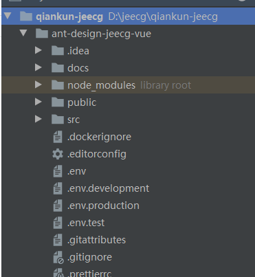
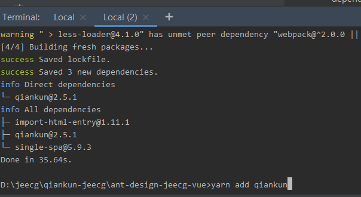
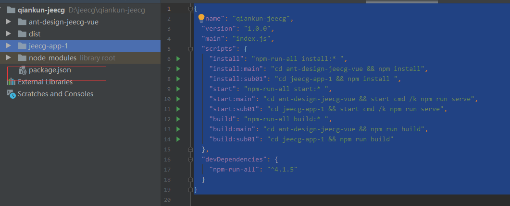

# 微前端高级改造
>[info] Version: 3.1.0 后的版本支持

ant-design-jeecg-vue最新版默认已经集成qiankun，老版本请参考一下步骤进行项目改造，详细使用说明参考 [qiankun官网](https://qiankun.umijs.org/zh/)
[TOC]
##  1.安装[qiankun](https://qiankun.umijs.org/zh)
 在前端项目外层建立qiankun-jeecg 文件夹 把ant-design-jeecg-vue拷贝到此文件夹下如下图

进入D:\jeecg\qiankun-jeecg\ant-design-jeecg-vue 目录下执行如下命令

```
yarn  add qiankun \# 或者 npm i qiankun -S
```
## 2.在主应用中注册微应用
* **src目录下新建qiankun文件夹**
* **qiankun目录下新建apps.js内容如下**
```
/**
 *微应用apps
 * @name: 微应用名称 - 具有唯一性
 * @entry: 微应用入口.必选 - 通过该地址加载微应用，
 * @container: 微应用挂载节点 - 微应用加载完成后将挂载在该节点上
 * @activeRule: 微应用触发的路由规则 - 触发路由规则后将加载该微应用
 */
//子应用列表
const _apps = [];
for (const key in process.env) {
    if (key.includes('VUE_APP_SUB_')) {
        const name = key.split('VUE_APP_SUB_')[1];
        const obj = {
            name,
            entry: process.env[key],
            container: '#content',
            activeRule: name,
        };
        _apps.push(obj)
    }
}
export const apps = _apps;
```
* **qiankun目录下新建state.js内容如下**
~~~
/**
 *公共数据
 */
import {initGlobalState} from 'qiankun';
import store from '@/store';
import router from '@/router';
import Vue from 'vue';
import {ACCESS_TOKEN} from "@/store/mutation-types"

//定义传入子应用的数据
export function getProps() {
  return {
    data: {
      publicPath: process.env.BASE_URL,
      token: Vue.ls.get(ACCESS_TOKEN),
      store,
      router
    }
  }
}

/**
 * 定义全局状态，并返回通信方法,在主应用使用，微应用通过 props 获取通信方法。
 * @param state 主应用穿的公共数据
 */
export function initGlState(info = {userName: 'admin'}) {
  // 初始化state
  const actions = initGlobalState(info);
  // 设置新的值
  actions.setGlobalState(info);
  // 注册 观察者 函数 - 响应 globalState 变化，在 globalState 发生改变时触发该 观察者 函数。
  actions.onGlobalStateChange((newState, prev) => {
    // state: 变更后的状态; prev 变更前的状态
    console.info("newState", newState)
    for (const key in newState) {
      console.info("onGlobalStateChange", key)
    }
  });
  // 将action对象绑到Vue原型上，为了项目中其他地方使用方便
  Vue.prototype.$actions = actions;
}
~~~
* **qiankun目录下新建index.js内容如下**
~~~
/**
 * qiankun配置
 */
import {registerMicroApps, setDefaultMountApp, start, runAfterFirstMounted, addGlobalUncaughtErrorHandler} from 'qiankun';
import {apps} from './apps';
import {getProps, initGlState} from './state';
/**
 * 重构apps
 */
function filterApps() {
    apps.forEach((item) => {
        //主应用需要传递给微应用的数据。
        item.props = getProps();
        //微应用触发的路由规则
        item.activeRule = genActiveRule('/' + item.activeRule);
    });
    return apps;
}

/**
 * 路由监听
 * @param {*} routerPrefix 前缀
 */
function genActiveRule(routerPrefix) {
    return location => location.pathname.startsWith(routerPrefix);
}

/**
 * 微应用注册
 */
function registerApps() {
    const _apps = filterApps();
    registerMicroApps(_apps,
        {
            beforeLoad: [
                loadApp => {
                    console.log('before load', loadApp);
                }
            ],
            beforeMount: [
                mountApp => {
                    console.log('before mount', mountApp);
                }
            ],
            afterMount: [
                mountApp => {
                    console.log('before mount', mountApp);
                }
            ],
            afterUnmount: [
                unloadApp => {
                    console.log('after unload', unloadApp);
                }
            ]
        });
    // 设置默认子应用,与 genActiveRule中的参数保持一致
    // setDefaultMountApp();
    // 第一个微应用 mount 后需要调用的方法，比如开启一些监控或者埋点脚本。
    runAfterFirstMounted(() => console.log('开启监控'));
    // 添加全局的未捕获异常处理器。
    addGlobalUncaughtErrorHandler(event => console.log(event));
    // 定义全局状态
    initGlState();
    //启动qiankun
    start({});
}
export default registerApps;
~~~
* **引入qiankun注册文件**
ant-design-jeecg-vue/src/components/layouts/TabLayout.vue 中加入如下代码

```
<div id="content" class="app-view-box"></div>
```
~~~
mounted() {
  if (process.env.VUE_APP_QIANKUN == 'true') {
    //update-begin-author:zyf date:20211129 for:qiankun 注册子应用
    if (!window.qiankunStarted) {
      window.qiankunStarted = true;
      registerApps();
    }
    //update-end-author:zyf date:20211129 for:qiankun 注册子应用
  }
},
~~~
* **添加全局控制开关**
ant-design-jeecg-vue/.env 文件中加入qiankun全局控制开关
* **修改打包输出位置**
修改vue.config.js中outputDir内容定义
~~~
//将打包内容输出到qiankun-jeecg文件夹下main目录下
outputDir: "../dist/main",
~~~
~~~
# 开启微应用模式
VUE_APP_QIANKUN=true
~~~
* **添加全局启动打包文件(package.json)** 存放位置如下图

文件内容如下
~~~
{
  "name": "qiankun-jeecg",
  "version": "1.0.0",
  "main": "index.js",
  "scripts": {
    "install": "npm-run-all install:* ",
    "install:main": "cd ant-design-jeecg-vue && npm install",
    "install:sub01": "cd jeecg-app-1 && npm install ",
    "start": "npm-run-all start:* ",
    "start:main": "cd ant-design-jeecg-vue && start cmd /k npm run serve",
    "start:sub01": "cd jeecg-app-1 && start cmd /k npm run serve",
    "build": "npm-run-all build:* ",
    "build:main": "cd ant-design-jeecg-vue && npm run build",
    "build:sub01": "cd jeecg-app-1 && npm run build"
  },
  "devDependencies": {
    "npm-run-all": "^4.1.5"
  }
}

~~~
## 3 子应用改造
* 在子应用src目录下新建public-path.js文件内容如下
~~~
//用于修改运行时的 publicPath
if (window.__POWERED_BY_QIANKUN__) {
  __webpack_public_path__ = window.__INJECTED_PUBLIC_PATH_BY_QIANKUN__;
}
~~~
* 修改main.js文件
~~~
function render(props = {}) {
    const {container} = props;
    instance = new Vue({
        router,
        render: (h) => h(App),
    }).$mount(container ? container.querySelector('#app') : '#app');
}

/**
 * 非qiankun独立启动
 */
if (!window.__POWERED_BY_QIANKUN__) {
    render();
}
/**
 * bootstrap 只会在微应用初始化的时候调用一次，下次微应用重新进入时会直接调用 mount 钩子，不会再重复触发 bootstrap。
 * 通常我们可以在这里做一些全局变量的初始化，比如不会在 unmount 阶段被销毁的应用级别的缓存等。
 */
export async function bootstrap(props) {
  common.setCommonData(props)
}

/**
 * 应用每次进入都会调用 mount 方法，通常我们在这里触发应用的渲染方法
 */
export async function mount(props) {
  common.initGlState(props)
  render(props);
}

/**
 * 应用每次 切出/卸载 会调用的方法，通常在这里我们会卸载微应用的应用实例
 */
export async function unmount() {
    instance.$destroy();
    instance.$el.innerHTML = '';
    instance = null;
}

/**
 * 可选生命周期钩子，仅使用 loadMicroApp 方式加载微应用时生效
 */
export async function update(props) {
    common.setCommonData(props)
    common.initGlState(props)
}

~~~
* 打包配置修改（`vue.config.js`）
```
const { name } = require('./package');
module.exports = {
  devServer: {
    headers: {
      // 主应用获取子应用时跨域响应头
      'Access-Control-Allow-Origin': '*',
    },
  },
  configureWebpack: {
    output: {
      library: `${name}-[name]`,
      libraryTarget: 'umd', // 把微应用打包成 umd 库格式
      jsonpFunction: `webpackJsonp_${name}`,
    },
  },
};
```
* 子应用vue.config.js完整配置参考如下内容
```
const path = require("path");
const packageName = require("./package.json").name;
const node_env = process.env.NODE_ENV === "production";
// const baseUrl = process.env.VUE_APP_BASE_URL;
const baseUrl = "/";
const resolve = (dir) => path.join(__dirname, dir);
module.exports = {
  //打包输入目录
  outputDir: `../dist/${packageName}`,
  publicPath: node_env ? baseUrl : "/",
  assetsDir: "static",
  configureWebpack: {
    resolve: {
      alias: {
        "@": resolve("src"),
      },
    },
    output: {
      library: `${packageName}-[name]`,
      libraryTarget: "umd", // 把微应用打包成 umd 库格式
      jsonpFunction: `webpackJsonp_${packageName}`,
    },
  },
  devServer: {
    hot: true,
    disableHostCheck: true,
    host:'localhost',
    port: 8092,
    headers: {
      "Access-Control-Allow-Origin": "*", // 主应用获取子应用时跨域响应头
    },
  },
};
```


