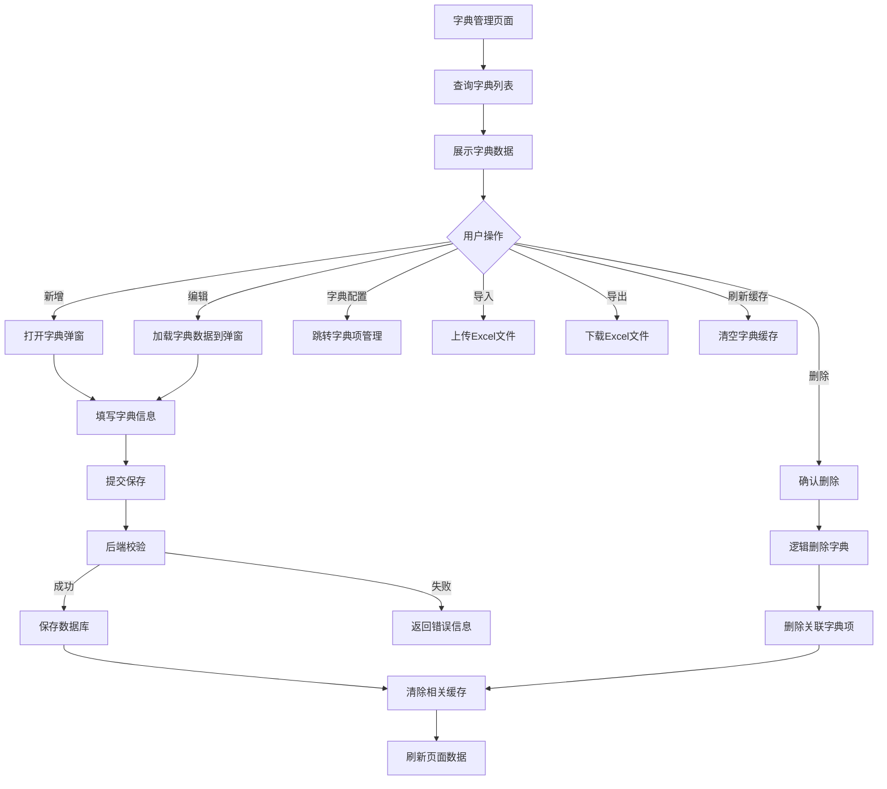
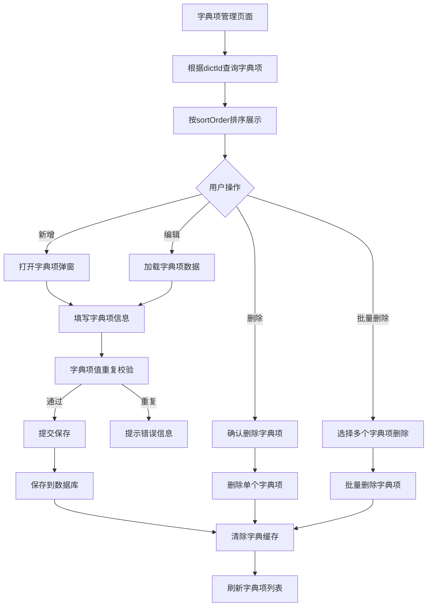
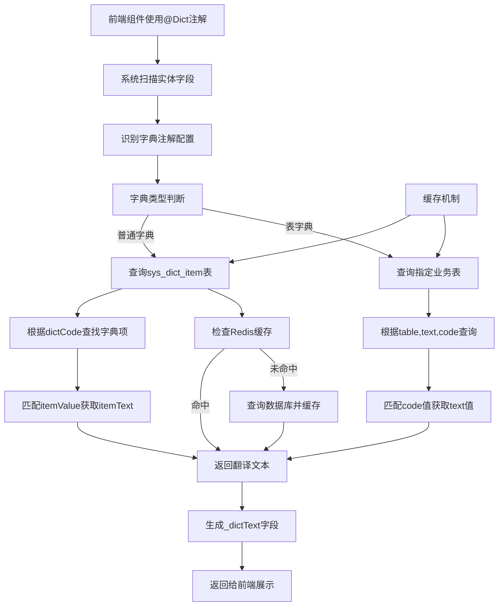

# 数据字典管理功能 PRD 文档

## 1. 模块概述

### 1.1 功能定位
数据字典管理是系统基础设施功能，负责管理系统中所有字典类型和字典项数据，为前端组件提供下拉选项、状态翻译等基础数据支持。包含字典主表管理和字典项管理两个核心模块。

### 1.2 业务价值
- **数据标准化**：统一管理系统中的枚举值、状态码等基础数据
- **维护便利性**：支持在线编辑字典项，无需修改代码即可调整业务配置
- **缓存优化**：基于Redis缓存机制，提升字典查询性能
- **导入导出**：支持Excel批量导入导出，便于数据迁移和备份

### 1.3 核心特性
- 字典类型与字典项的层级管理
- 字典项状态控制和排序功能
- 基于@Dict注解的自动翻译机制
- 支持表字典和普通字典两种模式
- 完整的缓存管理和刷新机制
- 逻辑删除和回收站功能

## 2. 前端页面结构分析

### 2.1 字典管理主页面
**文件位置**: `/src/views/system/modules/DictList.vue`

#### 核心功能模块
```javascript
// 查询条件区域
searchForm: {
  dictName: '',    // 字典名称
  dictCode: ''     // 字典编码
}

// 表格列配置
columns: [
  { title: '字典名称', dataIndex: 'dictName' },
  { title: '字典编码', dataIndex: 'dictCode' },
  { title: '描述', dataIndex: 'description' },
  { title: '操作', scopedSlots: { customRender: 'action' } }
]
```

#### 关键交互逻辑
- **分页查询**: 使用JeecgListMixin统一分页逻辑
- **新增编辑**: 调用DictModal弹窗组件
- **字典项管理**: 点击"字典配置"按钮跳转到字典项页面
- **导入导出**: 支持Excel格式的批量操作
- **缓存刷新**: 提供手动刷新字典缓存功能

### 2.2 字典项管理页面
**文件位置**: `/src/views/system/modules/DictItemList.vue`

#### 核心功能模块
```javascript
// 查询条件
searchForm: {
  dictId: '',      // 字典ID（从路由参数获取）
  itemText: '',    // 字典项文本
  itemValue: ''    // 字典项值
}

// 表格列配置
columns: [
  { title: '字典项文本', dataIndex: 'itemText' },
  { title: '字典项值', dataIndex: 'itemValue' },
  { title: '状态', dataIndex: 'status_dictText' },
  { title: '排序', dataIndex: 'sortOrder' },
  { title: '描述', dataIndex: 'description' }
]
```

#### 状态管理
- **启用状态**: 通过@Dict注解实现状态翻译显示
- **排序控制**: 支持自定义排序，影响前端下拉选项顺序
- **颜色配置**: 字典项支持颜色标识，用于前端样式区分

## 3. API接口分析

### 3.1 字典管理接口

#### 基础CRUD接口
```java
// Controller: SysDictController
@RequestMapping("/sys/dict")

// 分页查询
GET /sys/dict/list
// 参数: pageNo, pageSize, dictName, dictCode
// 返回: IPage<SysDict>

// 新增字典
POST /sys/dict/add
// 参数: @RequestBody SysDict
// 功能: 创建新字典类型

// 编辑字典  
PUT /sys/dict/edit
// 参数: @RequestBody SysDict
// 功能: 更新字典信息

// 删除字典
DELETE /sys/dict/delete?id={id}
// 功能: 逻辑删除字典及关联字典项

// 批量删除
DELETE /sys/dict/deleteBatch?ids={ids}
// 功能: 批量逻辑删除多个字典
```

#### 字典数据获取接口
```java
// 获取字典项数据
GET /sys/dict/getDictItems/{dictCode}
// 返回: List<DictModel>
// 功能: 根据字典编码获取所有字典项

// 字典文本翻译
GET /sys/dict/getDictText/{dictCode}/{key}
// 返回: String
// 功能: 根据字典编码和值获取对应文本

// 异步加载字典（大数据量）
GET /sys/dict/loadDict/{dictCode}
// 参数: keyword, pageSize
// 功能: 支持关键字搜索的分页加载
```

#### 缓存管理接口
```java
// 刷新字典缓存
POST /sys/dict/refleshCache
// 功能: 清空所有字典相关缓存
// 涉及缓存: SYS_DICT_CACHE, SYS_ENABLE_DICT_CACHE等
```

### 3.2 字典项管理接口

#### 基础CRUD接口
```java
// Controller: SysDictItemController  
@RequestMapping("/sys/dictItem")

// 分页查询字典项
GET /sys/dictItem/list
// 参数: dictId, pageNo, pageSize
// 排序: sortOrder ASC

// 新增字典项
POST /sys/dictItem/add
// 参数: @RequestBody SysDictItem
// 缓存: 自动清除相关字典缓存

// 编辑字典项
PUT /sys/dictItem/edit  
// 参数: @RequestBody SysDictItem
// 缓存: 自动清除相关字典缓存

// 删除字典项
DELETE /sys/dictItem/delete?id={id}
// 缓存: 自动清除相关字典缓存
```

#### 数据校验接口
```java
// 字典项值重复校验
GET /sys/dictItem/dictItemCheck
// 参数: itemValue, dictId, id(编辑时)
// 功能: 校验同一字典下字典项值的唯一性
```

## 4. 后端业务逻辑分析

### 4.1 Service接口设计

#### ISysDictService核心方法
```java
// 字典项查询方法
List<DictModel> queryDictItemsByCode(String code);
List<DictModel> queryEnableDictItemsByCode(String code);
Map<String, List<DictModel>> queryDictItemsByCodeList(List<String> dictCodeList);

// 字典翻译方法
String queryDictTextByKey(String code, String key);
List<String> queryTableDictByKeys(String table, String text, String code, String keys);

// 缓存相关方法
Map<String,List<DictModel>> queryAllDictItems();
List<DictModel> loadDict(String dictCode, String keyword, Integer pageSize);

// 数据管理方法
Integer saveMain(SysDict sysDict, List<SysDictItem> sysDictItemList);
void deleteOneDictPhysically(String id);
void updateDictDelFlag(int delFlag, String id);
```

### 4.2 缓存机制设计

#### 缓存策略
```java
// 缓存注解配置
@CacheEvict(value={CacheConstant.SYS_DICT_CACHE, CacheConstant.SYS_ENABLE_DICT_CACHE}, allEntries=true)

// 涉及的缓存类型
- SYS_DICT_CACHE: 普通字典缓存
- SYS_ENABLE_DICT_CACHE: 启用状态字典缓存  
- SYS_DICT_TABLE_CACHE: 表字典缓存
- SYS_DICT_TABLE_BY_KEYS_CACHE: 表字典按键缓存
```

#### 缓存刷新机制
- **自动刷新**: 增删改操作自动清除相关缓存
- **手动刷新**: 提供refleshCache接口手动清空所有字典缓存
- **批量清理**: 使用RedisUtil.removeAll()避免keys操作的性能问题

### 4.3 字典翻译机制

#### @Dict注解工作原理
```java
// 实体字段注解示例
@Dict(dicCode = "dict_item_status")
private Integer status;

// 翻译结果字段
// 系统自动生成status_dictText字段，包含翻译后的文本
```

#### 支持的字典类型
- **普通字典**: `@Dict(dicCode="字典编码")`
- **表字典**: `@Dict(dicCode="字段名", dicText="显示字段", dictTable="表名")`
- **多值翻译**: 逗号分隔的值串，返回逗号分隔的文本串

## 5. 数据结构分析

### 5.1 字典主表 (sys_dict)

#### SysDict实体类
```java
@TableName("sys_dict")
public class SysDict {
    @TableId(type = IdType.ASSIGN_ID)
    private String id;              // 主键ID
    
    private String dictName;        // 字典名称
    private String dictCode;        // 字典编码（唯一）
    private String description;     // 描述信息
    private Integer type;           // 字典类型（预留字段）
    
    @TableLogic
    private Integer delFlag;        // 删除标志（逻辑删除）
    
    private String createBy;        // 创建人
    private Date createTime;        // 创建时间
    private String updateBy;        // 更新人  
    private Date updateTime;        // 更新时间
    
    private Integer tenantId;       // 租户ID（多租户支持）
    private String lowAppId;        // 低代码应用ID
}
```

### 5.2 字典项表 (sys_dict_item)

#### SysDictItem实体类
```java
@TableName("sys_dict_item")  
public class SysDictItem {
    @TableId(type = IdType.ASSIGN_ID)
    private String id;              // 主键ID
    
    private String dictId;          // 字典ID（外键关联sys_dict.id）
    
    @Excel(name = "字典项文本", width = 20)
    private String itemText;        // 字典项显示文本
    
    @Excel(name = "字典项值", width = 30)  
    private String itemValue;       // 字典项存储值
    
    @Excel(name = "描述", width = 40)
    private String description;     // 描述信息
    
    @Excel(name = "排序", width = 15, type=4)
    private Integer sortOrder;      // 排序号
    
    @Dict(dicCode = "dict_item_status")
    private Integer status;         // 状态（1启用 0禁用）
    
    private String itemColor;       // 字典项颜色标识
    
    // 审计字段
    private String createBy;
    private Date createTime;
    private String updateBy;
    private Date updateTime;
}
```

### 5.3 VO类设计

#### SysDictPage导出VO
```java
public class SysDictPage {
    @Excel(name = "字典名称", width = 20)
    private String dictName;
    
    @Excel(name = "字典编码", width = 30) 
    private String dictCode;
    
    @Excel(name = "描述", width = 30)
    private String description;
    
    @ExcelCollection(name = "字典列表")
    private List<SysDictItem> sysDictItemList;  // 关联字典项列表
}
```

## 6. 业务流程图

### 6.1 字典管理流程



### 6.2 字典项管理流程



### 6.3 字典翻译流程



## 7. 业务规则

### 7.1 数据校验规则
- **字典编码唯一性**: 同一系统内字典编码必须唯一
- **字典项值唯一性**: 同一字典下字典项值不能重复
- **必填字段校验**: 字典名称、字典编码、字典项文本、字典项值为必填
- **编码格式规范**: 字典编码建议使用下划线分隔的小写格式

### 7.2 状态管理规则
- **字典状态**: 支持逻辑删除，删除后不影响已有数据的翻译
- **字典项状态**: 启用/禁用状态控制是否在下拉选项中显示
- **排序规则**: 字典项按sortOrder升序排列，影响前端显示顺序

### 7.3 缓存管理规则
- **自动缓存**: 字典查询结果自动缓存，提升查询性能
- **缓存失效**: 增删改操作自动清除相关缓存
- **缓存刷新**: 支持手动刷新所有字典缓存
- **缓存隔离**: 不同类型字典使用不同缓存key，避免相互影响

### 7.4 权限控制规则
- **管理员权限**: 完整的字典和字典项管理权限
- **普通用户**: 仅查询权限，不能修改字典配置
- **接口安全**: 部分接口需要签名验证，防止恶意调用

## 8. 代码位置索引

### 8.1 前端代码
```
字典管理主页面: /src/views/system/modules/DictList.vue
字典项管理页面: /src/views/system/modules/DictItemList.vue  
字典弹窗组件: /src/views/system/modules/DictModal.vue
字典项弹窗组件: /src/views/system/modules/DictItemModal.vue
```

### 8.2 后端代码
```
字典Controller: /jeecg-system-biz/src/main/java/org/jeecg/modules/system/controller/SysDictController.java
字典项Controller: /jeecg-system-biz/src/main/java/org/jeecg/modules/system/controller/SysDictItemController.java
字典Service接口: /jeecg-system-biz/src/main/java/org/jeecg/modules/system/service/ISysDictService.java
字典Service实现: /jeecg-system-biz/src/main/java/org/jeecg/modules/system/service/impl/SysDictServiceImpl.java
字典项Service接口: /jeecg-system-biz/src/main/java/org/jeecg/modules/system/service/ISysDictItemService.java
字典Mapper接口: /jeecg-system-biz/src/main/java/org/jeecg/modules/system/mapper/SysDictMapper.java
字典项Mapper接口: /jeecg-system-biz/src/main/java/org/jeecg/modules/system/mapper/SysDictItemMapper.java
```

### 8.3 实体类和VO
```
字典实体: /jeecg-system-biz/src/main/java/org/jeecg/modules/system/entity/SysDict.java
字典项实体: /jeecg-system-biz/src/main/java/org/jeecg/modules/system/entity/SysDictItem.java
字典页面VO: /jeecg-system-biz/src/main/java/org/jeecg/modules/system/vo/SysDictPage.java
字典模型: /jeecg-common/src/main/java/org/jeecg/common/system/vo/DictModel.java
```

### 8.4 数据库表结构
```
字典主表: sys_dict
字典项表: sys_dict_item
```

---

**文档版本**: v1.0  
**创建时间**: 2024年12月  
**维护人员**: 系统架构组  
**更新说明**: 基于静态代码分析完成的完整PRD文档，涵盖数据字典管理的所有功能模块和技术实现细节
