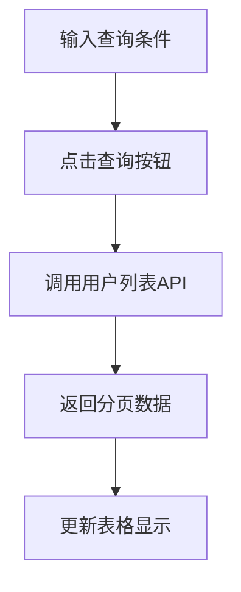
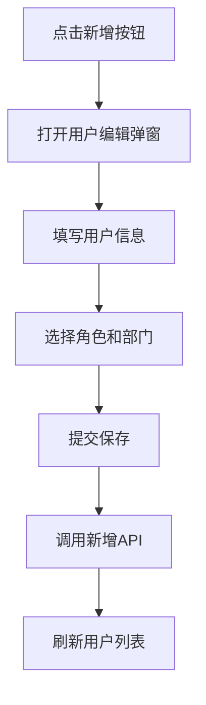
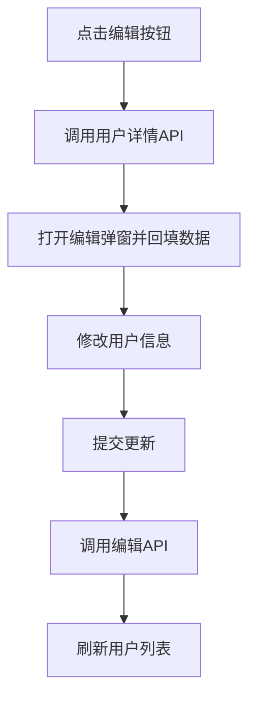
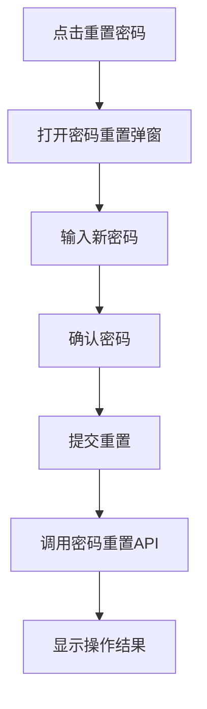

# 用户管理 PRD 文档

## 1. 模块概述

### 1.1 功能定位
用户管理模块是管理后台系统的核心模块，负责系统用户的全生命周期管理，包括用户的创建、编辑、删除、权限分配、状态管理等功能。

### 1.2 业务价值
- 提供完整的用户账户管理能力
- 支持多租户隔离的用户数据管理
- 实现用户与角色、部门的关联管理
- 提供用户状态控制和安全管理

### 1.3 核心功能
- 用户列表查询与筛选
- 用户信息的增删改查
- 批量操作（删除、冻结/解冻）
- 用户密码管理
- 用户角色分配
- 用户部门关联
- 导入导出功能

## 2. 前端页面结构

### 2.1 页面组件位置
- **前端页面路径**: `/src/views/system/UserList.vue`
- **页面类型**: Vue2 + Ant Design Vue
- **混入组件**: JeecgListMixin

### 2.2 页面布局结构

#### 2.2.1 查询区域
```javascript
// 查询表单字段
queryParam: {
  username: '',    // 用户账号
  realname: '',    // 真实姓名
  sex: '',         // 性别
  createTime: []   // 创建时间范围
}
```

#### 2.2.2 操作区域
- 新增用户按钮
- 批量删除按钮
- 批量冻结/解冻按钮
- 导入/导出按钮

#### 2.2.3 数据表格
| 字段 | 标题 | 类型 | 说明 |
|------|------|------|------|
| username | 用户账号 | 文本 | 登录账号 |
| realname | 真实姓名 | 文本 | 用户真实姓名 |
| avatar | 头像 | 图片 | 用户头像显示 |
| sex | 性别 | 字典 | 1-男，2-女 |
| birthday | 生日 | 日期 | 出生日期 |
| phone | 手机号 | 文本 | 联系电话 |
| email | 邮箱 | 文本 | 电子邮箱 |
| status | 状态 | 字典 | 1-正常，2-冻结 |
| createTime | 创建时间 | 日期时间 | 账号创建时间 |

#### 2.2.4 操作列
- 编辑：打开用户编辑弹窗
- 更多操作下拉菜单：
  - 重置密码
  - 冻结/解冻
  - 删除

## 3. 页面交互流程

### 3.1 用户查询流程


### 3.2 用户新增流程


### 3.3 用户编辑流程


### 3.4 密码重置流程


## 4. 数据结构分析

### 4.1 用户实体结构 (SysUser)
```java
// 核心字段
private String id;              // 主键ID
private String username;        // 登录账号
private String realname;        // 真实姓名
private String password;        // 密码（加密）
private String salt;           // 密码盐值
private String avatar;         // 头像路径
private Date birthday;         // 生日
private Integer sex;           // 性别（1男2女）
private String email;          // 邮箱
private String phone;          // 手机号
private String orgCode;        // 部门编码
private Integer loginTenantId; // 登录租户ID
private Integer status;        // 状态（1正常2冻结）
private Integer delFlag;       // 删除标志
private String workNo;         // 工号
private String post;           // 职务
private String telephone;      // 座机号

// 系统字段
private String createBy;       // 创建人
private Date createTime;       // 创建时间
private String updateBy;       // 更新人
private Date updateTime;       // 更新时间

// 扩展字段
private String departIds;      // 负责部门IDs
private String relTenantIds;   // 关联租户IDs（临时字段）
private String clientId;       // 设备ID
private String bpmStatus;      // 流程状态
```

### 4.2 用户角色关联 (SysUserRole)
```java
private String id;       // 主键
private String userId;   // 用户ID
private String roleId;   // 角色ID
```

### 4.3 用户部门关联 (SysUserDepart)
```java
private String id;       // 主键
private String userId;   // 用户ID
private String depId;    // 部门ID
```

## 5. API接口分析

### 5.1 后端Controller路径
- **Controller类**: `org.jeecg.modules.system.controller.SysUserController`
- **基础路径**: `/sys/user`

### 5.2 核心接口列表

#### 5.2.1 用户列表查询
- **接口路径**: `GET /sys/user/list`
- **功能**: 分页查询用户列表，支持多条件筛选
- **参数**: 
  - `pageNo`: 页码
  - `pageSize`: 页大小
  - `username`: 用户账号（模糊查询）
  - `realname`: 真实姓名（模糊查询）
  - `sex`: 性别
  - `createTime_begin`: 创建时间开始
  - `createTime_end`: 创建时间结束
  - `departId`: 部门ID（筛选部门下用户）

#### 5.2.2 用户新增
- **接口路径**: `POST /sys/user/add`
- **功能**: 创建新用户，支持角色和部门分配
- **请求体**: 
```json
{
  "username": "用户账号",
  "realname": "真实姓名",
  "password": "密码",
  "email": "邮箱",
  "phone": "手机号",
  "sex": 1,
  "birthday": "1990-01-01",
  "selectedroles": "角色ID,多个逗号分隔",
  "selecteddeparts": "部门ID,多个逗号分隔",
  "relTenantIds": "租户ID,多个逗号分隔"
}
```

#### 5.2.3 用户编辑
- **接口路径**: `PUT /sys/user/edit`
- **功能**: 更新用户信息
- **请求体**: 同新增接口，需包含用户ID

#### 5.2.4 用户删除
- **接口路径**: `DELETE /sys/user/delete`
- **参数**: `id` - 用户ID
- **功能**: 逻辑删除单个用户

#### 5.2.5 批量删除
- **接口路径**: `DELETE /sys/user/deleteBatch`
- **参数**: `ids` - 用户ID列表，逗号分隔
- **功能**: 批量逻辑删除用户

#### 5.2.6 用户详情查询
- **接口路径**: `GET /sys/user/queryById`
- **参数**: `id` - 用户ID
- **功能**: 根据ID查询用户详细信息

#### 5.2.7 密码重置
- **接口路径**: `PUT /sys/user/changePassword`
- **请求体**:
```json
{
  "username": "用户账号",
  "password": "新密码",
  "confirmpassword": "确认密码"
}
```

#### 5.2.8 批量冻结/解冻
- **接口路径**: `PUT /sys/user/frozenBatch`
- **请求体**:
```json
{
  "ids": "用户ID列表,逗号分隔",
  "status": "1或2"  // 1-正常，2-冻结
}
```

#### 5.2.9 用户角色查询
- **接口路径**: `GET /sys/user/queryUserRole`
- **参数**: `userid` - 用户ID
- **功能**: 查询用户已分配的角色列表

#### 5.2.10 导入导出
- **导出接口**: `GET /sys/user/exportXls`
- **导入接口**: `POST /sys/user/importExcel`

## 6. 后端业务逻辑

### 6.1 Service层核心方法

#### 6.1.1 用户保存 (saveUser)
```java
void saveUser(SysUser user, String selectedRoles, String selectedDeparts, String relTenantIds)
```
- 密码加密处理
- 用户角色关联保存
- 用户部门关联保存
- 多租户关联处理
- 特殊角色业务逻辑（代理商、供应商、店铺、加盟商）

#### 6.1.2 用户编辑 (editUser)
```java
void editUser(SysUser user, String roles, String departs, String relTenantIds)
```
- 更新用户基本信息
- 重新分配角色关联
- 重新分配部门关联
- 处理租户关联变更

#### 6.1.3 用户删除 (deleteUser)
```java
boolean deleteUser(String userId)
```
- 逻辑删除用户记录
- 清理用户角色关联
- 清理用户部门关联
- 清理第三方账号关联

#### 6.1.4 批量操作
- `deleteBatchUsers`: 批量删除用户
- 支持事务处理，确保数据一致性

### 6.2 租户隔离逻辑
- 查询时自动添加租户条件过滤
- 新增时自动设置当前租户ID
- 编辑删除时验证租户权限

### 6.3 特殊角色处理
系统支持以下特殊角色的业务逻辑：
- **代理商角色**: 创建代理商账户信息
- **供应商角色**: 创建供应商管理信息
- **店铺角色**: 创建店铺管理信息
- **加盟商角色**: 创建加盟商管理信息

## 7. 数据库结构

### 7.1 主要数据表

#### 7.1.1 sys_user (用户表)
- 存储用户基本信息
- 支持逻辑删除 (del_flag)
- 包含租户隔离字段

#### 7.1.2 sys_user_role (用户角色关联表)
- 用户与角色的多对多关联
- 支持一个用户分配多个角色

#### 7.1.3 sys_user_depart (用户部门关联表)
- 用户与部门的多对多关联
- 支持一个用户属于多个部门

#### 7.1.4 sys_user_tenant (用户租户关联表)
- 多租户场景下的用户租户关联
- 支持用户跨租户访问

## 8. 异常处理

### 8.1 业务异常
- 用户名重复校验
- 手机号/邮箱唯一性校验
- 密码强度校验
- 角色权限校验

### 8.2 系统异常
- 数据库连接异常
- 事务回滚处理
- 并发操作冲突

### 8.3 前端异常处理
- 表单验证失败提示
- 网络请求失败处理
- 权限不足提示

## 9. 安全性能

### 9.1 安全措施
- 密码MD5加盐加密
- 敏感信息脱敏显示
- 操作日志记录
- 权限控制验证

### 9.2 性能优化
- 分页查询减少数据量
- 索引优化查询性能
- 缓存用户权限信息
- 批量操作事务优化

## 10. 测试策略

### 10.1 功能测试
- 用户CRUD操作验证
- 批量操作功能测试
- 权限控制测试
- 导入导出功能测试

### 10.2 性能测试
- 大数据量查询性能
- 并发操作压力测试
- 内存使用监控

### 10.3 安全测试
- SQL注入防护测试
- XSS攻击防护测试
- 权限绕过测试

## 11. 代码位置索引

### 11.1 前端代码
- **页面组件**: `/src/views/system/UserList.vue`
- **API封装**: `/src/api/api.js` (userApi相关方法)
- **路由配置**: `/src/router/index.js`

### 11.2 后端代码
- **Controller**: `/jeecg-module-system/jeecg-system-biz/src/main/java/org/jeecg/modules/system/controller/SysUserController.java`
- **Service接口**: `/jeecg-module-system/jeecg-system-biz/src/main/java/org/jeecg/modules/system/service/ISysUserService.java`
- **Service实现**: `/jeecg-module-system/jeecg-system-biz/src/main/java/org/jeecg/modules/system/service/impl/SysUserServiceImpl.java`
- **Entity实体**: `/jeecg-module-system/jeecg-system-biz/src/main/java/org/jeecg/modules/system/entity/SysUser.java`
- **Mapper接口**: `/jeecg-module-system/jeecg-system-biz/src/main/java/org/jeecg/modules/system/mapper/SysUserMapper.java`

### 11.3 数据库脚本
- **建表脚本**: `/db/shop-boot/shop-boot-member.sql`
- **初始数据**: 系统默认管理员账户数据

---

**文档版本**: v1.0  
**编写日期**: 2024年  
**维护人员**: 系统开发团队  
**审核状态**: 待审核
