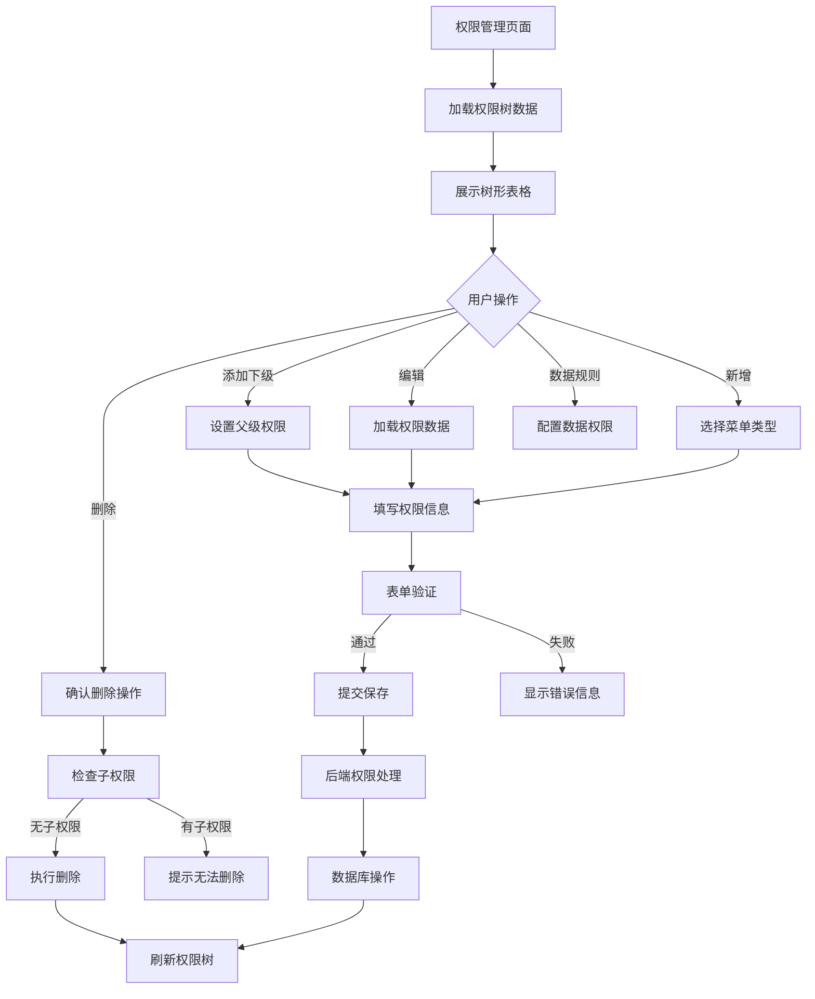
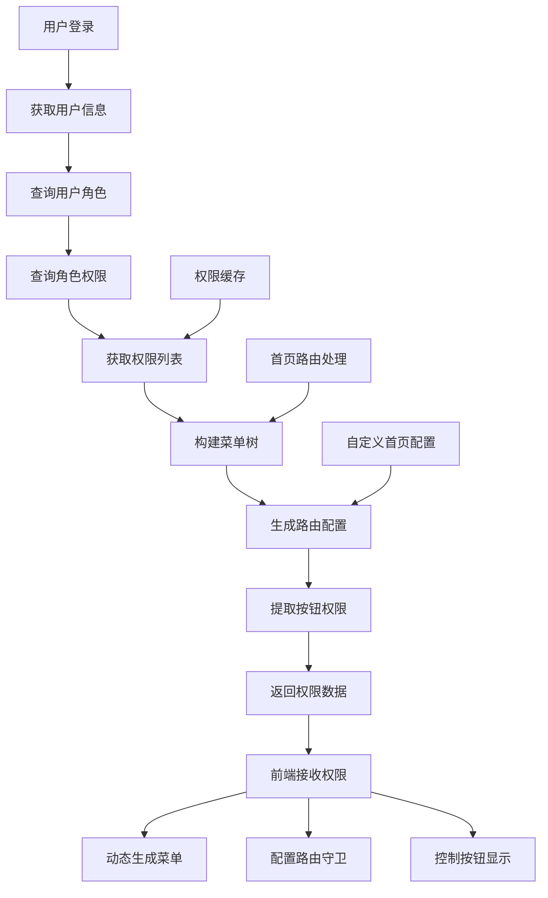
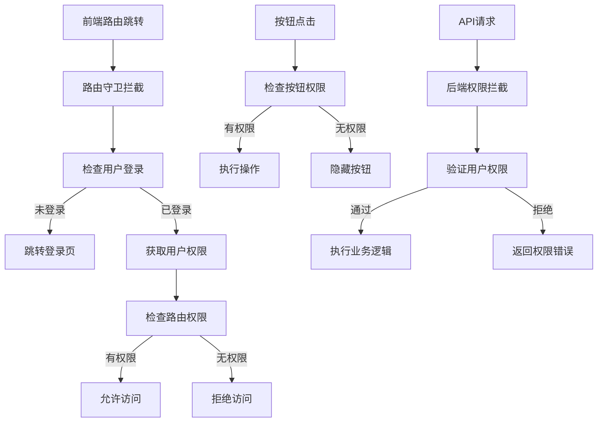

# 菜单权限管理功能 PRD 文档

## 1. 模块概述

### 1.1 功能定位
菜单权限管理是jeecg-boot管理后台RBAC权限体系的核心模块，负责管理系统中所有菜单、按钮权限的层级结构、访问控制和路由配置。该功能实现了基于角色的权限分配、动态菜单生成和细粒度的功能权限控制，是整个管理后台权限系统的基础设施。

### 1.2 业务价值
- **权限精细控制**：支持菜单级、按钮级的细粒度权限管理
- **动态路由生成**：根据用户权限动态生成前端路由和菜单结构
- **角色权限分离**：通过RBAC模型实现用户、角色、权限的解耦管理
- **系统安全保障**：确保用户只能访问被授权的功能模块

### 1.3 核心特性
- 支持三级菜单层级结构（一级菜单、子菜单、按钮权限）
- 提供树形结构的权限管理界面
- 实现路由缓存、隐藏路由等高级配置
- 支持外部链接和内部组件的灵活配置

## 2. 前端页面结构分析

### 2.1 主页面组件
**文件路径**: `/src/views/system/PermissionList.vue`

#### 2.1.1 核心功能模块
```javascript
// 表格列配置
columns: [
  { title: '菜单名称', dataIndex: 'name' },
  { title: '菜单类型', dataIndex: 'menuType', customRender: renderMenuType },
  { title: 'icon', dataIndex: 'icon' },
  { title: '组件', dataIndex: 'component' },
  { title: '路径', dataIndex: 'url' },
  { title: '排序', dataIndex: 'sortNo' },
  { title: '操作', scopedSlots: { customRender: 'action' } }
]

// 菜单类型渲染
function renderMenuType(text) {
  if (text == 0) return '菜单'      // 一级菜单
  else if (text == 1) return '菜单' // 子菜单  
  else if (text == 2) return '按钮/权限'
  else return text
}
```

#### 2.1.2 操作按钮区域
```javascript
// 主要操作按钮
<div class="table-operator">
  <a-button @click="handleAdd" type="primary" icon="plus">新增</a-button>
  <a-button @click="batchDel" v-if="selectedRowKeys.length > 0" 
            ghost type="primary" icon="delete">批量删除</a-button>
</div>
```

#### 2.1.3 树形表格展示
```javascript
// 树形表格配置
<a-table
  :columns="columns"
  :dataSource="dataSource"
  :pagination="false"
  :expandedRowKeys="expandedRowKeys"
  :rowSelection="{selectedRowKeys, onChange: onSelectChange}"
  @expandedRowsChange="handleExpandedRowsChange">
  
  <!-- 操作列插槽 -->
  <span slot="action" slot-scope="text, record">
    <a @click="handleEdit(record)">编辑</a>
    <a-divider type="vertical"/>
    <a-dropdown>
      <a class="ant-dropdown-link">更多 <a-icon type="down"/></a>
      <a-menu slot="overlay">
        <a-menu-item><a @click="handleDetail(record)">详情</a></a-menu-item>
        <a-menu-item><a @click="handleAddSub(record)">添加下级</a></a-menu-item>
        <a-menu-item><a @click="handleDataRule(record)">数据规则</a></a-menu-item>
        <a-menu-item>
          <a-popconfirm title="确定删除吗?" @confirm="() => handleDelete(record.id)">
            <a>删除</a>
          </a-popconfirm>
        </a-menu-item>
      </a-menu>
    </a-dropdown>
  </span>
</a-table>
```

### 2.2 权限编辑弹窗组件
**文件路径**: `/src/views/system/modules/PermissionModal.vue`

#### 2.2.1 菜单类型选择
```javascript
// 菜单类型单选组
<a-form-model-item label="菜单类型">
  <a-radio-group @change="onChangeMenuType" v-model="model.menuType">
    <a-radio :value="0">一级菜单</a-radio>
    <a-radio :value="1">子菜单</a-radio>
    <a-radio :value="2">按钮/权限</a-radio>
  </a-radio-group>
</a-form-model-item>
```

#### 2.2.2 动态表单字段
```javascript
// 根据菜单类型动态显示字段
computed: {
  show() {
    return this.model.menuType !== 2; // 按钮权限隐藏部分字段
  },
  menuLabel() {
    return this.model.menuType === 2 ? '按钮/权限' : '菜单名称';
  }
}

// 核心表单字段
- 菜单名称/按钮名称 (name)
- 上级菜单选择 (parentId) - 树形选择器
- 菜单路径 (url)
- 前端组件 (component) - 菜单类型显示
- 授权标识 (perms) - 按钮权限显示
- 授权策略 (permsType) - 字典选择
- 菜单图标 (icon) - 图标选择器
- 排序号 (sortNo)
- 路由配置开关 (route, hidden, keepAlive, alwaysShow)
```

## 3. API接口分析

### 3.1 权限管理核心接口

#### 基础CRUD接口
```java
// Controller: SysPermissionController
@RequestMapping("/sys/permission")

// 获取权限树列表
GET /sys/permission/list
// 参数: name (菜单名称模糊查询)
// 返回: List<SysPermissionTree> 树形结构数据

// 新增权限
POST /sys/permission/add
// 参数: @RequestBody SysPermission
// 功能: 添加菜单或按钮权限

// 编辑权限
PUT /sys/permission/edit  
// 参数: @RequestBody SysPermission
// 功能: 更新权限信息

// 删除权限
DELETE /sys/permission/delete?id={id}
// 功能: 删除单个权限及其子权限

// 批量删除权限
DELETE /sys/permission/deleteBatch?ids={ids}
// 功能: 批量删除多个权限
```

#### 权限查询接口
```java
// 获取用户权限菜单和按钮
GET /sys/permission/getUserPermissionByToken
// 返回: JSONObject包含menu(菜单)、auth(按钮权限)、allAuth(全部权限)
// 功能: 根据当前登录用户获取其拥有的权限集合

// 获取权限编码列表 (Vue3专用)
GET /sys/permission/getPermCode
// 返回: codeList(权限编码数组)、auth、allAuth、sysSafeMode
// 功能: 为前端权限控制提供权限编码列表

// 获取系统一级菜单
GET /sys/permission/getSystemMenuList
// 返回: List<SysPermissionTree> 一级菜单列表
// 功能: 懒加载方式获取顶级菜单

// 获取子菜单
GET /sys/permission/getSystemSubmenu?parentId={parentId}
// 返回: List<SysPermissionTree> 子菜单列表
// 功能: 根据父ID获取下级菜单
```

#### 权限树查询接口
```java
// 获取完整权限树
GET /sys/permission/queryTreeList
// 返回: Map包含treeList(树形数据)和ids(所有权限ID)
// 功能: 为角色权限分配提供完整的权限树结构

// 批量获取子菜单
GET /sys/permission/getSystemSubmenuBatch?parentIds={parentIds}
// 参数: parentIds (多个父ID逗号分隔)
// 返回: Map<String, List<SysPermissionTree>> 按父ID分组的子菜单
```

#### 权限校验接口
```java
// 检查权限路径重复
GET /sys/permission/checkPermDuplication
// 参数: id, url, alwaysShow
// 功能: 校验菜单路径的唯一性
```

### 3.2 权限数据处理逻辑

#### 权限菜单生成
```java
// 菜单权限JSON生成
private void getPermissionJsonArray(JSONArray jsonArray, List<SysPermission> metaList, String parentId) {
    // 递归构建菜单树结构
    // 处理路由配置、组件映射、权限控制
    // 支持外部链接和内部组件
}

// 按钮权限JSON生成  
private void getAuthJsonArray(JSONArray jsonArray, List<SysPermission> authList) {
    // 提取按钮权限编码
    // 生成前端权限控制数据
}
```

## 4. 后端业务逻辑分析

### 4.1 权限实体设计

#### SysPermission核心字段
```java
@TableName("sys_permission")
public class SysPermission {
    @TableId(type = IdType.ASSIGN_ID)
    private String id;              // 权限ID
    
    private String parentId;        // 父权限ID
    private String name;            // 菜单/按钮名称
    private String perms;           // 权限编码 (如: sys:user:list)
    private String permsType;       // 权限策略 (1显示2禁用)
    
    private String icon;            // 菜单图标
    private String component;       // 前端组件路径
    private String componentName;   // 组件名称
    private String url;             // 菜单路径
    private String redirect;        // 一级菜单跳转地址
    
    private Double sortNo;          // 排序号
    
    @Dict(dicCode = "menu_type")
    private Integer menuType;       // 菜单类型 (0一级菜单 1子菜单 2按钮权限)
    
    @TableField(value="is_leaf")
    private boolean leaf;           // 是否叶子节点
    
    @TableField(value="is_route")
    private boolean route;          // 是否路由菜单
    
    @TableField(value="keep_alive")
    private boolean keepAlive;      // 是否缓存页面
    
    private boolean hidden;         // 是否隐藏路由
    private boolean hideTab;        // 是否隐藏Tab
    private boolean alwaysShow;     // 聚合路由
    private boolean internalOrExternal; // 外链打开方式
    
    private String status;          // 按钮权限状态
    private Integer delFlag;        // 删除标志
    private Integer ruleFlag;       // 数据权限配置标志
}
```

### 4.2 Service业务逻辑

#### ISysPermissionService核心方法
```java
// 权限查询方法
List<SysPermission> queryByUser(String username);              // 根据用户查询权限
List<SysPermission> list(LambdaQueryWrapper<SysPermission> query); // 条件查询

// 权限管理方法
void addPermission(SysPermission permission);                  // 新增权限
void editPermission(SysPermission permission);                 // 编辑权限  
void deletePermission(String id);                              // 删除权限

// 权限校验方法
boolean checkPermDuplication(String id, String url, Boolean alwaysShow); // 路径重复校验
```

### 4.3 权限数据处理工具

#### PermissionDataUtil智能处理
```java
public class PermissionDataUtil {
    // 智能处理权限数据
    public static SysPermission intelligentProcessData(SysPermission permission) {
        // 根据菜单类型自动设置默认值
        // 处理组件路径和路由配置
        // 设置叶子节点标识
    }
    
    // 检查是否包含首页
    public static boolean hasIndexPage(List<SysPermission> metaList) {
        return metaList.stream().anyMatch(p -> "首页".equals(p.getName()));
    }
}
```

## 5. 数据结构分析

### 5.1 权限表结构 (sys_permission)

#### 核心字段说明
```sql
CREATE TABLE sys_permission (
  id VARCHAR(32) PRIMARY KEY,           -- 权限ID
  parent_id VARCHAR(32),                -- 父权限ID  
  name VARCHAR(100) NOT NULL,           -- 菜单名称
  perms VARCHAR(500),                   -- 权限编码
  perms_type VARCHAR(10),               -- 权限策略
  
  icon VARCHAR(100),                    -- 菜单图标
  component VARCHAR(255),               -- 前端组件
  component_name VARCHAR(100),          -- 组件名称
  url VARCHAR(255),                     -- 菜单路径
  redirect VARCHAR(255),                -- 重定向地址
  
  sort_no DECIMAL(8,2),                 -- 排序号
  menu_type INT DEFAULT 0,              -- 菜单类型
  
  is_leaf TINYINT(1) DEFAULT 1,         -- 是否叶子节点
  is_route TINYINT(1) DEFAULT 1,        -- 是否路由菜单
  keep_alive TINYINT(1) DEFAULT 1,      -- 是否缓存
  hidden TINYINT(1) DEFAULT 0,          -- 是否隐藏
  hide_tab TINYINT(1) DEFAULT 0,        -- 是否隐藏Tab
  always_show TINYINT(1) DEFAULT 0,     -- 聚合路由
  internal_or_external TINYINT(1) DEFAULT 0, -- 外链方式
  
  status VARCHAR(2) DEFAULT '1',        -- 状态
  del_flag INT DEFAULT 0,               -- 删除标志
  rule_flag INT DEFAULT 0,              -- 数据权限标志
  
  create_by VARCHAR(32),                -- 创建人
  create_time DATETIME,                 -- 创建时间
  update_by VARCHAR(32),                -- 更新人
  update_time DATETIME                  -- 更新时间
);
```

### 5.2 权限树形VO设计

#### SysPermissionTree
```java
public class SysPermissionTree extends TreeModel<SysPermissionTree> {
    private String icon;                  // 菜单图标
    private String component;             // 前端组件
    private String url;                   // 菜单路径
    private Integer menuType;             // 菜单类型
    private String perms;                 // 权限编码
    private Double sortNo;                // 排序号
    private boolean route;                // 路由标识
    private boolean leaf;                 // 叶子节点
    
    // 构造方法
    public SysPermissionTree(SysPermission permission) {
        // 从权限实体转换为树形VO
    }
}
```

## 6. 业务流程图

### 6.1 权限管理流程



### 6.2 用户权限获取流程



### 6.3 权限校验流程



## 7. 业务规则

### 7.1 权限层级规则
- **三级结构限制**: 最多支持三级菜单结构（一级菜单 → 子菜单 → 按钮权限）
- **父子关系约束**: 子菜单和按钮权限必须指定有效的父级权限
- **类型限制**: 按钮权限不能作为其他权限的父级
- **路径唯一性**: 同级菜单的URL路径不能重复

### 7.2 权限编码规则
- **编码格式**: 采用模块:功能:操作的格式，如 `sys:user:list`
- **编码唯一性**: 系统内权限编码必须全局唯一
- **命名规范**: 使用小写字母和冒号分隔，语义清晰
- **按钮权限**: 必须配置权限编码，菜单权限可选

### 7.3 路由配置规则
- **组件路径**: 必须对应实际存在的Vue组件文件
- **路由缓存**: 根据keepAlive配置决定是否缓存页面
- **隐藏路由**: hidden为true的路由不在菜单中显示但可直接访问
- **外部链接**: internalOrExternal为true时在新窗口打开

### 7.4 权限分配规则
- **角色继承**: 用户通过角色获得权限，支持多角色
- **权限传递**: 拥有父级权限自动拥有所有子级权限
- **最小权限**: 遵循最小权限原则，默认无权限
- **动态生效**: 权限变更后需重新登录生效

## 8. 代码位置索引

### 8.1 前端代码
```
权限管理主页面: /src/views/system/PermissionList.vue
权限编辑弹窗: /src/views/system/modules/PermissionModal.vue
图标选择组件: /src/views/system/modules/icon/Icons.vue
数据权限管理: /src/views/system/PermissionDataRuleList.vue
```

### 8.2 后端代码
```
权限Controller: /jeecg-system-biz/src/main/java/org/jeecg/modules/system/controller/SysPermissionController.java
权限Service接口: /jeecg-system-biz/src/main/java/org/jeecg/modules/system/service/ISysPermissionService.java
权限Service实现: /jeecg-system-biz/src/main/java/org/jeecg/modules/system/service/impl/SysPermissionServiceImpl.java
权限Mapper接口: /jeecg-system-biz/src/main/java/org/jeecg/modules/system/mapper/SysPermissionMapper.java
权限数据处理: /jeecg-system-biz/src/main/java/org/jeecg/modules/system/util/PermissionDataUtil.java
```

### 8.3 实体类和VO
```
权限实体: /jeecg-system-biz/src/main/java/org/jeecg/modules/system/entity/SysPermission.java
权限树VO: /jeecg-system-biz/src/main/java/org/jeecg/modules/system/model/SysPermissionTree.java
树形模型: /jeecg-common/src/main/java/org/jeecg/modules/system/model/TreeModel.java
```

### 8.4 数据库表结构
```
权限表: sys_permission
角色权限关联表: sys_role_permission
用户角色关联表: sys_user_role
权限数据规则表: sys_permission_data_rule
```

---

**文档版本**: v2.0  
**创建时间**: 2024年12月  
**维护人员**: 系统架构组  
**更新说明**: 基于RBAC权限体系的完整菜单权限管理PRD文档，涵盖权限管理的所有功能模块和技术实现细节
